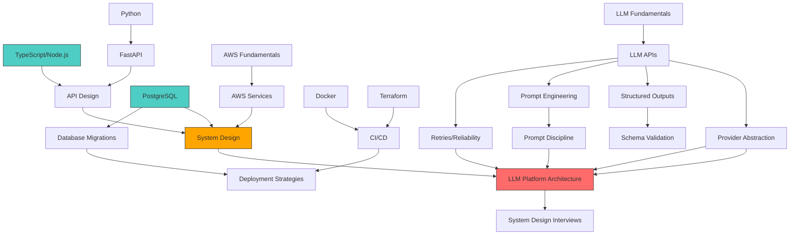

# MASTER STUDY PLAN — Technical Lead (TypeScript & Python)

## SAQAYA × Palladium Interview Preparation

---

## Interview Strategy Overview

You are interviewing for a **single role** with **two interview surfaces**:

| Interview | Focus | What They Evaluate |
|-----------|-------|-------------------|
| **SAQAYA** | Engineering depth, AI-native mindset, production capability | Can you build and lead the technical platform? |
| **Palladium** | Domain understanding, stakeholder management, communication | Can you work with our domain teams and deliver impact? |

### Key Strategic Insight

> **SAQAYA is evaluating you as an engineer who leads.**
> **Palladium is evaluating you as a leader who engineers.**

Your preparation must serve both lenses simultaneously.

---

## Role Analysis — What This Job Really Is

Based on the JD, this is NOT a generic Tech Lead role. It is specifically:

1. **Platform Transition Lead** — Taking an early-stage product to production
2. **LLM Platform Owner** — Owning the generation platform end-to-end
3. **Technology Decision Maker** — Making the TypeScript vs Python backend decision
4. **Infrastructure Builder** — CI/CD, staging, PostgreSQL deployments, cloud infra from scratch
5. **AI Engineering Standards Setter** — Establishing AI-assisted development practices
6. **Domain Partner** — Working closely with Palladium's development finance teams

### The "Narrative Arc" of Your Interview

Your answers should consistently tell this story:

> "I am a senior engineer who has repeatedly taken systems from early-stage to production-ready. I understand LLM workloads deeply — not just the API calls, but the reliability, cost, and operational concerns. I make pragmatic technology decisions based on trade-offs, not hype. I establish engineering standards that scale with the team. And I communicate complex technical concepts to non-technical stakeholders effectively."

---

## Topic Priority Matrix

### P0 — Extremely High Priority (Must Master)

These topics are **explicitly mentioned** in the JD and represent the core of what you'll be evaluated on. Dedicate **60% of study time** here.

| Topic | Why P0 | Study Files |
|-------|--------|-------------|
| **LLM Platform Architecture** | "Own the generation platform" — this IS the job | `07_LLM_AI_ENGINEERING/*`, `12_SYSTEM_DESIGN_INTERVIEWS/02_LLM_PLATFORM.md` |
| **Provider Abstraction & Cost Management** | Explicitly called out in JD | `07_LLM_AI_ENGINEERING/03_PROVIDER_ABSTRACTION.md`, `11_LLM_COST_MANAGEMENT.md` |
| **Prompt Discipline** | Explicitly called out — unique term suggesting rigor | `07_LLM_AI_ENGINEERING/07_PROMPT_DISCIPLINE.md` |
| **Structured Outputs & Schema Validation** | Explicitly called out as requirement | `07_LLM_AI_ENGINEERING/04_STRUCTURED_OUTPUTS.md`, `05_SCHEMA_VALIDATION.md` |
| **TypeScript + Node.js (Production)** | "Strong production experience" — primary backend | `02_CORE_BACKEND/01_TYPESCRIPT.md`, `02_NODEJS.md`, `03_NODEJS_PERFORMANCE.md` |
| **PostgreSQL (Production)** | "Solid PostgreSQL experience" — explicit requirement | `03_DATABASE/*` |
| **CI/CD & Production Infrastructure** | "Build production infrastructure from the ground up" | `06_CICD_INFRASTRUCTURE/*` |
| **AWS (Hands-on)** | "Strong hands-on AWS experience" | `05_AWS_CLOUD/*` |
| **Technical Leadership & Decision Making** | "Make the final backend technology decision" | `09_TECHNICAL_LEADERSHIP/*` |
| **LLM Reliability, Retries, Scalability** | Explicitly called out trio | `07_LLM_AI_ENGINEERING/08_RETRIES_TIMEOUTS.md`, `09_LLM_RELIABILITY.md`, `10_LLM_SCALABILITY.md` |

### P1 — High Priority (Must Know Well)

These are **strongly implied** by the JD or are core Technical Lead competencies. Dedicate **25% of study time**.

| Topic | Why P1 | Study Files |
|-------|--------|-------------|
| **Python + FastAPI** | "Strong plus" — likely used for LLM workloads | `02_CORE_BACKEND/04_PYTHON.md`, `05_FASTAPI.md` |
| **System Design (General)** | Expected in any Lead interview | `04_SYSTEM_DESIGN/*` |
| **AI-Assisted Engineering Standards** | "Establish rigorous standards for AI-assisted development" | `08_AI_ASSISTED_ENGINEERING/*` |
| **Production Operations** | Implied by "production-ready environment" | `10_PRODUCTION_OPERATIONS/*` |
| **LLM Observability & Evaluation** | Required for owning generation platform | `07_LLM_AI_ENGINEERING/12_LLM_OBSERVABILITY.md`, `13_LLM_EVALUATION.md` |
| **Docker & Containerization** | Required for production infrastructure | `06_CICD_INFRASTRUCTURE/02_DOCKER.md` |
| **Terraform / IaC** | Required for "cloud infrastructure" | `06_CICD_INFRASTRUCTURE/03_TERRAFORM.md` |
| **API Design** | Core backend skill | `02_CORE_BACKEND/06_API_DESIGN.md` |
| **AI Security & Prompt Injection** | Critical for production LLM | `07_LLM_AI_ENGINEERING/14_AI_SECURITY.md`, `15_PROMPT_INJECTION.md` |

### P2 — Medium Priority (Should Be Familiar)

Important context but unlikely to be deep-dived in interview. Dedicate **10% of study time**.

| Topic | Why P2 | Study Files |
|-------|--------|-------------|
| **eLearning Domain** | "eLearning platforms are a plus" | `11_ELEARNING/*` |
| **Palladium Domain Knowledge** | Useful for Palladium interview | `01_COMPANY_RESEARCH/04_PALLADIUM.md`, `05_PALLADIUM_INNOVATIVE_FINANCE.md` |
| **Stakeholder Management** | Important for Palladium interview | `09_TECHNICAL_LEADERSHIP/04_STAKEHOLDER_MANAGEMENT.md` |
| **Behavioral Questions** | Expected in any interview | `09_TECHNICAL_LEADERSHIP/11_LEADERSHIP_BEHAVIORAL.md` |
| **Microservices** | Common architecture topic | `04_SYSTEM_DESIGN/07_MICROSERVICES.md` |
| **Caching** | Common system design topic | `04_SYSTEM_DESIGN/05_CACHING.md` |

### P3 — Nice to Have (Skim for Context)

Background knowledge that shows breadth. Dedicate **5% of study time**.

| Topic | Why P3 | Study Files |
|-------|--------|-------------|
| **SCORM/xAPI/LTI** | eLearning standards — only if asked | `11_ELEARNING/03_SCORM_XAPI_LTI.md` |
| **Advanced distributed systems theory** | Unlikely in this specific role | `04_SYSTEM_DESIGN/02_DISTRIBUTED_SYSTEMS.md` |
| **Multi-region architecture** | Unlikely for early-stage platform | `04_SYSTEM_DESIGN/08_PRODUCTION_ARCHITECTURE.md` |
| **Development Impact Bonds** | Domain depth — only for Palladium | `01_COMPANY_RESEARCH/05_PALLADIUM_INNOVATIVE_FINANCE.md` |

---

## Study Sequence — Dependency Order

### Week 1: Foundation & Core (Days 1-7)

```
Day 1: Company Research
├── Read 01_COMPANY_RESEARCH/01_SAQAYA.md
├── Read 01_COMPANY_RESEARCH/02_SAQAYA_ENGINEERING.md
├── Read 01_COMPANY_RESEARCH/04_PALLADIUM.md
├── Read 01_COMPANY_RESEARCH/05_PALLADIUM_INNOVATIVE_FINANCE.md
└── Understand the "who" and "why" before the "what"

Day 2: TypeScript & Node.js Deep Dive
├── Study 02_CORE_BACKEND/01_TYPESCRIPT.md
├── Study 02_CORE_BACKEND/02_NODEJS.md
└── Focus: Event loop, async patterns, type system

Day 3: Node.js Performance + Python
├── Study 02_CORE_BACKEND/03_NODEJS_PERFORMANCE.md
├── Study 02_CORE_BACKEND/04_PYTHON.md
└── Focus: Production debugging, GIL, asyncio

Day 4: FastAPI + API Design
├── Study 02_CORE_BACKEND/05_FASTAPI.md
├── Study 02_CORE_BACKEND/06_API_DESIGN.md
└── Focus: ASGI, Pydantic, REST design principles

Day 5: PostgreSQL Deep Dive
├── Study 03_DATABASE/01_POSTGRESQL.md
├── Study 03_DATABASE/02_POSTGRESQL_PERFORMANCE.md
└── Focus: MVCC, indexing, EXPLAIN ANALYZE

Day 6: PostgreSQL Transactions + Migrations
├── Study 03_DATABASE/03_TRANSACTIONS_CONCURRENCY.md
├── Study 03_DATABASE/04_DATABASE_MIGRATIONS.md
└── Focus: Isolation levels, zero-downtime migrations

Day 7: Review + Practice Questions
├── Review 13_INTERVIEW_QUESTIONS/01_TYPESCRIPT_NODE_QUESTIONS.md
├── Review 13_INTERVIEW_QUESTIONS/02_PYTHON_FASTAPI_QUESTIONS.md
├── Review 13_INTERVIEW_QUESTIONS/03_POSTGRESQL_QUESTIONS.md
└── Practice answering aloud
```

### Week 2: LLM Platform & AWS (Days 8-14)

```
Day 8: LLM Fundamentals + APIs
├── Study 07_LLM_AI_ENGINEERING/01_LLM_FUNDAMENTALS.md
├── Study 07_LLM_AI_ENGINEERING/02_LLM_APIS.md
└── Focus: Token economics, API patterns, streaming

Day 9: Provider Abstraction + Structured Outputs
├── Study 07_LLM_AI_ENGINEERING/03_PROVIDER_ABSTRACTION.md
├── Study 07_LLM_AI_ENGINEERING/04_STRUCTURED_OUTPUTS.md
├── Study 07_LLM_AI_ENGINEERING/05_SCHEMA_VALIDATION.md
└── Focus: Abstraction layer design, Zod/Pydantic

Day 10: Prompt Engineering + Discipline
├── Study 07_LLM_AI_ENGINEERING/06_PROMPT_ENGINEERING.md
├── Study 07_LLM_AI_ENGINEERING/07_PROMPT_DISCIPLINE.md
└── Focus: Production prompt management, versioning, testing

Day 11: LLM Reliability + Retries + Cost
├── Study 07_LLM_AI_ENGINEERING/08_RETRIES_TIMEOUTS.md
├── Study 07_LLM_AI_ENGINEERING/09_LLM_RELIABILITY.md
├── Study 07_LLM_AI_ENGINEERING/11_LLM_COST_MANAGEMENT.md
└── Focus: Retry strategies, circuit breakers, cost optimization

Day 12: LLM Scalability + Observability + Security
├── Study 07_LLM_AI_ENGINEERING/10_LLM_SCALABILITY.md
├── Study 07_LLM_AI_ENGINEERING/12_LLM_OBSERVABILITY.md
├── Study 07_LLM_AI_ENGINEERING/14_AI_SECURITY.md
├── Study 07_LLM_AI_ENGINEERING/15_PROMPT_INJECTION.md
└── Focus: Monitoring LLM workloads, prompt injection defense

Day 13: Production LLM Architecture + Evaluation
├── Study 07_LLM_AI_ENGINEERING/13_LLM_EVALUATION.md
├── Study 07_LLM_AI_ENGINEERING/16_PRODUCTION_LLM_ARCHITECTURE.md
└── Focus: End-to-end architecture, evaluation frameworks

Day 14: AWS Deep Dive
├── Study 05_AWS_CLOUD/01_AWS_FUNDAMENTALS.md
├── Study 05_AWS_CLOUD/02_AWS_NETWORKING.md
├── Study 05_AWS_CLOUD/03_ECS_EC2_LAMBDA.md
├── Study 05_AWS_CLOUD/04_RDS_POSTGRESQL.md
└── Focus: VPC design, ECS/Fargate, RDS PostgreSQL
```

### Week 3: Infrastructure, Leadership & Practice (Days 15-21)

```
Day 15: AWS Services + Cost
├── Study 05_AWS_CLOUD/05_S3_CLOUDFRONT.md through 10_AWS_COST_OPTIMIZATION.md
├── Review 13_INTERVIEW_QUESTIONS/04_AWS_QUESTIONS.md
└── Focus: SQS/SNS patterns, IAM, cost optimization

Day 16: CI/CD + Infrastructure
├── Study 06_CICD_INFRASTRUCTURE/01_CI_CD.md through 04_ENVIRONMENTS.md
└── Focus: GitHub Actions, Docker, Terraform

Day 17: Deployment + Production Ops
├── Study 06_CICD_INFRASTRUCTURE/05_DEPLOYMENT_STRATEGIES.md through 07_ROLLBACKS_DISASTER_RECOVERY.md
├── Study 10_PRODUCTION_OPERATIONS/01_OBSERVABILITY.md
├── Study 10_PRODUCTION_OPERATIONS/02_INCIDENT_RESPONSE.md
└── Focus: Zero-downtime deployments, incident response

Day 18: System Design Practice
├── Study 04_SYSTEM_DESIGN/01_SYSTEM_DESIGN_FUNDAMENTALS.md through 04_RELIABILITY.md
├── Practice 12_SYSTEM_DESIGN_INTERVIEWS/02_LLM_PLATFORM.md
└── Focus: System design interview framework

Day 19: AI-Assisted Engineering + Technical Leadership
├── Study 08_AI_ASSISTED_ENGINEERING/* (all files)
├── Study 09_TECHNICAL_LEADERSHIP/01_TECHNICAL_LEAD_ROLE.md through 05_CONFLICTS.md
└── Focus: AI-assisted dev standards, decision frameworks

Day 20: Leadership + Behavioral
├── Study 09_TECHNICAL_LEADERSHIP/06_MENTORING.md through 11_LEADERSHIP_BEHAVIORAL.md
├── Study 13_INTERVIEW_QUESTIONS/08_TECHNICAL_LEAD_QUESTIONS.md
├── Study 13_INTERVIEW_QUESTIONS/10_BEHAVIORAL_QUESTIONS.md
└── Focus: STAR method, leadership stories

Day 21: eLearning + Domain
├── Study 11_ELEARNING/* (all files)
├── Study 12_SYSTEM_DESIGN_INTERVIEWS/04_ELEARNING_PLATFORM.md
├── Study 12_SYSTEM_DESIGN_INTERVIEWS/08_AI_TUTOR.md
└── Focus: eLearning architecture, AI tutoring
```

### Week 4: Company-Specific Prep & Mock Interviews (Days 22-28)

```
Day 22: SAQAYA-Specific Preparation
├── Review 01_COMPANY_RESEARCH/03_SAQAYA_INTERVIEW_RESEARCH.md
├── Study 14_SAQAYA_INTERVIEW/* (all files)
└── Focus: SAQAYA's AI-native model, their likely questions

Day 23: Palladium-Specific Preparation
├── Review 01_COMPANY_RESEARCH/06_PALLADIUM_INTERVIEW_RESEARCH.md
├── Study 15_PALLADIUM_INTERVIEW/* (all files)
└── Focus: Domain alignment, stakeholder communication

Day 24: System Design Mock
├── Practice 12_SYSTEM_DESIGN_INTERVIEWS/01_PRODUCTION_PLATFORM.md
├── Practice 12_SYSTEM_DESIGN_INTERVIEWS/03_MULTI_PROVIDER_LLM.md
├── Time yourself: 45 minutes per design
└── Practice drawing on whiteboard/paper

Day 25: Mock Interviews
├── Run through 16_MOCK_INTERVIEWS/01_SAQAYA_MOCK_INTERVIEW.md
├── Run through 16_MOCK_INTERVIEWS/02_PALLADIUM_MOCK_INTERVIEW.md
└── Record yourself, review for clarity

Day 26: LLM + Production Mock
├── Run through 16_MOCK_INTERVIEWS/05_LLM_MOCK.md
├── Run through 16_MOCK_INTERVIEWS/03_TECHNICAL_LEAD_MOCK.md
└── Practice explaining trade-offs clearly

Day 27: Weak Areas + Review
├── Identify weak areas from mock interviews
├── Re-study those specific topics
├── Review 17_FINAL_REVISION/01_TOP_100_QUESTIONS.md
├── Review 17_FINAL_REVISION/02_TOP_50_MUST_KNOW.md
└── Focus on gaps, not strengths

Day 28: Final Revision
├── Review 17_FINAL_REVISION/03_LAST_DAY_REVISION.md
├── Review 17_FINAL_REVISION/04_CHEAT_SHEET.md
├── Light review only — no new material
└── Rest, eat well, prepare logistics
```

---

## Estimated Study Effort

| Section | Files | Estimated Hours | Priority |
|---------|-------|----------------|----------|
| Company Research | 6 | 3-4h | P0/P2 |
| Core Backend (TS/Node/Python/FastAPI) | 6 | 12-15h | P0/P1 |
| Database (PostgreSQL) | 4 | 8-10h | P0 |
| System Design | 8 | 10-12h | P0/P1 |
| AWS Cloud | 10 | 12-15h | P0 |
| CI/CD Infrastructure | 7 | 8-10h | P0 |
| LLM/AI Engineering | 16 | 20-25h | P0 |
| AI-Assisted Engineering | 5 | 4-5h | P1 |
| Technical Leadership | 11 | 8-10h | P0/P1 |
| Production Operations | 6 | 5-6h | P1 |
| eLearning | 4 | 3-4h | P2 |
| System Design Interviews | 8 | 10-12h | P0 |
| Interview Questions | 10 | 12-15h | P0 |
| SAQAYA Interview | 5 | 4-5h | P0 |
| Palladium Interview | 5 | 4-5h | P1 |
| Mock Interviews | 5 | 6-8h | P0 |
| Final Revision | 4 | 3-4h | P0 |
| **TOTAL** | **~120** | **~130-165h** | |

### Compressed Schedule (2 weeks)

If you only have 2 weeks, focus exclusively on P0 topics:

| Day | Focus | Hours |
|-----|-------|-------|
| 1 | Company research + TypeScript/Node.js | 6h |
| 2 | Node.js Performance + Python + FastAPI | 6h |
| 3 | PostgreSQL deep dive | 6h |
| 4 | LLM Fundamentals + APIs + Provider Abstraction | 6h |
| 5 | Structured Outputs + Prompt Discipline + Cost | 6h |
| 6 | LLM Reliability + Scalability + Architecture | 6h |
| 7 | AWS core (VPC, ECS, RDS, IAM) | 6h |
| 8 | CI/CD + Docker + Terraform | 6h |
| 9 | System Design practice (LLM platform, production platform) | 6h |
| 10 | Technical Leadership + AI-assisted engineering | 6h |
| 11 | SAQAYA-specific + interview questions | 6h |
| 12 | Palladium-specific + behavioral | 6h |
| 13 | Mock interviews + weak area review | 6h |
| 14 | Final revision + cheat sheet | 4h |

---

## Dependencies Between Topics



---

## What Must Be MASTERED vs What Needs FAMILIARITY

### Must Be Mastered (Can explain deeply, write code, design systems)

- [ ] LLM provider abstraction — design and implement
- [ ] Structured outputs with Zod (TS) and Pydantic (Python)
- [ ] Prompt discipline — versioning, testing, governance
- [ ] LLM cost management — tracking, optimization, alerting
- [ ] TypeScript advanced types and patterns
- [ ] Node.js event loop and async patterns
- [ ] PostgreSQL indexing, EXPLAIN ANALYZE, MVCC
- [ ] PostgreSQL zero-downtime migrations
- [ ] AWS VPC, ECS/Fargate, RDS, IAM
- [ ] CI/CD pipeline design (GitHub Actions)
- [ ] Docker multi-stage builds for TS and Python
- [ ] Terraform basics for AWS
- [ ] System design framework (requirements → architecture → trade-offs)
- [ ] Technical decision frameworks (reversible/irreversible, trade-off matrices)
- [ ] Production readiness checklist

### Needs Solid Familiarity (Can discuss intelligently, reference patterns)

- [ ] Python asyncio and GIL implications
- [ ] FastAPI architecture and Pydantic v2
- [ ] LLM evaluation and observability (Langfuse, etc.)
- [ ] Prompt injection defenses
- [ ] Circuit breaker and retry patterns
- [ ] Caching strategies (Redis, CDN)
- [ ] Message queues (SQS)
- [ ] Microservices patterns
- [ ] AI-assisted development standards
- [ ] eLearning platform architecture
- [ ] Incident response process
- [ ] Behavioral interview STAR stories

### Can Safely Be Deprioritized (Know it exists, basic understanding)

- [ ] Advanced distributed systems theory (Paxos, Raft)
- [ ] SCORM/xAPI/LTI deep details
- [ ] Multi-region architecture
- [ ] Kubernetes deep dive
- [ ] GraphQL deep dive
- [ ] Advanced Python metaclasses
- [ ] Development Impact Bond financial structures

---

## SAQAYA-Specific Preparation

### What SAQAYA Will Likely Focus On

1. **Your AI-native engineering mindset** — How do you use AI tools in your daily work?
2. **LLM platform ownership** — Can you design and own the generation platform?
3. **TypeScript vs Python decision** — How would you make this decision?
4. **Production readiness** — Have you taken systems from 0 to production?
5. **CI/CD from scratch** — Can you build the entire pipeline?
6. **Code quality + AI** — How do you maintain quality with AI-generated code?
7. **Technical leadership** — How do you lead without being a bottleneck?

### Key Stories to Prepare for SAQAYA

1. A time you took a system from early-stage to production-ready
2. A time you made a critical technology decision and how
3. A time you designed an LLM-powered feature
4. A time you established engineering standards for a team
5. A time you optimized costs for a cloud workload
6. A time you handled a production incident
7. A time you disagreed with a technical decision and what happened

### SAQAYA Interview Red Flags to Avoid

- ❌ Not having opinions on TypeScript vs Python
- ❌ Not understanding LLM cost implications
- ❌ Not having hands-on AWS experience
- ❌ Not being able to discuss prompt discipline concretely
- ❌ Not demonstrating production mindset (monitoring, alerting, rollbacks)
- ❌ Over-engineering simple solutions
- ❌ Under-estimating the importance of AI-assisted development

---

## Palladium-Specific Preparation

### What Palladium Will Likely Focus On

1. **Domain understanding** — Do you understand development finance?
2. **Stakeholder communication** — Can you translate tech to business?
3. **Impact orientation** — Do you care about the mission?
4. **Cross-cultural competence** — Can you work with global teams?
5. **Practical thinking** — Are you pragmatic, not academic?
6. **Security and compliance** — Do you understand data sensitivity?
7. **Remote work readiness** — Can you be effective remotely?

### Key Stories to Prepare for Palladium

1. A time you worked with non-technical stakeholders
2. A time you translated a complex technical concept for a non-technical audience
3. A time you adapted your approach to work with a different team culture
4. A time you prioritized impact over technical elegance
5. A time you handled sensitive data or compliance requirements
6. A time you worked on a project with social impact
7. A time you managed stakeholder expectations when things went wrong

### Palladium Interview Red Flags to Avoid

- ❌ Not knowing what Palladium does
- ❌ Not understanding development finance basics
- ❌ Being too technical without business context
- ❌ Not showing interest in the impact/mission
- ❌ Not demonstrating remote work effectiveness
- ❌ Not considering data privacy and security

---

## Final Revision Strategy

### 3 Days Before Interview

1. Review `17_FINAL_REVISION/01_TOP_100_QUESTIONS.md` — answer each one aloud
2. Review `17_FINAL_REVISION/02_TOP_50_MUST_KNOW.md` — verify understanding
3. Review your prepared STAR stories

### 1 Day Before Interview

1. Review `17_FINAL_REVISION/03_LAST_DAY_REVISION.md`
2. Review `17_FINAL_REVISION/04_CHEAT_SHEET.md`
3. Do one light mock interview (30 min max)
4. Review company research files
5. **Stop studying by 6 PM** — rest your mind

### Day of Interview

1. Glance at `04_CHEAT_SHEET.md` for 15 minutes
2. Review your key stories (3 minutes each)
3. Review SAQAYA or Palladium specific file (depending on which interview)
4. Deep breaths, confidence, and remember:

> You are a senior engineer with 8+ years of experience. You have shipped production systems. You have led teams. You have opinions backed by experience. You are here because you ARE qualified for this role.

---

## File Index

| # | Section | Files |
|---|---------|-------|
| 00 | Master Plan | `00_MASTER_STUDY_PLAN.md` (this file) |
| 01 | Company Research | `01_COMPANY_RESEARCH/` (6 files) |
| 02 | Core Backend | `02_CORE_BACKEND/` (6 files) |
| 03 | Database | `03_DATABASE/` (4 files) |
| 04 | System Design | `04_SYSTEM_DESIGN/` (8 files) |
| 05 | AWS Cloud | `05_AWS_CLOUD/` (10 files) |
| 06 | CI/CD Infrastructure | `06_CICD_INFRASTRUCTURE/` (7 files) |
| 07 | LLM/AI Engineering | `07_LLM_AI_ENGINEERING/` (16 files) |
| 08 | AI-Assisted Engineering | `08_AI_ASSISTED_ENGINEERING/` (5 files) |
| 09 | Technical Leadership | `09_TECHNICAL_LEADERSHIP/` (11 files) |
| 10 | Production Operations | `10_PRODUCTION_OPERATIONS/` (6 files) |
| 11 | eLearning | `11_ELEARNING/` (4 files) |
| 12 | System Design Interviews | `12_SYSTEM_DESIGN_INTERVIEWS/` (8 files) |
| 13 | Interview Questions | `13_INTERVIEW_QUESTIONS/` (10 files) |
| 14 | SAQAYA Interview | `14_SAQAYA_INTERVIEW/` (5 files) |
| 15 | Palladium Interview | `15_PALLADIUM_INTERVIEW/` (5 files) |
| 16 | Mock Interviews | `16_MOCK_INTERVIEWS/` (5 files) |
| 17 | Final Revision | `17_FINAL_REVISION/` (4 files) |

**Total: ~120 files**

---

## Questions to Ask THEM

### Questions for SAQAYA

1. "What does the current technology stack look like, and what's the biggest technical challenge right now?"
2. "How do you currently handle prompt versioning and testing in the generation platform?"
3. "What does the AI-assisted development workflow look like day-to-day for your engineers?"
4. "What does the team structure look like, and how does the Tech Lead interact with the Pilot/Atlas/Owl/Raven disciplines?"
5. "What's the current state of CI/CD and production infrastructure?"

### Questions for Palladium

1. "What does the eLearning platform look like today, and what's the vision for the next 12 months?"
2. "How does the domain team work with the engineering team day-to-day?"
3. "What are the most important metrics for success of this platform?"
4. "What are the data privacy and compliance requirements for the learner data?"
5. "How do you measure the impact of the technology on your development finance objectives?"

---

*Last updated: September 2026*
*Preparation target: SAQAYA + Palladium Technical Lead interviews*
