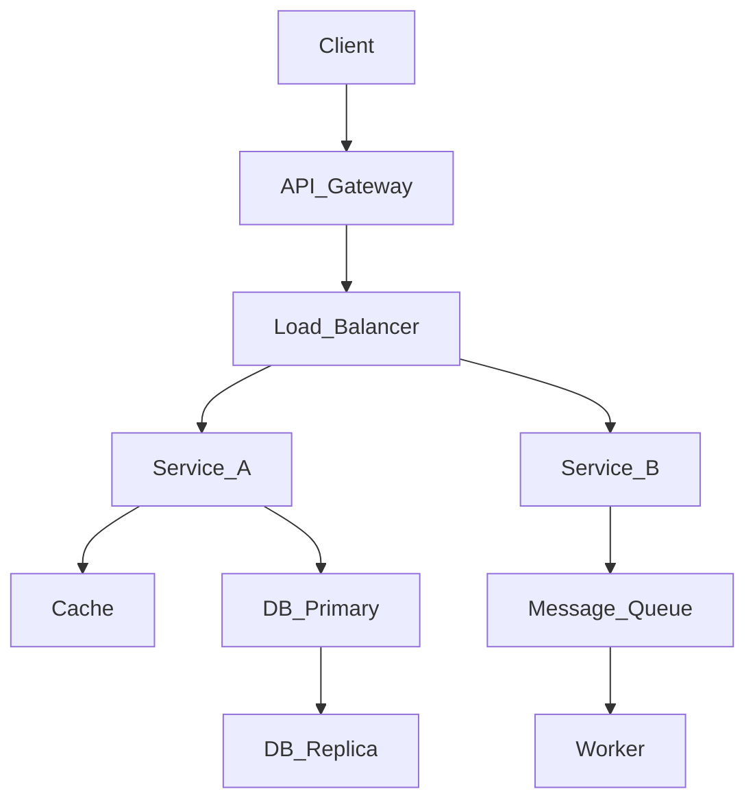

# 01 System Design Fundamentals

## 1. CAP Theorem and PACELC

### CAP Theorem
The CAP theorem states that a distributed data store can only guarantee two out of the following three:
- **Consistency (C):** Every read receives the most recent write or an error.
- **Availability (A):** Every request receives a (non-error) response, without the guarantee that it contains the most recent write.
- **Partition Tolerance (P):** The system continues to operate despite an arbitrary number of messages being dropped (or delayed) by the network between nodes.

**Why it matters:** In distributed systems, network partitions (P) are inevitable. Therefore, you must choose between Consistency (CP) and Availability (AP) during a partition.
- **CP Systems:** (e.g., HBase, MongoDB, Redis in some modes). Favor consistency. If a partition occurs, nodes may reject requests to avoid returning stale data.
- **AP Systems:** (e.g., Cassandra, DynamoDB). Favor availability. If a partition occurs, nodes will return the most recent available version of the data, which might be stale.

### PACELC Theorem
An extension to CAP that addresses normal operations (when there is no partition).
**P**artition ? **A**vailability or **C**onsistency : **E**lse ? **L**atency or **C**onsistency.
- If there is a Partition (P), trade-off between A and C.
- Else (E), trade-off between L and C.
Example: DynamoDB is PA/EL (Partition ? Availability : Else ? Latency).

## 2. Consistency Models
1. **Strong Consistency:** After a write completes, any subsequent read will return the updated value. High latency.
2. **Eventual Consistency:** If no new updates are made, eventually all accesses will return the last updated value. High availability, low latency.
3. **Causal Consistency:** Writes that are potentially causally related must be seen by all nodes in the same order.
4. **Read-Your-Writes:** A user will always see their own updates immediately.

## 3. Availability Patterns
- **Active-Active:** Traffic is distributed across multiple active nodes/regions. If one fails, others take the load.
- **Active-Passive (Primary-Replica):** One active node handles writes, passive nodes replicate data. If active fails, a passive is promoted.

## 4. System Design Interview Framework
1. **Understand the Goal & Requirements (5-7 min):**
   - Functional (What does the system do?)
   - Non-Functional (Scale, Performance, Consistency, Availability)
2. **Back-of-the-Envelope Estimation (3-5 min):**
   - QPS, Storage (per day/year), Bandwidth.
3. **High-Level Design (5-7 min):**
   - Draw core components (Client, API Gateway, Load Balancer, App Servers, Database, Cache).
4. **Deep Dive (15-20 min):**
   - Database schema, API design, scalability bottlenecks, caching, partitioning, failure modes.
5. **Trade-offs & Wrap-up (5 min):**
   - Analyze bottlenecks, single points of failure, what happens if traffic spikes 10x.

## 5. Back-of-Envelope Estimation
- **Numbers you should know:**
  - L1 cache reference: 0.5 ns
  - L2 cache reference: 7 ns
  - Main memory read: 100 ns
  - SSD random read: 150 us
  - HDD random read: 10 ms
  - Round trip within same datacenter: 500 us
  - Send packet CA to Netherlands: 150 ms
- **Math:** 1 million requests/day ~ 12 req/sec. 100 million req/day ~ 1200 req/sec.

## 6. Interview Questions & Answers
**Q: How do you handle a sudden 100x spike in traffic?**
*A:* Immediately scale out stateless app servers via Auto-scaling groups. Offload reads to CDNs and caches (Redis). Introduce message queues (SQS) to buffer writes and protect the database. If the DB is the bottleneck, enable read replicas and consider throttling/rate limiting at the API Gateway to drop non-critical requests and preserve system stability.
