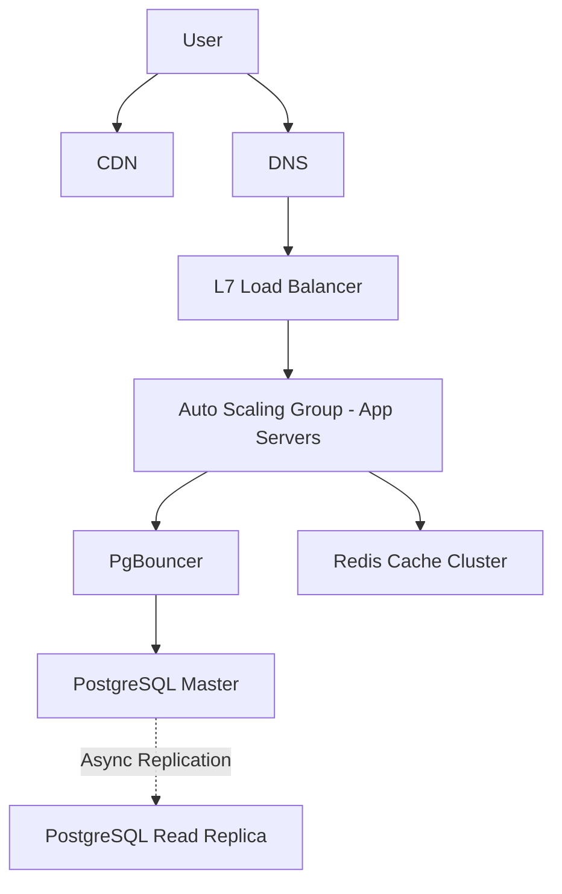

# 03 Scalability

## 1. Horizontal vs Vertical Scaling
- **Vertical Scaling (Scale-up):** Upgrading the existing server with more CPU, RAM, or faster disks.
  - *Pros:* Simple, no architecture changes, no distributed data consistency issues.
  - *Cons:* Hard limit on hardware capabilities, requires downtime to upgrade, single point of failure.
- **Horizontal Scaling (Scale-out):** Adding more servers to the resource pool.
  - *Pros:* Practically infinite scalability, built-in redundancy, zero-downtime upgrades.
  - *Cons:* Architecture must support distribution, data consistency is harder, networking overhead.

## 2. Load Balancing (L4 vs L7)
Load balancers distribute incoming traffic across multiple backend servers to prevent overload and ensure high availability.
- **Layer 4 (Transport Layer):** Routes traffic based on IP address and TCP/UDP port. Fast, low overhead, ignorant of application payload.
- **Layer 7 (Application Layer):** Routes traffic based on HTTP headers, URLs, cookies. Slower but enables smart routing (e.g., routing `/api/users` to User Service, `/api/orders` to Order Service).

## 3. Database Scaling Strategies

### Read Replicas
- Master database handles Writes, asynchronously replicates to Read Replicas.
- Replicas handle Read queries.
- *Trade-off:* Replication lag can lead to eventual consistency. If a user writes data and immediately reads it from a replica, they might see stale data.

### Database Sharding (Data Partitioning)
Splitting a single logical database across multiple physical databases.
- **Hash-based Sharding:** `server_id = hash(key) % N`. Requires consistent hashing to minimize data movement when adding/removing servers.
- **Range-based Sharding:** Shard by range (e.g., User IDs 1-1M on Shard A, 1M-2M on Shard B). Can lead to uneven data distribution (hot spots).
- **Directory-based Sharding:** A lookup service maintains a mapping of which shard holds which key. Flexible but introduces a single point of failure and latency.

### Dealing with Hot Spots
A hot spot occurs when a specific shard or key receives significantly more traffic than others (e.g., a celebrity's post).
- *Solution:* Add a cache in front of the database. For extreme cases, partition the hot key artificially (e.g., `key_1, key_2`) and scatter it across shards.

## 4. Connection Pooling
Opening a database connection is expensive (TCP handshake, authentication). A connection pool maintains a pool of open connections that applications can reuse.
- Example: PgBouncer for PostgreSQL. Limits the number of concurrent active connections to the database, queuing requests when the pool is exhausted, preventing the database from crashing under load.

## 5. Caching and CDNs
- **CDN (Content Delivery Network):** Geographically distributed network of proxy servers. Caches static assets (images, CSS, JS) closer to the user to reduce latency and origin server load.
- **Edge Computing:** Pushing compute logic to the CDN level (e.g., Cloudflare Workers).

## 6. Scaling PostgreSQL specifically
- Use connection pooling (PgBouncer).
- Tune `shared_buffers` (typically 25% of RAM).
- Use proper indexing (B-Tree, GIN, GiST) and avoid over-indexing.
- Vacuuming: Ensure Auto-vacuum is tuned to avoid transaction ID wraparound and table bloat.
- Partitioning: Native declarative partitioning (by RANGE or LIST) for time-series or large tables.
- Read replicas using Streaming Replication.

## 7. Capacity Planning & Auto-scaling
- **Metrics to monitor:** CPU, Memory, Network I/O, Disk I/O, Request Latency, Error Rates.
- **Auto-scaling:** Add/remove nodes dynamically based on metrics. Use predictive scaling for known spikes (e.g., Black Friday).

## 8. Interview Questions & Answers
**Q: You notice the database CPU is at 99%. How do you debug and scale it?**
*A:*
1. **Identify:** Check `pg_stat_statements` or slow query logs to find the offending queries.
2. **Quick Fix:** Kill long-running queries. Add missing indexes. If it's a read-heavy load, ensure queries hit read replicas or cache.
3. **Long Term:** Implement caching for hot data. Implement pagination. If write-heavy, consider batching writes, offloading non-relational data to NoSQL, or ultimately sharding the database.
