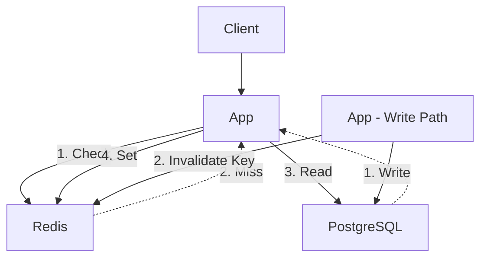

# 05 Caching

## 1. Caching Strategies

### Cache-Aside (Lazy Loading)
The application is responsible for reading and writing from storage.
- **Read:** App checks cache. If miss, app reads DB, writes to cache, returns to user.
- **Write:** App writes to DB, then invalidates or updates cache.
- *Best for:* General purpose, read-heavy workloads.
- *Failure mode:* If cache goes down, the database takes all the load (Cache Stampede).

### Read-Through
The cache sits between the application and the database. App only interacts with the cache. If cache miss, the cache provider loads it from the DB.
- *Best for:* Read-heavy workloads, simplifies application code.

### Write-Through
App writes to the cache, and the cache synchronously writes to the DB.
- *Pros:* Data is always consistent.
- *Cons:* Higher write latency because you wait for two writes to complete.

### Write-Behind (Write-Back)
App writes to the cache, and the cache *asynchronously* writes to the DB.
- *Pros:* Extreme low write latency. Handles write spikes well.
- *Cons:* Data loss if the cache crashes before syncing to the DB.

## 2. Redis Internals
Redis is an in-memory data structure store. Single-threaded event loop (uses epoll/kqueue).
- **Data Structures:** Strings, Hashes, Lists, Sets, Sorted Sets (ZSET), HyperLogLog, Bitmaps, Geospatial.
- **Persistence:**
  - **RDB (Redis Database):** Point-in-time snapshots. Compact, fast to load, but potential data loss between snapshots.
  - **AOF (Append Only File):** Logs every write operation. More durable, but slower and larger file size (though it can be rewritten/compacted).
- **Replication:** Asynchronous replication from Master to Replicas.
- **Redis Cluster:** Automatically partitions data across multiple nodes using Hash Slots (16384 total). Provides high availability and horizontal scalability.

### Redis vs Memcached
- **Memcached:** Multi-threaded, simpler, only supports simple key-value strings, no persistence.
- **Redis:** Single-threaded (historically, though multi-threaded I/O added in v6), rich data structures, persistence, Lua scripting, Pub/Sub.

## 3. Cache Eviction Policies
When cache is full, what gets removed?
- **LRU (Least Recently Used):** Removes the item that hasn't been accessed for the longest time. (Most common).
- **LFU (Least Frequently Used):** Removes the item accessed the least number of times.
- **FIFO (First In First Out).**
- **TTL (Time To Live):** Items expire after a specific time.

## 4. Cache Failure Modes

### Cache Stampede (Thundering Herd)
When a highly popular item expires from the cache, thousands of concurrent requests hit the database simultaneously to regenerate it, potentially crashing the DB.
- **Solutions:**
  - **Locking/Mutex:** Only allow one thread to regenerate the cache. Others wait.
  - **Probabilistic Early Expiration (PER):** Randomly trigger background refresh before the actual TTL expires.
  - **Stale Set:** Return stale data while regenerating in the background.

### Cache Penetration
Requests for a key that does *not* exist in the database. Cache will always miss, hitting the DB every time (e.g., malicious attack).
- **Solutions:**
  - **Cache empty/null values** with a short TTL.
  - **Bloom Filters:** A space-efficient probabilistic data structure used to test whether an element is a member of a set. Place it before the cache to block non-existent keys.

## 5. Distributed Caching and Sizing
- **Consistent Hashing:** Used to distribute keys across a cluster of cache nodes. If a node is added/removed, only `1/N` keys are remapped, minimizing cache misses.
- **Sizing:** `Total Memory = (Average Object Size) * (Number of Objects)`. Factor in Redis overhead (allocator fragmentation, replication buffers).

## 6. Interview Questions & Answers
**Q: How do you keep the cache and database consistent in a distributed system?**
*A:* True strict consistency is difficult. In a Cache-Aside pattern, always Write to DB -> Delete from Cache (not update cache). If you update the cache, concurrent writes might interleave and leave the cache permanently stale. To solve race conditions where a read populates the cache with old data just after a write deleted it, use mechanisms like Change Data Capture (CDC - e.g., Debezium tailing DB binlogs) to asynchronously push invalidations to the cache.

