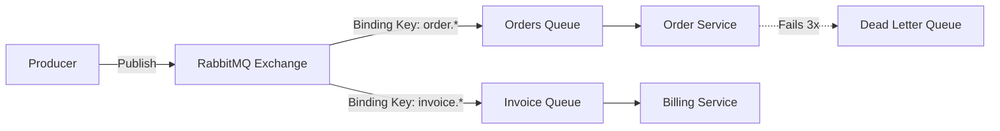

# 06 Async Messaging and Event-Driven Architecture

## 1. Message Queues vs Event Streams
- **Message Queues (RabbitMQ, SQS, ActiveMQ):**
  - Point-to-point. A message is produced, consumed by a single worker, and then deleted from the queue.
  - Excellent for task distribution (e.g., image processing, email sending).
  - Built-in retry mechanisms, Dead Letter Queues (DLQ).
- **Event Streams (Kafka, Kinesis):**
  - Pub/Sub model. Messages (events) are appended to a log.
  - Multiple consumer groups can read the same stream independently.
  - Events are persistent for a configured retention period.
  - Excellent for real-time analytics, event sourcing, auditing.

## 2. Apache Kafka Internals
- **Topics & Partitions:** A topic is split into partitions. Partitions allow Kafka to scale horizontally.
- **Ordering:** Order is *only* guaranteed within a single partition. If you need strict ordering for a user's events, partition by `user_id`.
- **Consumer Groups:** Consumers are labeled with a group ID. Each partition is read by exactly one consumer within a group. If you have 4 partitions and 4 consumers in a group, each gets 1. If you add a 5th consumer, it sits idle.
- **Offsets:** Consumers commit offsets to track what they have read.
  - *At-most-once:* Commit offset, then process. (Fast, data loss if crash).
  - *At-least-once:* Process, then commit offset. (Safe, duplicates if crash).
  - *Exactly-once:* Achieved using Kafka Transactions (Transactional outbox pattern).

## 3. RabbitMQ Internals
- **Exchanges & Queues:** Producers send messages to an Exchange. The Exchange routes messages to Queues based on bindings (Direct, Topic, Fanout, Headers).
- **AMQP Protocol:** Advanced Message Queuing Protocol.
- **Push model:** RabbitMQ pushes messages to consumers (unlike Kafka's pull model). Supports prefetch counts to control backpressure.

## 4. Backpressure
When producers are faster than consumers, queues grow indefinitely, eventually crashing the broker (OOM).
- **Solutions:**
  1. Drop messages (if acceptable, e.g., metrics).
  2. Block the producer (TCP backpressure).
  3. Scale out consumers.
  4. Spool to disk (slower, but prevents crash).

## 5. Event Sourcing & CQRS
- **Event Sourcing:** Instead of storing the current state of an entity, store a sequence of state-changing events. The current state is derived by replaying the events. Provides perfect audit logs.
- **CQRS (Command Query Responsibility Segregation):** Separate the read model from the write model.
  - Writes (Commands) go to a Write DB (e.g., Event Store).
  - Background workers process events and update Read DBs (e.g., Elasticsearch, Redis) optimized for specific queries.
  - *Trade-off:* High eventual consistency complexity.

## 6. Microservices Communication: Saga Pattern
When a business transaction spans multiple microservices, you cannot use ACID DB transactions.
- **Choreography:** Decentralized. Service A does its work, publishes `OrderCreated`. Service B listens, does its work, publishes `PaymentProcessed`.
  - *Pros:* Decoupled, no single point of failure.
  - *Cons:* Hard to track the whole flow, complex debugging.
- **Orchestration:** Centralized. An Orchestrator service tells A to do work, waits for response, then tells B to do work.
  - *Pros:* Easy to track, centralized error handling.
  - *Cons:* Orchestrator becomes a god-service, tight coupling.

## 7. Dead Letter Queues (DLQ)
If a message cannot be processed after N retries (e.g., bad payload causing a crash, or downstream API down), it is moved to a DLQ.
- Allows the main queue to continue processing.
- Engineers can inspect the DLQ, fix the bug, and replay the messages.

## 8. Interview Questions & Answers
**Q: How do you guarantee message ordering in a distributed system?**
*A:* True global ordering is highly unscalable as it requires routing everything through a single bottleneck. The solution is partial ordering. Using Kafka, you partition the topic by a logical key (e.g., `user_id` or `order_id`). Kafka guarantees strict ordering within a partition. Therefore, all events for a specific user will be processed sequentially by a single consumer thread, which is usually the required business constraint.

