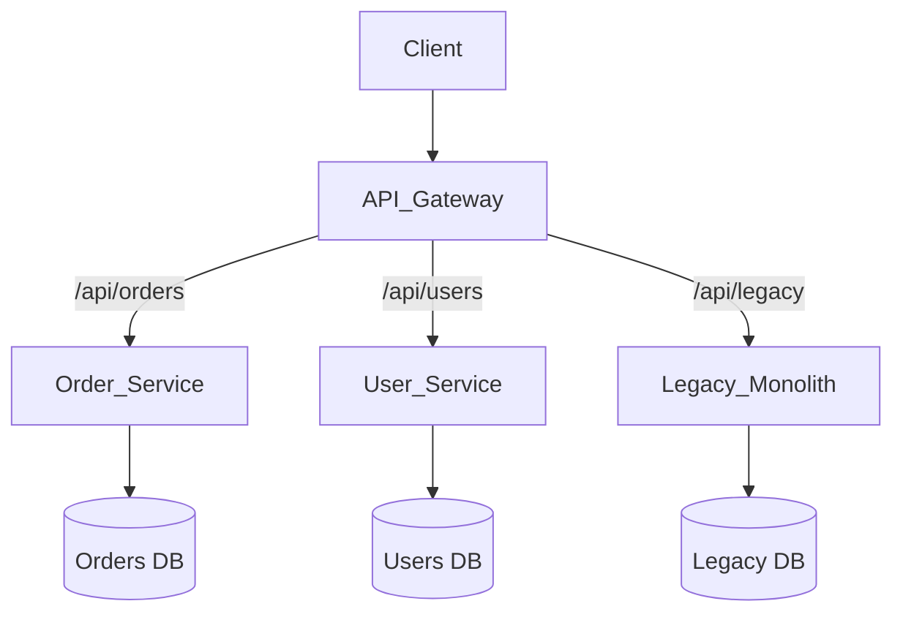

# 07 Microservices

## 1. Monolith vs Microservices
- **Monolith:** All business logic, UI, and data access in a single deployable unit.
  - *Pros:* Simple to develop, test, deploy, and debug. ACID transactions are easy.
  - *Cons:* Tight coupling, slow build/deploy times, scaling bottlenecks (must scale the whole app), technology lock-in.
- **Microservices:** A suite of small, independently deployable services organized around business capabilities.
  - *Pros:* Independent scaling, technology diversity, smaller blast radius, isolated deployments.
  - *Cons:* Distributed system complexity (networking, data consistency, debugging, deployment overhead).

## 2. API Gateway
A single entry point for all clients.
- **Functions:** Routing, composition/aggregation (fetching from multiple microservices), rate limiting, authentication/authorization, TLS termination, logging.
- **BFF (Backend for Frontend):** A specific pattern where you create tailored API Gateways for different clients (e.g., one for Web, one for Mobile) to optimize payloads.

## 3. Service Discovery
In a cloud environment, instances IP addresses change dynamically (auto-scaling, failures).
- **Client-Side Discovery:** Client queries a registry (e.g., Netflix Eureka, Consul) to get instances, then load balances.
- **Server-Side Discovery:** Client calls a load balancer, which queries the registry and routes the request.
- *Kubernetes:* Handles this natively via internal DNS and `Service` abstractions.

## 4. Service Mesh
An infrastructure layer for managing service-to-service communication.
- Examples: Istio, Linkerd.
- **How it works:** Deploys a "sidecar" proxy (e.g., Envoy) alongside every microservice instance. All inter-service traffic flows through the proxies.
- **Features:** Mutual TLS (mTLS) for security, retries, circuit breaking, distributed tracing, traffic routing (canary deployments), observability—all without changing application code.

## 5. Data Ownership & Management
- **Rule #1:** Each microservice must own its own database. Services should never share a database directly to prevent tight coupling.
- **Communication:** Services share data via APIs (Sync) or Events (Async).
- **Distributed Transactions:** Handled via the Saga pattern (covered in Async Messaging).

## 6. Distributed Tracing
Debugging a request that traverses 5 different microservices is impossible without tracing.
- **How it works:** An API Gateway generates a `Trace-ID` and passes it in HTTP headers (e.g., `X-B3-TraceId`). Every service logs this ID.
- **Spans:** Represents a single operation within a service, tied to the overall Trace-ID.
- Tools: Jaeger, Zipkin, OpenTelemetry.

## 7. Migrating from Monolith: Strangler Fig Pattern
Do not rewrite the monolith from scratch (the "Big Bang" rewrite usually fails).
1. Put an API Gateway in front of the Monolith.
2. Identify a bounded context to extract (e.g., User Profiles).
3. Build the new User Profile microservice.
4. Route traffic for `/api/profiles` to the new service at the Gateway.
5. "Strangle" the monolith slowly by extracting features one by one until the monolith can be decommissioned.

## 8. Interview Questions & Answers
**Q: How do you handle synchronous dependencies where Service A calls Service B, and B calls C?**
*A:* Deep synchronous chains (A->B->C) are anti-patterns in microservices because latency compounds and availability multiplies (if A, B, and C each have 99% uptime, the chain has ~97% uptime). To mitigate:
1. Redesign to be asynchronous (Event-driven).
2. If sync is required, use aggressive caching at A or B.
3. Use Circuit Breakers and short timeouts to prevent cascading thread pool exhaustion.
4. Flatten the architecture: Have the API Gateway orchestrate calling B and C in parallel if possible.
