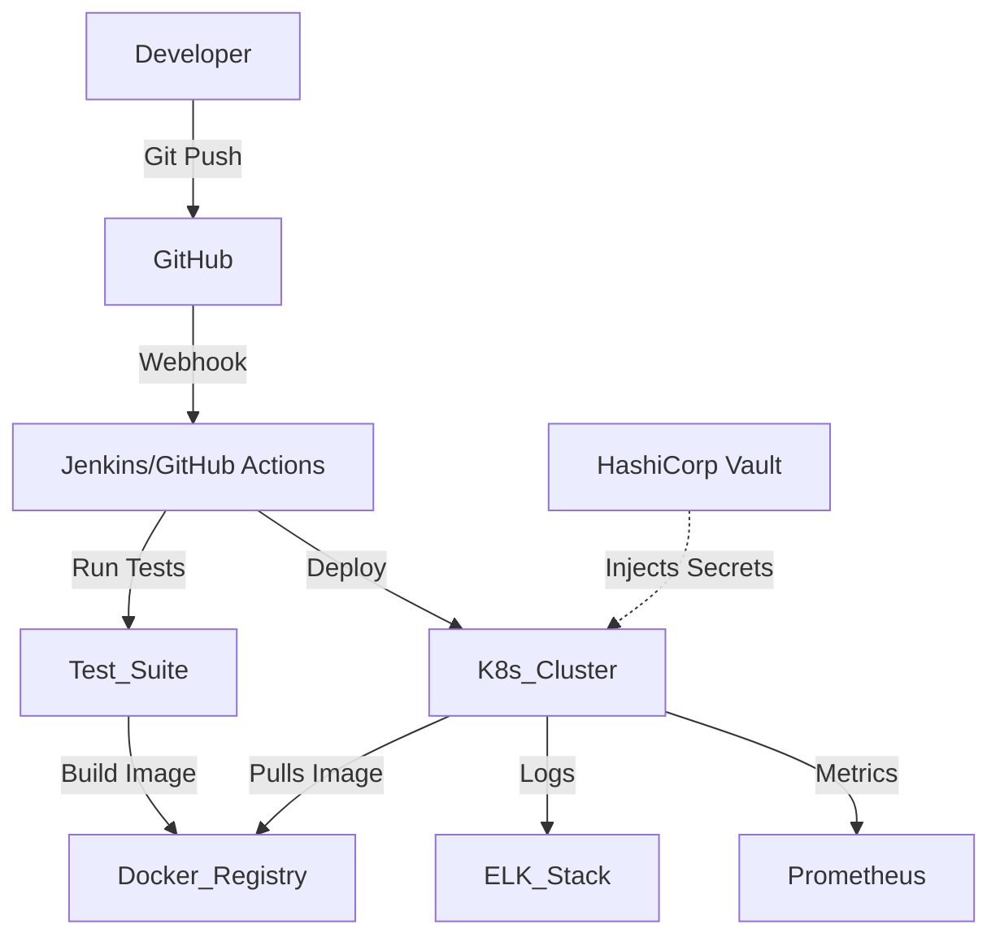

# 08 Production Architecture & Operations

## 1. The Twelve-Factor App
A methodology for building scalable SaaS applications. Key principles:
- **Codebase:** One codebase tracked in revision control, many deploys.
- **Dependencies:** Explicitly declare and isolate dependencies (e.g., Docker, requirements.txt).
- **Config:** Store config in the environment (never hardcode secrets).
- **Backing Services:** Treat databases, caches, queues as attached resources.
- **Stateless Processes:** Execute the app as one or more stateless processes. Share nothing.
- **Disposability:** Maximize robustness with fast startup and graceful shutdown.
- **Logs:** Treat logs as event streams (write to stdout, let infrastructure handle aggregation).

## 2. Configuration & Secrets Management
- **Configuration:** Should be decoupled from code. Use GitOps (e.g., ArgoCD) or tools like Consul or AWS AppConfig.
- **Secrets:** Never store passwords/API keys in code or plain config files. Use HashiCorp Vault, AWS Secrets Manager, or Kubernetes Secrets. App fetches secrets at runtime via IAM roles.

## 3. Deployment Strategies
- **Rolling Update:** Gradually replace old instances with new ones. (Standard K8s behavior).
- **Blue-Green Deployment:** Run two identical production environments. Blue is live. Deploy new version to Green, test it, then switch the router/load balancer to point to Green. Instant rollback.
- **Canary Release:** Deploy the new version to a small subset of users (e.g., 5% of traffic). Monitor error rates and latency. If healthy, gradually ramp up to 100%.

## 4. Feature Flags (Toggles)
Decouple deployment from release. Deploy code to production hidden behind a toggle.
- Allows for testing in production.
- Enables A/B testing.
- Allows instant rollback of a feature by flipping a switch without a code deploy.

## 5. Database Migration Strategies
Zero-downtime DB migrations are critical. You cannot lock a table for 10 minutes in production to add a column.
- **Expand and Contract Pattern:**
  1. Add new column (allow nulls). Deploy code that writes to both old and new columns.
  2. Run background script to backfill data to the new column.
  3. Deploy code that reads from the new column.
  4. Deploy code that drops writing to the old column.
  5. Drop the old column.

## 6. Disaster Recovery (DR)
- **RTO (Recovery Time Objective):** How long can the system be down before business suffers significantly? (e.g., "Must be back online in 1 hour").
- **RPO (Recovery Point Objective):** How much data loss is acceptable? (e.g., "Max 5 minutes of data loss").
- **Multi-Region Architecture:** Deploy across AWS `us-east-1` and `eu-west-1`. Can be Active-Passive (easier, failover via Route53) or Active-Active (complex data synchronization, CRDTs, global databases like CockroachDB/Spanner).

## 7. Production Readiness Checklist
Before any service goes to production, it must have:
1. Structured JSON logging to a central system (ELK/Datadog).
2. APM / Distributed tracing enabled.
3. Health check endpoints (`/health/liveness`, `/health/readiness`).
4. Defined SLIs/SLOs and configured alerting (PagerDuty).
5. Load testing completed.
6. Runbooks defined for common alerts.

## 8. Interview Questions & Answers
**Q: You deploy a new version of the app, and database CPU spikes to 100%, causing an outage. Walk me through your incident response.**
*A:*
1. **Mitigate immediately:** Rollback the deployment to the previous stable version using the deployment orchestrator (or flip the feature flag off) to restore service.
2. **Communicate:** Update the status page for customers and inform internal stakeholders.
3. **Investigate:** Once stable, look at APM and DB logs for the time of the incident. It's likely a missing index on a new query, an N+1 query issue introduced, or a bad migration.
4. **Fix & Prevent:** Write a fix, add tests to catch it, run an EXPLAIN plan, and conduct a post-mortem to discuss why load testing or QA didn't catch the performance regression.
