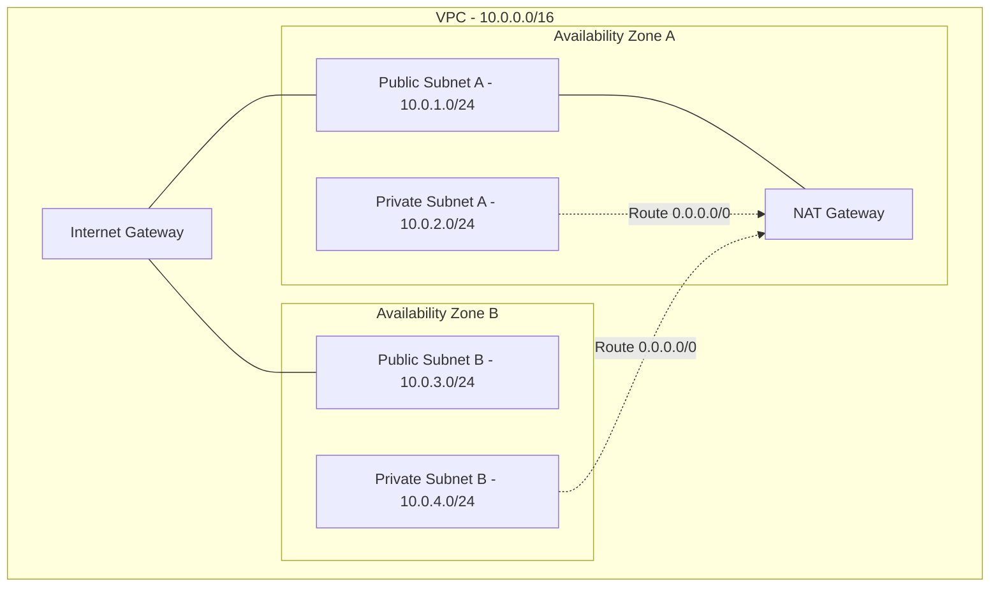

# AWS Networking for Technical Leads

## 1. VPC Deep Dive

### What it is
Amazon Virtual Private Cloud (VPC) is a logically isolated section of the AWS cloud where you launch resources in a virtual network you define.

### Core Components
*   **CIDR Block:** The IP range for the VPC (e.g., `10.0.0.0/16`).
*   **Subnets:** Divisions of the VPC CIDR block, mapped 1:1 to Availability Zones.
    *   *Public Subnet:* Has a route to an Internet Gateway (IGW).
    *   *Private Subnet:* Does not have a direct route to an IGW.
*   **Route Tables:** Rules (routes) that determine where network traffic from subnets or gateways is directed.
*   **Internet Gateway (IGW):** Allows communication between instances in your VPC and the internet.
*   **NAT Gateway:** Enables instances in a private subnet to connect to the internet (e.g., for patching) but prevents the internet from initiating connections to those instances.

### Architecture Diagram



### Terraform Example: VPC creation
```hcl
resource "aws_vpc" "main" {
  cidr_block           = "10.0.0.0/16"
  enable_dns_support   = true
  enable_dns_hostnames = true
  tags = { Name = "production-vpc" }
}

resource "aws_subnet" "private_a" {
  vpc_id            = aws_vpc.main.id
  cidr_block        = "10.0.1.0/24"
  availability_zone = "us-east-1a"
}
```

## 2. Security Groups vs NACLs

| Feature | Security Groups (SG) | Network ACLs (NACL) |
| :--- | :--- | :--- |
| **Scope** | Instance level (ENI) | Subnet level |
| **State** | Stateful (Return traffic is automatically allowed) | Stateless (Return traffic must be explicitly allowed) |
| **Rules** | Allow rules only (default deny all) | Allow and Deny rules |
| **Evaluation** | All rules evaluated before deciding | Evaluated in number order (lowest to highest) |

### When to use
*   **Security Groups:** Use as the primary firewall for your application logic (e.g., "Web servers can talk to App servers on port 8080").
*   **NACLs:** Use as an additional layer of security or for explicit blocks (e.g., "Block this specific malicious IP range at the subnet level").

## 3. VPC Connectivity

### VPC Peering
*   **What:** Connects two VPCs directly using AWS's private network.
*   **Limits:** Not transitive (A peers with B, B peers with C, A cannot talk to C). IP CIDRs cannot overlap.

### Transit Gateway (TGW)
*   **What:** A network transit hub that connects VPCs and on-premises networks.
*   **Why:** Solves the complexity of point-to-point VPC peering at scale (Hub and Spoke model). Supports transitive routing.

### VPC Endpoints (PrivateLink)
*   **What:** Enables private connections between your VPC and supported AWS services (like S3, DynamoDB, API Gateway) without requiring an IGW, NAT device, or public IP.
*   **Types:**
    *   *Gateway Endpoints:* For S3 and DynamoDB (free, modifies route tables).
    *   *Interface Endpoints:* For almost everything else (creates an ENI with a private IP, costs hourly per AZ + data processing).

## 4. Route 53 & DNS

*   **Routing Policies:**
    *   *Simple:* Standard DNS lookup.
    *   *Weighted:* Route traffic based on assigned weights (e.g., 20% to new version, 80% to old).
    *   *Latency:* Route to the region with the lowest network latency for the user.
    *   *Failover:* Active-Passive configuration with health checks.
    *   *Geolocation:* Route based on user's geographic location.

## 5. Load Balancing (ELB)

*   **Application Load Balancer (ALB):** Layer 7 (HTTP/HTTPS). Routes based on paths, headers. Supports WebSockets, gRPC. Best for web apps, microservices.
*   **Network Load Balancer (NLB):** Layer 4 (TCP/UDP). Ultra-high performance, millions of requests per second, very low latency. Provides a static IP. Best for raw TCP traffic, gaming, financial apps.

## 6. Interview Questions

**Q: You have an EC2 instance in a private subnet that needs to download files from an S3 bucket. The data transfer is massive, and you noticed high NAT Gateway data processing charges. How do you fix this?**
A: I would create a VPC Gateway Endpoint for S3 and associate it with the route table of the private subnet. Traffic to S3 will then be routed directly over the AWS private network, bypassing the NAT Gateway entirely. Gateway endpoints for S3 have no hourly charge and no data processing fees, drastically reducing costs.

**Q: Explain how you would safely expose an internal microservice running in one AWS account to a partner application in a completely different AWS account, without making the service public on the internet and without dealing with overlapping IP CIDR ranges.**
A: I would use AWS PrivateLink. In the providing account, I would create a Network Load Balancer (NLB) in front of the microservice, and then create a VPC Endpoint Service pointing to that NLB. In the consumer account, I would create a VPC Interface Endpoint connected to that endpoint service. This securely exposes the service via an ENI in the consumer's VPC without requiring VPC peering or worrying about IP overlaps.
