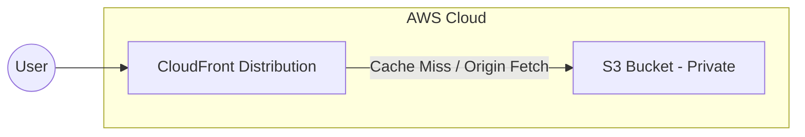

# Storage and Content Delivery: S3 and CloudFront

## 1. Amazon S3 (Simple Storage Service)

Object storage service offering industry-leading scalability, data availability, security, and performance.

### S3 Storage Classes
Choosing the right tier heavily impacts cost.
*   **S3 Standard:** For frequently accessed data. High performance, high cost.
*   **S3 Standard-Infrequent Access (IA):** For data accessed less than once a month but requires rapid access when needed. Cheaper storage, but charges a retrieval fee.
*   **S3 One Zone-IA:** Same as IA but stored in only one AZ. Lower cost, use for reproducible data.
*   **S3 Glacier Flexible Retrieval:** Archive data. Retrieval takes minutes to hours.
*   **S3 Glacier Deep Archive:** Lowest cost storage class. Retrieval takes 12-48 hours. Use for regulatory compliance backups.
*   **S3 Intelligent-Tiering:** Automatically moves objects between access tiers based on access patterns without performance impact or retrieval fees. Best when access patterns are unknown.

### Key S3 Features
*   **Versioning:** Keeps multiple variants of an object in the same bucket. Crucial for recovering from unintended user actions or application failures.
*   **Lifecycle Policies:** Rules to automatically transition objects to cheaper storage classes or expire (delete) them after a certain number of days (e.g., Move to IA after 30 days, Glacier after 90 days, delete after 365 days).
*   **Event Notifications:** Trigger notifications (to SNS, SQS, or Lambda) when objects are created, removed, or restored. Essential for event-driven processing (e.g., triggering a Lambda to resize an uploaded image).
*   **Presigned URLs:** Provide temporary access to an object. Useful for letting users download a private file directly from S3 without proxying the download through your backend servers.
*   **Multipart Upload:** Recommended for files > 100MB, required for files > 5GB. Uploads file in chunks in parallel, improving throughput and reliability.

## 2. Amazon CloudFront

A fast content delivery network (CDN) service that securely delivers data, videos, applications, and APIs to customers globally with low latency.

### CloudFront Concepts
*   **Distribution:** The CDN configuration. Gives you a `xyz.cloudfront.net` domain name.
*   **Origin:** Where CloudFront fetches the files (e.g., S3 bucket, Application Load Balancer, EC2 instance).
*   **Cache Behaviors:** Rules mapping URL paths (e.g., `/images/*`) to specific origins and cache settings.
*   **Cache Policies:** Define HTTP headers, cookies, and query strings to include in the cache key. This determines whether CloudFront returns a cached response or fetches from the origin.

### Edge Computing
*   **Lambda@Edge:** Node.js or Python functions that run in AWS edge locations in response to CloudFront events (Viewer Request, Origin Request, Origin Response, Viewer Response). Use for complex routing, authentication, or modifying headers.
*   **CloudFront Functions:** Lightweight JavaScript functions for highly latent-sensitive, simple transformations (like URL rewrites, setting security headers) at the edge. Cheaper and faster than Lambda@Edge but more restrictive.

### Static Website Hosting Architecture

*Note: Best practice is to keep the S3 bucket private and use Origin Access Control (OAC) to ensure users can only access the files via CloudFront.*

## 3. Interview Questions

**Q: You are tasked with hosting a highly trafficked static website (React frontend). Describe the architecture and how you ensure security and cost-efficiency.**
A: I would host the compiled static assets in an S3 bucket. I would configure a CloudFront distribution with the S3 bucket as its origin. To secure the bucket, I would disable all public access on S3 and configure CloudFront Origin Access Control (OAC), ensuring the bucket only accepts requests from CloudFront. For cost efficiency, CloudFront caches the assets globally, reducing the number of requests hitting S3. I would also implement cache-control headers during deployment to ensure browsers cache static assets effectively.

**Q: Users upload large video files to our platform via our API servers, causing severe network bottlenecks on our EC2 instances. How can we optimize this using AWS services?**
A: I would refactor the upload flow to use S3 Presigned URLs. When a user wants to upload a video, the client application requests a secure URL from our backend API. The API generates an S3 Presigned URL (valid for a short time) and returns it to the client. The client then uploads the video directly to S3 using that URL, completely bypassing our API servers. We can then use S3 Event Notifications to trigger a Lambda function to process the video once the direct upload is complete.
