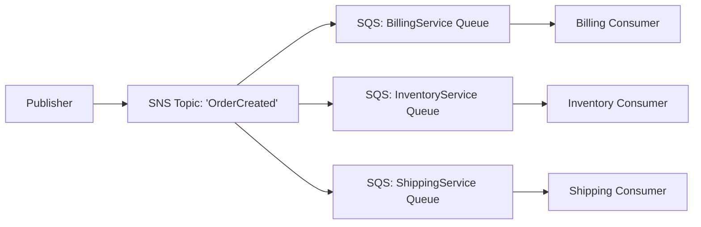

# Messaging and Event-Driven Architectures

## 1. Amazon SQS (Simple Queue Service)

Fully managed message queuing for microservices, distributed systems, and serverless applications. Pull-based.

### Queue Types
*   **Standard Queues:** Best-effort ordering, at-least-once delivery. Extremely high throughput. Can result in duplicate messages.
*   **FIFO Queues:** Exactly-once processing, strict ordering. Throughput is limited (up to 3000 msgs/sec with batching). Required when order of operations is critical (e.g., banking transactions).

### Core Concepts
*   **Visibility Timeout:** When a consumer pulls a message, the message becomes "invisible" to other consumers for a set period. If the consumer processes it successfully, they delete it. If they crash or take too long, the timeout expires, and the message becomes visible again for retries.
*   **Dead-Letter Queue (DLQ):** If a message fails to be processed after a configured number of retries (Maximum Receives), SQS moves it to a DLQ. Essential for debugging "poison pill" messages that crash the consumer.
*   **Long Polling:** Consumers wait up to 20 seconds for a message to arrive in the queue before returning an empty response. Reduces API calls and costs compared to short polling.

## 2. Amazon SNS (Simple Notification Service)

Fully managed pub/sub messaging. Push-based.

### Core Concepts
*   **Topics:** A logical access point and communication channel.
*   **Subscriptions:** Endpoints that receive messages published to a topic (e.g., SQS queues, Lambda functions, HTTP/S webhooks, Email, SMS).
*   **Message Filtering:** Subscribers can define filter policies to only receive a subset of messages published to the topic based on message attributes, reducing unnecessary processing.

### Architecture Pattern: SNS fan-out to SQS
A common pattern where a single event needs to be processed by multiple independent services.

## 3. Amazon EventBridge

A serverless event bus service that connects application data from your own apps, SaaS, and AWS services.

### Core Concepts
*   **Event Buses:** A router that receives events. (Default bus receives AWS services events, custom buses for your applications).
*   **Rules:** Match incoming events based on their payload pattern and route them to targets.
*   **Targets:** Where events are sent (Lambda, Step Functions, SQS, API Destinations).
*   **Schema Registry:** Discovers, creates, and manages OpenAPI or JSON schemas for events, allowing developers to download code bindings to easily interact with event payloads.

### EventBridge vs. SNS
*   **SNS** is simple, fast pub/sub. Filtering is basic (attributes only). Better for high-throughput, simple fan-out.
*   **EventBridge** is an enterprise service bus. It allows complex routing rules based on the *content* of the event body (JSON payload). It integrates natively with many SaaS providers and AWS services. It supports schema registries and archiving/replaying events.

## 4. Interview Questions

**Q: A microservice needs to reliably process messages from a queue, but occasionally a malformed message causes the processing logic to crash. How do you prevent this from stalling the whole system?**
A: I would configure an SQS Dead-Letter Queue (DLQ) and attach it to the main queue with a `maxReceiveCount` of, say, 3. When the service crashes while processing the malformed message, the visibility timeout will expire, and SQS will make it visible again. After 3 failed attempts, SQS will automatically move the "poison pill" message to the DLQ. The main queue can then continue processing new messages, and engineers can inspect the DLQ to debug the payload and fix the code.

**Q: Describe an event-driven architecture using AWS services for an e-commerce checkout flow.**
A: When a user completes a checkout, an API Gateway triggers a Lambda function that saves the order to DynamoDB and emits an `OrderPlaced` event to a custom EventBridge Event Bus. EventBridge rules route this event to multiple targets:
1. A rule matching the event triggers an SQS queue for the Inventory Service to reserve stock.
2. Another rule routes the event to a Step Functions workflow that orchestrates the payment processing.
3. A third rule, filtering for high-value orders, routes the event to an SNS topic that emails the customer success team.
This completely decouples the services, allowing us to add new listeners in the future without modifying the checkout service.
