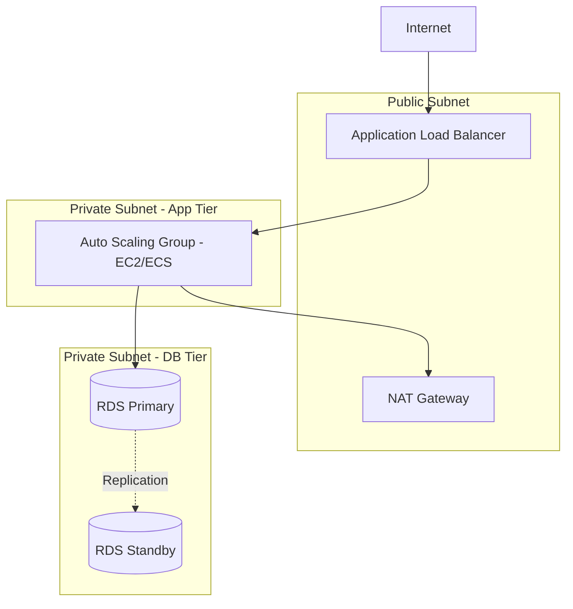
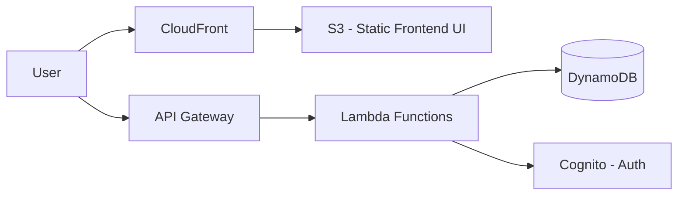

# Cloud Architecture Patterns

## 1. Classic Three-Tier Web Architecture

The foundation of traditional web applications mapped to AWS.

*   **Web Tier:** Handled by Route53, CloudFront, and ALB in public subnets.
*   **App Tier:** Compute (EC2 instances or ECS Fargate tasks) running in private subnets, managed by an Auto Scaling Group for HA.
*   **Data Tier:** RDS in private subnets with Multi-AZ enabled. Security Groups ensure RDS only accepts traffic from the App Tier's Security Group.

## 2. Serverless Web Application

Replacing managed servers with fully managed, event-driven services.

*   **Compute:** API Gateway routing requests to specific Lambda functions.
*   **Database:** DynamoDB (NoSQL) for highly scalable, millisecond latency data storage.
*   **Auth:** Amazon Cognito handles user registration and JWT token generation.
*   **Trade-offs:** Near-infinite scalability and zero server management, but potential cold start latency issues and vendor lock-in.

## 3. Event-Driven & Decoupled Architecture

Ensures high reliability by preventing cascading failures.

*   **Pattern:** Instead of Service A calling Service B synchronously via HTTP, Service A publishes an event to EventBridge or an SQS queue, and Service B consumes it asynchronously.
*   **Benefits:** If Service B goes down, Service A is unaffected. Events queue up in SQS and are processed when Service B recovers.

## 4. Multi-Account Strategy & Landing Zones

Production AWS is never a single account.

*   **AWS Control Tower:** Used to set up a "Landing Zone" – a secure, well-architected multi-account AWS environment based on best practices.
*   **Structure:**
    *   *Log Archive Account:* Immutable storage for all CloudTrail and AWS Config logs across the organization.
    *   *Security Tooling Account:* Centralizes GuardDuty, Security Hub.
    *   *Workload Accounts:* Isolated Dev, QA, and Prod accounts.
*   **Network Centralization:** Using Transit Gateway in a central Network account to inspect and route traffic between workload VPCs and on-premises networks.

## 5. Infrastructure as Code (IaC) Best Practices

Using Terraform (or CloudFormation/CDK) is mandatory for Lead roles.

*   **State Management:** Always use remote state (e.g., S3 backend with DynamoDB for state locking) to prevent race conditions during CI/CD deployments.
*   **Modularity:** Break infrastructure down into reusable Terraform modules (e.g., a standard VPC module, a standard ECS service module) to enforce company standards.
*   **Blast Radius:** Separate state files based on lifecycle. Do not put the VPC and the ECS service in the same state file. If the ECS deployment fails and corrupts state, it shouldn't affect the foundational network layer.

## 6. Interview Questions

**Q: Design a highly available, fault-tolerant image processing pipeline. Users upload raw images, and the system needs to generate thumbnails and run ML categorization.**
A: 
1. **Upload:** Users upload images directly to an S3 bucket via Presigned URLs to offload compute.
2. **Event Trigger:** S3 is configured to send an Event Notification on `ObjectCreated` to an SNS Topic.
3. **Fan-out:** Two SQS Queues subscribe to the SNS Topic: one for the Thumbnail Service and one for the ML Categorization Service.
4. **Processing:** Two separate ASGs (or Lambda pools) poll their respective SQS queues.
5. **Storage:** Processed thumbnails are saved to a separate S3 bucket. Metadata and ML tags are saved to a DynamoDB table.
6. **Resilience:** If the ML API goes down, its SQS queue simply builds up. The Thumbnail service is unaffected. Dead-Letter Queues (DLQs) catch any corrupted images that crash the workers.

**Q: Why use a Transit Gateway instead of VPC Peering?**
A: VPC Peering is non-transitive and requires establishing a 1:1 connection between every VPC. With 10 VPCs, that's 45 peering connections (full mesh). Transit Gateway acts as a central hub (Hub and Spoke model). You connect each VPC to the TGW once. It simplifies routing, allows centralized network inspection (via a firewall VPC), and scales easily to thousands of VPCs.
