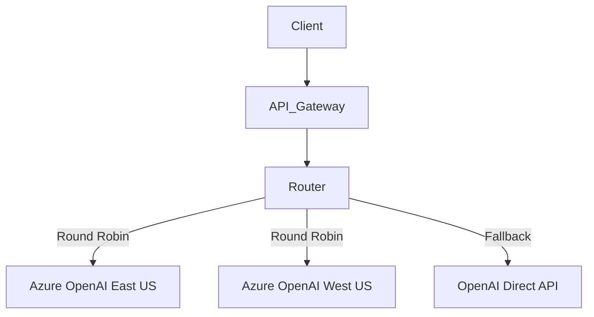

# LLM Scalability

## 1. The Bottleneck of LLMs
Unlike standard microservices, LLM inference is highly compute and memory-bound. API providers strictly limit concurrency, RPM (Requests Per Minute), and TPM (Tokens Per Minute). 
Scaling an LLM application is rarely about scaling *your* web servers; it's about scaling how you manage external API limits and throughput.

## 2. Request Queuing & Asynchronous Processing
Synchronous REST APIs fail at scale when backed by LLMs. A user request holding an HTTP connection open for 45 seconds while waiting for GPT-4 to generate text will exhaust your server's connection pool.

### The Asynchronous Pattern
1. Client sends request to API.
2. API validates, drops request into a Message Broker (RabbitMQ, Kafka, AWS SQS), and immediately returns `HTTP 202 Accepted` with a `job_id`.
3. Worker nodes pull from the queue, execute the LLM call, and store the result in a DB (Redis/Postgres).
4. Client polls the status using `job_id`, or receives the result via WebSockets/SSE.

## 3. Caching LLM Responses
The fastest and cheapest LLM call is the one you don't make.

### Exact Match Caching
Cache the exact string of the prompt to the exact response. Good for static data.
```python
import hashlib
import redis

cache = redis.Redis()

def call_llm_with_cache(prompt: str):
    prompt_hash = hashlib.sha256(prompt.encode()).hexdigest()
    if cached := cache.get(prompt_hash):
        return cached.decode()
        
    response = expensive_llm_call(prompt)
    cache.set(prompt_hash, response, ex=3600) # 1 hour TTL
    return response
```

### Semantic Caching
Users rarely ask the exact same question. "How do I reset my password?" and "I forgot my password, how to reset?" are semantically identical.
**How it works:**
1. Embed the incoming prompt using a fast embedding model.
2. Query a Vector Database (e.g., Pinecone, Redisearch) for the closest matching embedded prompt.
3. If similarity > 0.95 (threshold), return the cached response of that previous prompt.
4. If not, generate via LLM, embed the new prompt, and store the pair in the semantic cache.

## 4. Batch Processing
For offline tasks (e.g., classifying 100,000 product reviews), do not send 100,000 concurrent API requests.
- **Provider Batch APIs:** OpenAI and Anthropic offer Batch APIs where you upload a `.jsonl` file of 50,000 requests. They process it async within 24 hours at a 50% discount. 
- **Application Batching:** If you must do it synchronously, chunk the reviews into arrays of 20 and ask the LLM to process the array in one prompt. This saves massive amounts of system prompt tokens.

## 5. Horizontal Scaling Patterns (Multi-Key Routing)
To bypass rate limits across a massive user base, route requests across multiple provider accounts or cloud endpoints.



---

## Interview Questions

**Q1: We are launching a B2C LLM feature tomorrow. We expect a spike of 10,000 concurrent users at launch. Our current architecture is a monolithic Express.js app calling OpenAI synchronously. What will happen and how do we fix it?**
**A:** The Express app will crash. Node.js is single-threaded; while it handles async I/O well, keeping 10,000 open TCP connections waiting for 10-20 seconds for OpenAI will exhaust memory and connection pools. Furthermore, OpenAI will return 429 Rate Limit errors immediately.
*Immediate Fix:* Implement an asynchronous queue. Accept the request, put it in SQS/Redis, and return a "Generating..." state to the frontend.
*Scale Fix:* Implement multiple Azure OpenAI endpoints behind a round-robin load balancer to multiply our TPM/RPM limits. Introduce aggressive caching for common launch-day queries.

**Q2: Explain how Semantic Caching works and its primary trade-off.**
**A:** Semantic caching converts user queries into vector embeddings and checks a vector database for similar past queries (e.g., cosine similarity > 0.95). If a match is found, it returns the previously generated answer, bypassing the LLM completely.
*Trade-off:* The main risk is "False Positives." Two prompts might be semantically similar but require different answers. For example, "Summarize Q1 earnings for Apple" and "Summarize Q2 earnings for Apple" have incredibly high semantic similarity but require entirely different factual outputs. It must be carefully tuned, and often restricted to non-factual or highly generic tasks.
