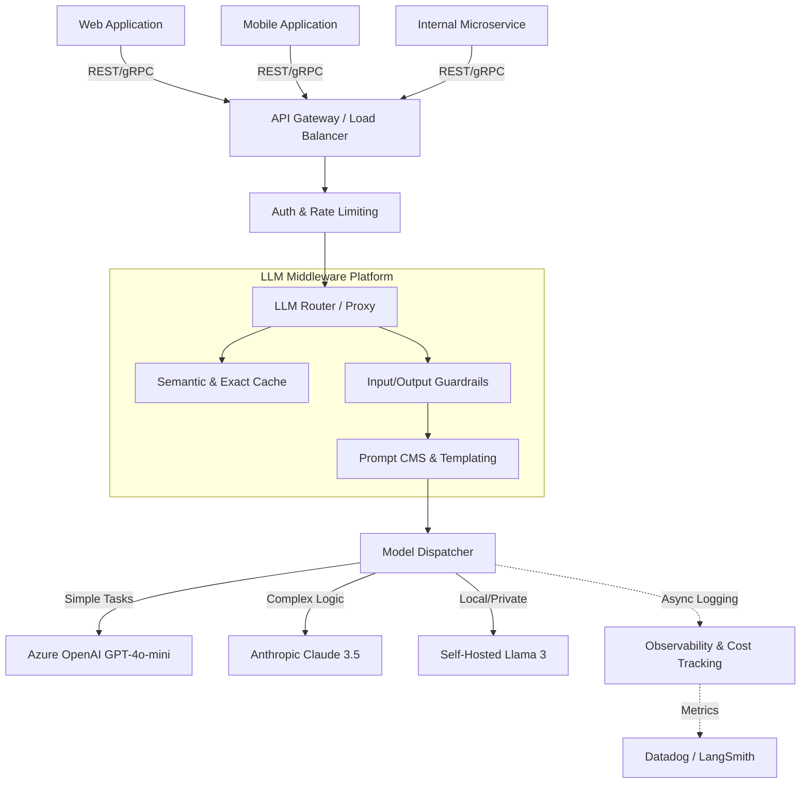

# Production LLM Platform Architecture

## 1. High-Level Architecture
A production LLM platform acts as a centralized gateway for all internal applications to consume AI capabilities. It centralizes authentication, routing, cost management, and observability.

## 2. Component Deep Dive

### A. The API Gateway & Auth
- Validates the internal service's API token.
- Enforces strict Rate Limits (TPM/RPM) per tenant or internal service.
- Handles connection pooling and circuit breakers.

### B. The LLM Router (LiteLLM / Custom Proxy)
- Standardizes the API request (e.g., everything speaks OpenAI format, even if routed to Anthropic).
- **Fallback Chains:** If OpenAI 500s, it automatically seamlessly routes to Anthropic.
- **Cost Routing:** Routes based on a `tier` or `complexity` flag.

### C. The Caching Layer (Redis)
- **Exact Cache:** Hashes the prompt. High hit rate for static reporting tasks.
- **Semantic Cache:** Uses a fast local embedding model (e.g., `all-MiniLM-L6-v2`) to check Pinecone/Redisearch for similar past prompts. Drastically cuts costs for customer support bots.

### D. Guardrails & Security
- Detects PII and masks it before leaving the VPC.
- Runs toxic content classifiers.
- Scans for Prompt Injection signatures.

### E. Prompt Registry
- Prompts are not hardcoded in the requesting applications.
- Applications request `template_id: "invoice_extraction_v2"`.
- The platform fetches the template, injects the application's variables, and forms the final string. Enables A/B testing prompts centrally.

### F. Observability & Cost Tracking
- Every request is tagged with `app_id`, `user_id`, and `prompt_version`.
- Async workers calculate exact token costs and push metrics to a time-series DB (Datadog).
- Full input/output traces are stored in a datalake for future fine-tuning and offline evaluation.

## 3. The Request Pipeline Flow
1. **App1** sends `{"user_input": "...", "template": "support_bot"}`.
2. **Router** checks **Cache**. If hit, return immediately.
3. If miss, **Guardrails** scan `user_input` for PII.
4. **PromptRegistry** builds the full prompt string.
5. **ModelDispatcher** calls Azure OpenAI (timeout 30s).
6. Azure fails (502 Bad Gateway).
7. **ModelDispatcher** triggers fallback, calls Anthropic Claude.
8. Claude succeeds.
9. **Guardrails** scan output for toxicity/hallucination.
10. **Observability** logs latency, tokens, cost, and route taken.
11. Response returned to **App1**.

---

## Interview Questions

**Q1: You are designing this centralized LLM platform for a company with 50 different microservices. Some services need to stream responses to the UI, while others process millions of background jobs. How do you handle this at the Gateway layer?**
**A:** The platform must support two distinct architectural patterns.
1. **Synchronous/Streaming API:** For user-facing chat apps, the gateway exposes HTTP endpoints supporting Server-Sent Events (SSE). The router passes the stream through directly to the client to minimize TTFT (Time to First Token).
2. **Asynchronous Queue:** For offline processing, services should not use the REST API. We expose a message queue (Kafka/SQS) topic. Services push payloads to the queue. Platform worker nodes pull from the queue, batch requests where possible to use provider Batch APIs for cost savings, and push the results to an output topic or webhook.

**Q2: In this architecture, where does RAG (Vector Database retrieval) happen? Inside the LLM Platform, or in the downstream application?**
**A:** It depends on the abstraction level, but usually, **Retrieval happens in the downstream application**, not the centralized LLM platform. 
The LLM platform's job is text-in, text-out reliability, routing, and cost management. The domain-specific microservice (e.g., the HR Bot) understands its specific vector database, embedding strategies, and access controls. The HR Bot retrieves the documents and passes them as variables into the LLM Platform's Prompt Registry. Putting domain-specific vector DBs into the core LLM gateway creates a monolithic bottleneck.
