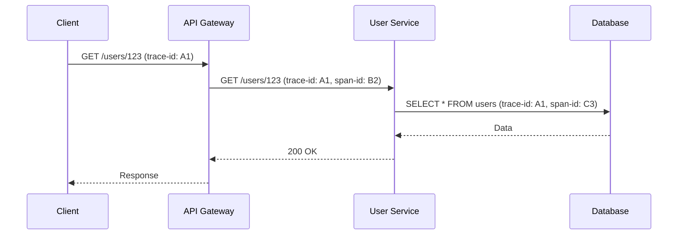

# Observability in Production

Observability goes beyond simple monitoring; it’s a property of a system that allows you to understand its internal state from its external outputs. For a Technical Lead, designing observable systems is crucial for maintaining SLA/SLOs and enabling rapid incident response.

## The Three Pillars of Observability

### 1. Logs (Event Records)
Logs are immutable records of discrete events that happened over time.

- **Structured Logging:** Moving from plain text to JSON formatted logs is critical for log aggregation and search.
  ```typescript
  // Bad: Plain text logging
  console.log(`User ${userId} failed to authenticate after ${attempts} attempts`);
  
  // Good: Structured logging (using Winston/Pino)
  logger.warn('Authentication failed', {
    userId: userId,
    attempts: attempts,
    ipAddress: req.ip,
    userAgent: req.headers['user-agent'],
    correlationId: req.headers['x-correlation-id']
  });
  ```
- **Log Aggregation:** Tools like ELK Stack (Elasticsearch, Logstash, Kibana), Splunk, Datadog, or AWS CloudWatch Logs centralize logs. 
- **Cost Management:** Logging is expensive. Use sampling for successful verbose events and retain 100% of errors.

### 2. Metrics (Aggregated Data)
Numeric representations of data measured over intervals of time.

- **Counters:** A cumulative metric that represents a single monotonically increasing counter (e.g., number of requests, errors).
- **Gauges:** A metric that represents a single numerical value that can arbitrarily go up and down (e.g., memory usage, concurrent connections).
- **Histograms/Summaries:** Measures the distribution of values, like request durations or response sizes. Crucial for calculating percentiles (p95, p99).

```python
# Prometheus Python Client Example
from prometheus_client import Counter, Histogram

REQUEST_COUNT = Counter('app_request_count', 'Total HTTP requests', ['method', 'endpoint', 'http_status'])
REQUEST_LATENCY = Histogram('app_request_latency_seconds', 'Request latency', ['endpoint'])

@REQUEST_LATENCY.labels('/api/v1/users').time()
def get_users():
    REQUEST_COUNT.labels('GET', '/api/v1/users', '200').inc()
    return fetch_users_from_db()
```

### 3. Traces (Request Lifecycle)
Distributed tracing tracks a request as it flows through a distributed system.

- **Spans:** Represents a single logical operation (e.g., database query, external API call). Contains a name, start time, and duration.
- **Traces:** A tree of spans representing a complete request.
- **Tools:** OpenTelemetry (standard), Jaeger, Zipkin, AWS X-Ray, Datadog APM.
- **Context Propagation:** Passing `trace-id` and `span-id` across HTTP headers or message queue headers (e.g., W3C Trace Context).



## SLIs, SLOs, and SLAs
- **SLI (Service Level Indicator):** A carefully measured quantitative measure of some aspect of the level of service. E.g., The proportion of HTTP GET requests to /profile that have 200 OK status and complete in < 200ms.
- **SLO (Service Level Objective):** A target value or range of values for a service level that is measured by an SLI. E.g., The SLI will be >= 99.9% over a rolling 30-day window.
- **SLA (Service Level Agreement):** An explicit or implicit contract with your users that includes consequences of meeting (or missing) the SLOs. Usually tied to business and money.

**Error Budgets:** If your SLO is 99.9%, you have an error budget of 0.1% (about 43 minutes of downtime per month). If you exhaust your error budget, feature development stops, and focus shifts entirely to reliability.

## Alerting Strategies
Alert fatigue is a real problem. Ensure alerts are actionable.
- **Symptom-based alerting:** Alert on user-facing symptoms (e.g., 5xx rate > 5%, p99 latency > 1s) rather than underlying causes (e.g., CPU > 80%).
- **Multi-channel routing:** Critical alerts via PagerDuty/OpsGenie phone calls; non-critical warnings to Slack/Teams; informational events to email or dashboards.

## Observability for LLM Workloads
LLM applications require specialized observability (LLMOps).
- **Metrics to track:** Token usage (prompt vs. completion), latency to first token (TTFT), total generation time, cost per request.
- **Tracing:** Tracking the entire chain (e.g., LangChain/LlamaIndex execution paths), including document retrieval steps in RAG, embedding generation, and the final LLM call.
- **Evaluation logs:** Logging the input prompt, retrieved context, output, and user feedback (thumbs up/down) to detect drift and hallucinations.

## Interview Questions
**Q: How would you design observability for a microservices architecture handling 10k RPS?**
*A: Emphasize distributed tracing with OpenTelemetry, injecting W3C headers at the API Gateway. Use structured JSON logging shipped via Fluentbit to an ELK stack. For metrics, deploy Prometheus scraping /metrics endpoints on services, visualizing via Grafana. To handle scale, aggressively sample traces (e.g., 5% of 200s, 100% of 500s) and drop DEBUG level logs in prod.*

**Q: Your team complains of alert fatigue from PagerDuty. How do you fix it?**
*A: Shift to SLO-based alerting. Stop alerting on infrastructure metrics (CPU/RAM) unless they are predictive of an imminent outage. Alert on burn rate of error budgets. Group and deduplicate alerts. Classify alerts: actionable (pager), informational (slack), useless (delete).*
