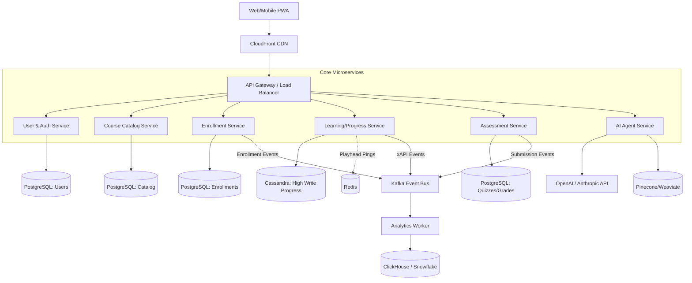

# System Design: Scalable eLearning Platform

## 1. Requirements Gathering
**Functional Requirements:**
- Role-based access (Admins, Instructors, Learners).
- Course catalog, enrollment, and content delivery (Video, PDFs).
- Assessment engine (Quizzes) with state persistence.
- Analytics and progress tracking.
- AI Tutor / Content Generation features.

**Non-Functional Requirements:**
- High availability (99.99%).
- Low latency video streaming globally.
- Eventual consistency is acceptable for analytics, but strict consistency required for enrollments/payments and quiz submissions.
- Scalable to handle traffic spikes (e.g., start of a school semester).

## 2. High-Level Architecture

## 3. Deep Dive into Specific Components

### A. Video Delivery & Transcoding Pipeline
You cannot serve static MP4 files for scale.
1. Instructor uploads raw video to S3 via pre-signed URL (bypassing backend bottlenecks).
2. S3 triggers an AWS Lambda or AWS Elemental MediaConvert job.
3. Video is transcoded into HLS (HTTP Live Streaming) format, generating multiple resolutions (1080p, 720p, 480p) and a `.m3u8` playlist file.
4. Output is saved to a public S3 bucket and cached globally via CDN.
5. The frontend video player adapts resolution seamlessly based on user bandwidth.

### B. Progress Tracking (High Throughput)
Learners generate massive amounts of telemetry (heartbeats every 10s of video playback).
- **Ingestion:** Route pings to the API Gateway -> Learning Service.
- **Buffering:** Service writes the updates to Redis (fast in-memory). 
- **Persistence:** A cron/worker flushes aggregated Redis data to the permanent database (Cassandra or PostgreSQL) every 5 minutes.
- **Event Bus:** Emit state changes ("Module Completed") to Kafka so the Analytics and Notification services can react asynchronously.

### C. AI-Powered Features (LLM Integration)
- **AI Tutor (RAG):** When a student asks a question in a course, the AI Svc queries the Vector DB for semantic matches within the specific course transcript/materials. It feeds this context to the LLM to generate an accurate, course-specific answer without hallucinations.
- **Content Generation:** Instructors input a syllabus. The LLM generates multiple-choice questions. The backend stores these in the Assessment DB.

### D. Assessment Engine Consistency
- When a user starts a quiz, create an immutable `QuizAttempt` record.
- As they answer questions, save responses individually. If they lose connection, they don't lose progress.
- Use Database Transactions (ACID) when submitting the final grade to ensure a race condition doesn't result in double-grading or missed certificates.

## 4. Scalability and Resiliency Trade-offs
- **Postgres vs NoSQL for Progress:** PostgreSQL is great, but at millions of concurrent learners, the UPDATE locking on progress rows becomes a bottleneck. Sharding Postgres or moving to a write-heavy NoSQL DB like Cassandra for progress telemetry is a necessary trade-off, sacrificing easy JOINs for write throughput.
- **Microservices vs Complexity:** The architecture above assumes massive scale. For smaller deployments, combining UserSvc, CatalogSvc, and EnrollSvc into a single monolithic API reduces network latency and operational overhead.

## 5. Interview System Design Evaluation
**Q: How do you handle sudden spikes in traffic, like a company mandating a compliance course due by 5 PM today, causing 50,000 users to log in at 4 PM?**
*A:
1. **Infrastructure:** Rely on auto-scaling groups for stateless microservices based on CPU/Request metrics.
2. **Database Protection:** Utilize connection pooling (PgBouncer) to prevent the DB from being overwhelmed by connections. Implement aggressive read-caching in Redis for the Course Catalog and metadata.
3. **Throttling/Rate Limiting:** Protect critical paths (like login or payment) at the API Gateway level.
4. **Asynchronous Processing:** Shift non-critical workloads to background queues. E.g., when a user finishes the course, generating their PDF certificate can be queued via RabbitMQ/SQS and processed later, rather than forcing the user to wait for a synchronous response.*
