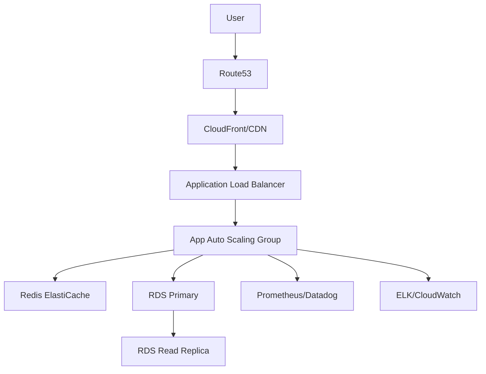

# Design: Transition an Early-Stage Platform to a Production-Ready Environment

## 1. Clarify requirements
- What does the current platform look like? (Single server, simple DB, manual deployments).
- What is the goal? (High availability, automated deployments, monitoring, security).
- Are there specific compliance requirements? (SOC2, GDPR).

## 2. Functional requirements
- Automated deployment pipeline (CI/CD).
- Zero-downtime deployments.
- Multiple environments (Dev, Staging, Prod).
- Automated database migrations.
- Centralized logging and metrics.

## 3. Non-functional requirements
- Availability: 99.9% uptime.
- Scalability: Ability to scale web tier horizontally.
- Security: Encryption at rest and in transit, secrets management.
- Observability: Alerts on error rates > 1%.

## 4. Scale assumptions
- 10k daily active users.
- Read/Write ratio: 80/20.

## 5. Traffic estimation
- ~50 requests per second (RPS) peak.
- 50 RPS is low, but the architecture must support scaling to 5000 RPS.

## 6. Storage estimation
- 100 GB per month of relational data.
- 500 GB per month of logs (retained for 30 days).

## 7. API design
N/A for infrastructure design, but assume standard REST/GraphQL endpoints with versioning.

## 8. High-level architecture

## 9. Component responsibilities
- **CDN**: Caches static assets.
- **ALB**: SSL termination, load balancing across AZs.
- **Auto Scaling Group**: Manages application instances/containers.
- **RDS**: Managed relational database with automatic backups.

## 10. Database design
Use PostgreSQL with a primary and read replica setup for high availability. Migrations run via CI/CD using tools like Liquibase or Prisma.

## 11. Caching
Redis for session management and frequent read data (e.g., user profiles).

## 12. Queues
RabbitMQ or SQS for background jobs (e.g., email sending).

## 13. Async processing
Workers consuming from SQS to process heavy tasks off the main web thread.

## 14. Failure handling
- Health checks on ALB.
- Multi-AZ RDS for automatic failover.

## 15. Retry strategy
Exponential backoff for external API calls and queue worker retries.

## 16. Idempotency
Ensure all retryable API endpoints use an Idempotency-Key.

## 17. Consistency
Read replicas have eventual consistency. Write to primary, read from primary immediately after write if strict consistency is needed.

## 18. Security
- VPC with public/private subnets. App and DB in private subnets.
- AWS Secrets Manager for env vars.
- WAF on ALB.

## 19. Observability
- OpenTelemetry for tracing.
- Structured JSON logging.
- Dashboards for RED (Rate, Errors, Duration) metrics.

## 20. Deployment
- GitHub Actions for CI/CD.
- Dockerize application.
- Use ECS/EKS or Terraform to deploy via Blue/Green deployment strategy.

## 21. Scaling
Horizontal scaling triggers on CPU > 70% or queue length.

## 22. Disaster recovery
- Daily automated snapshots of RDS.
- Infrastructure as Code (Terraform) allows recreating the environment in another region within hours.

## 23. Cost
- Start small: 2 t3.medium apps, 1 db.t3.medium Multi-AZ.
- Approximate cost: $300-$500/month for base production infra.

## 24. Trade-offs
- Managed services vs self-hosted (Cost vs Operations). Chose managed to reduce ops burden for a small team.

## 25. Alternative architecture
Serverless (AWS Lambda, DynamoDB). Trade-off: Cold starts and vendor lock-in, but lower idle costs.

## 26. Final interview answer
To transition this early-stage platform, I would introduce a 3-phase approach:
1. Containerize the application and set up CI/CD to eliminate manual errors.
2. Migrate to managed infrastructure (ALB, ECS, RDS Multi-AZ) using Terraform for reproducibility.
3. Introduce comprehensive observability (Datadog/Prometheus) to establish baseline metrics and alerts. This ensures stability, security, and scalability while keeping operational overhead low.
