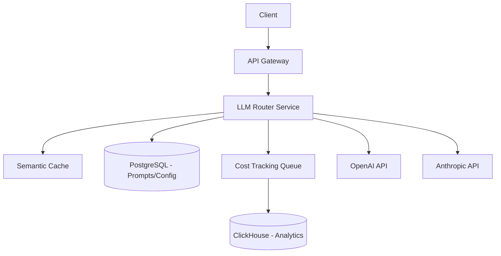

# Design: LLM Generation Platform

## 1. Clarify requirements
- Core features: Multi-provider routing (OpenAI, Anthropic), prompt versioning, strict JSON outputs, cost tracking.
- Users: Internal developers and external API consumers.

## 2. Functional requirements
- Execute prompts against multiple LLMs.
- Enforce schema for structured outputs.
- Track token usage and costs per tenant/user.
- Version prompts and allow A/B testing.

## 3. Non-functional requirements
- Low latency overhead (< 50ms internal latency).
- High reliability (automatic fallbacks if OpenAI goes down).
- Secure API key management.

## 4. Scale assumptions
- 1 Million requests per day.
- Average 1000 input tokens, 500 output tokens.

## 5. Traffic estimation
- ~12 RPS average, ~50 RPS peak.

## 6. Storage estimation
- 1M requests/day * 5KB metadata = 5GB/day = 1.5TB/year.

## 7. API design
```typescript
POST /v1/completions
{
  "prompt_id": "summarize_v2",
  "variables": {"text": "..."},
  "tenant_id": "org_123"
}
```

## 8. High-level architecture



## 9. Component responsibilities
- **LLM Router**: Fetches prompt, applies variables, selects provider, executes, validates schema.
- **Semantic Cache**: Returns cached responses for similar queries.
- **Cost Tracker**: Async worker aggregating token usage.

## 10. Database design
- PostgreSQL: `prompts`, `prompt_versions`, `api_keys`, `tenants`.
- ClickHouse: `llm_requests` (tenant_id, model, input_tokens, output_tokens, cost, latency, timestamp).

## 11. Caching
Redis for prompt templates and rate limiting. GPTCache/Redis for semantic caching.

## 12. Queues
Kafka/Redpanda for streaming request logs to ClickHouse without blocking the main request path.

## 13. Async processing
Cost calculation and log aggregation are purely asynchronous to maintain low latency.

## 14. Failure handling
- Circuit breakers on provider APIs.
- Fallback chain: If GPT-4 fails, fallback to Claude 3.5 Sonnet.

## 15. Retry strategy
Retry with exponential backoff on HTTP 429 (Rate Limit) or 503.

## 16. Idempotency
Provide an `idempotency_key` in the request header to prevent duplicate generations on client retries.

## 17. Consistency
Eventual consistency for analytics/billing. Strong consistency for prompt version updates.

## 18. Security
- Encrypt provider API keys at rest using AWS KMS.
- Tenant isolation on requests.

## 19. Observability
- Trace every request (input, output, provider, latency, token count).
- Use LangSmith or custom OpenTelemetry spans.

## 20. Deployment
Kubernetes/ECS for the Router Service. ClickHouse Cloud for analytics.

## 21. Scaling
Stateless Router services can scale horizontally effortlessly based on CPU usage.

## 22. Disaster recovery
Multi-region deployment of the Router. If us-east-1 goes down, traffic routes to us-west-2.

## 23. Cost
- Infrastructure is cheap (few compute nodes).
- LLM API costs dominate. The system aims to *reduce* this via caching and routing to cheaper models for simple tasks.

## 24. Trade-offs
- Self-hosted router vs. using a managed tool like Portkey/LiteLLM. Self-hosting gives more control over data privacy and custom billing.

## 25. Alternative architecture
Use a library-based approach instead of a network proxy (e.g., embedding LiteLLM directly in apps). Trade-off: Harder to enforce central policies and tracking.

## 26. Final interview answer
This LLM Platform acts as an intelligent gateway. Its core value proposition is abstracting provider complexity, ensuring reliability via fallbacks, and strictly enforcing output schemas using tools like Instructor/Zod. By offloading token tracking to an async Kafka pipeline into ClickHouse, we ensure the critical path remains fast, providing sub-50ms overhead while delivering rich cost observability.
