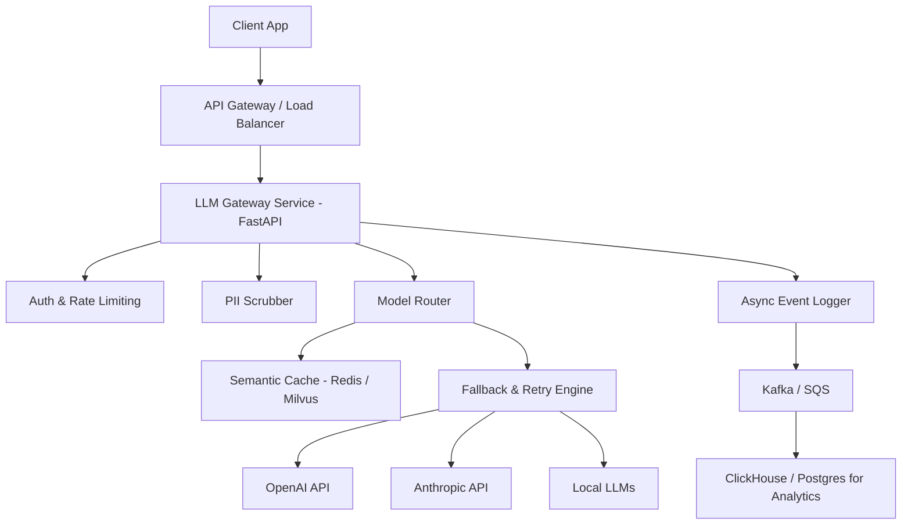

# Design: Multi-Provider LLM Gateway

## 1. Clarify Requirements
**Candidate**: "Before we dive in, let me clarify the main goals of this Multi-Provider LLM Gateway. Who are the primary users? Are we building this for internal services or as a public SaaS?"
**Interviewer**: "Internal services across our organization."
**Candidate**: "What scale are we looking at? The prompt says 10K-100K daily requests."
**Interviewer**: "Correct."
**Candidate**: "What are the primary challenges we want to solve?"
**Interviewer**: "Cost optimization, provider outages, and keeping observability unified."

## 2. Functional Requirements
- Accept requests in a unified format (e.g., OpenAI compatible API).
- Route requests to different LLM providers (OpenAI, Anthropic, Gemini, local models) based on configuration, cost, or availability.
- Automatic failover if a primary provider goes down or rate limits us.
- Semantic caching to serve repeated or similar queries instantly without hitting the LLM.
- Track usage and token costs per application/team.
- Stream responses back to the client.
- Support for PII filtering before sending data to third-party providers.

## 3. Non-Functional Requirements
- **High Availability**: The gateway must be highly available (99.99% uptime), even if providers fail.
- **Low Latency**: The gateway itself should add negligible latency (<20ms overhead).
- **Scalability**: Must handle bursts of traffic.
- **Security**: Secure storage of provider API keys, prevent leaking keys to users.
- **Observability**: Detailed metrics on token usage, latency, error rates, and costs.

## 4. Scale Assumptions
- **Daily Requests**: 100,000 requests/day.
- **Average Tokens**: 500 tokens input, 500 tokens output per request.
- **Peak TPS**: ~10 requests/second on average, but let's design for bursts up to 100 RPS.
- **Data per request**: ~1KB input, ~1KB output.

## 5. Traffic Estimation
- **Requests**: 100,000 / 86400 ≈ 1.15 RPS avg. Peak: 10-20 RPS.
- **Bandwidth**: 20 RPS * 2KB = 40 KB/s (very low, network is not a bottleneck).

## 6. Storage Estimation
- Need to store metadata for observability and billing:
  - 100K requests/day.
  - Each log entry ~1KB.
  - 100MB/day -> 3GB/month -> 36GB/year.
  - Easily fits in standard relational database or timeseries DB.
- Semantic Cache:
  - Vector embeddings for 100K requests/day. 1536 dims = 6KB per embedding.
  - 600MB/day in vector DB. Can configure TTL (e.g., 7 days) to limit size.

## 7. API Design
```typescript
interface ChatCompletionRequest {
  model: string; // e.g., "router-best-quality", "router-lowest-cost"
  messages: Array<{ role: string; content: string }>;
  temperature?: number;
  stream?: boolean;
  metadata?: {
    appId: string;
    userId: string;
  };
}

interface ChatCompletionResponse {
  id: string;
  choices: Array<{
    message: { role: string; content: string };
    finish_reason: string;
  }>;
  usage: {
    prompt_tokens: number;
    completion_tokens: number;
    total_tokens: number;
    cost_usd: number;
  };
  provider: string; // which actual provider served this
}
```

## 8. High-Level Architecture


## 9. Component Responsibilities
- **API Gateway**: Handles SSL termination and basic rate limiting per app.
- **Auth & Rate Limiting**: Validates internal App IDs.
- **PII Scrubber**: Presidio or similar tool to mask names, SSNs before leaving the network.
- **Semantic Cache**: Checks if a highly similar query was asked recently.
- **Model Router**: Decides which provider to hit based on the virtual "model" requested (e.g., cost vs quality).
- **Fallback Engine**: If OpenAI throws 429, seamlessly retries Anthropic.
- **Async Logger**: Fires off usage metrics without blocking the response.

## 10. Database Design
```sql
CREATE TABLE applications (
    app_id UUID PRIMARY KEY,
    name VARCHAR(255),
    budget_limit_usd DECIMAL(10,2)
);

CREATE TABLE llm_requests (
    request_id UUID PRIMARY KEY,
    app_id UUID REFERENCES applications(app_id),
    requested_model VARCHAR(50),
    actual_provider VARCHAR(50),
    actual_model VARCHAR(50),
    prompt_tokens INT,
    completion_tokens INT,
    cost_usd DECIMAL(10,6),
    latency_ms INT,
    status VARCHAR(20),
    created_at TIMESTAMP DEFAULT CURRENT_TIMESTAMP
);

CREATE INDEX idx_app_time ON llm_requests(app_id, created_at);
```

## 11. Caching (Semantic Caching)
Instead of exact text match (which rarely hits for LLMs), we use an embedding-based cache.
- Extract user prompt.
- Generate fast embedding (e.g., using lightweight local model like `all-MiniLM-L6-v2`).
- Query Vector DB (Redis/Milvus) for similarity > 0.95.
- If hit, return cached response. If miss, proceed to LLM and store result asynchronously.

## 12. Queues
For analytics and logging, we don't write to Postgres synchronously.
- We push a payload to an SQS queue or Kafka topic.
- A background worker consumes this and bulk-inserts into Postgres/ClickHouse.

## 13. Async Processing
Logging, Cache updating, and PII un-masking (on the response side) are done asynchronously to keep streaming latency low.

## 14. Failure Handling
- **Provider Outages**: Circuit breaker pattern. If OpenAI fails 5 times in 1 minute, open circuit and route all traffic to Anthropic immediately.
- **Timeout Cascades**: Enforce strict timeouts (e.g., 30s) on API calls so the gateway doesn't run out of threads/connections.

## 15. Retry Strategy
- Use Exponential Backoff with Jitter for 429 (Rate Limit) errors.
- For 500/503 errors, retry immediately on a *different* provider.

## 16. Idempotency
Clients should send an `Idempotency-Key` header. If a request times out on the client side, they can safely retry without incurring double token costs if the gateway already processed it.

## 17. Consistency
Eventual consistency is fine for cost tracking. If an app exceeds its budget, it might successfully make a few extra requests before the cache/DB updates and blocks them.

## 18. Security
- API keys for providers are stored in AWS Secrets Manager, injected as environment variables.
- PII filtering:
```python
# PII filtering example
from presidio_analyzer import AnalyzerEngine
from presidio_anonymizer import AnonymizerEngine

def scrub_pii(text):
    analyzer = AnalyzerEngine()
    anonymizer = AnonymizerEngine()
    results = analyzer.analyze(text=text, language='en')
    return anonymizer.anonymize(text=text, analyzer_results=results).text
```

## 19. Observability
- Integration with Langfuse or Datadog LLM Observability.
- Dashboard showing: Cost per app, Cache hit rate, Latency percentiles per provider, Error rates.

## 20. Deployment
- Deployed as Docker containers on Kubernetes (EKS) or AWS Fargate.
- Horizontal Pod Autoscaler (HPA) based on CPU and concurrent connections.

## 21. Scaling
- 100K/day is very small. A single fast container could handle it. 
- For High Availability, run 3 replicas across different Availability Zones.

## 22. Disaster Recovery
- Keep multiple regions or alternative providers configured. If AWS us-east-1 is down, failover to us-west-2 or switch from AWS Bedrock to direct Anthropic API.

## 23. Cost Optimization
- **Routing**: If task is "summarize", route to `gpt-4o-mini` or `haiku` (cheaper). If task is "complex reasoning", route to `gpt-4o` or `sonnet-3.5`.
- **Caching**: Saves 100% of the LLM cost on a hit.

## 24. Trade-offs
- **Semantic Caching vs Latency**: Generating an embedding takes ~10-50ms. It adds latency to misses, but saves huge time on hits. We only enable it for generic Q&A.
- **Unified API vs Provider Features**: Normalizing the API means losing some provider-specific features (e.g., Anthropic's specific prompt caching mechanics), though we can pass them as raw kwargs if needed.

## 25. Alternative Architecture
- **Using LiteLLM**: Instead of building from scratch, use an open-source gateway like LiteLLM proxy, which handles 90% of this (routing, fallbacks, cost tracking) out of the box.

## 26. Final Interview Answer
"In summary, we've designed a resilient, multi-provider LLM gateway that optimizes for cost via model routing and semantic caching, ensures high availability via automated fallbacks, and maintains strict security with PII scrubbing. By treating LLM providers as interchangeable commodities, the organization is protected from vendor lock-in and provider outages, while getting fine-grained visibility into token usage and costs."
