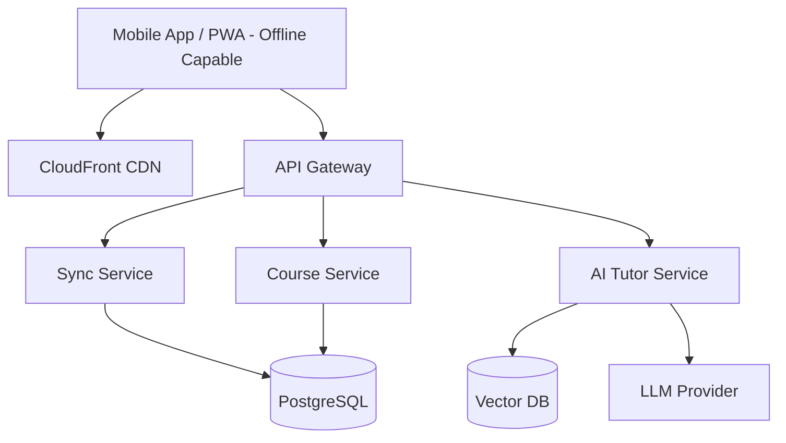

# Design: AI-Powered eLearning Platform

## 1. Clarify Requirements
**Candidate**: "Let's align on the goals for Palladium's eLearning platform. Who are the users?"
**Interviewer**: "Stakeholders in 90+ countries learning about development finance."
**Candidate**: "Key features?"
**Interviewer**: "Course delivery, AI tutoring, assessments, multi-language, and offline capability."

## 2. Functional Requirements
- **CMS**: Create and manage SCORM-compliant courses.
- **Course Delivery**: Video, text, interactive modules.
- **AI Tutor**: RAG-based LLM bot to answer questions based on course material.
- **Offline Access**: Download courses, sync progress when back online.
- **Multi-language**: Dynamic translation or localized content delivery.
- **Analytics**: Track progress, completion rates, assessment scores.

## 3. Non-Functional Requirements
- **Global Latency**: Fast access across 90+ countries (requires CDN).
- **Resilience**: Handle poor network connectivity.
- **Scalability**: Support spikes during major training rollouts.
- **Compliance**: GDPR, local data sovereignty where applicable.

## 4. Scale Assumptions
- **Users**: 50,000 active learners.
- **Daily Active Users (DAU)**: 10,000.
- **Courses**: 500 modules.
- **Storage**: ~5TB for video and assets.

## 5. Traffic Estimation
- **API RPS**: ~50 RPS average.
- **CDN Bandwidth**: Video streaming can take GBs; heavily offloaded to CDN.

## 6. Storage Estimation
- User profiles & progress: PostgreSQL (negligible size, <10GB).
- Course Videos/Assets: S3 (5TB).
- Vector Embeddings for AI Tutor: pgvector or Pinecone (10GB).

## 7. API Design
```typescript
// Progress tracking
interface SyncProgressRequest {
  userId: string;
  courseId: string;
  moduleId: string;
  status: 'STARTED' | 'COMPLETED';
  score?: number;
  offlineTimestamp: string;
}

// AI Tutor Request
interface TutorRequest {
  courseId: string;
  query: string;
  history: ChatMessage[];
}
```

## 8. High-Level Architecture


## 9. Component Responsibilities
- **PWA/Mobile App**: Caches content via Service Workers, stores progress in IndexedDB/SQLite.
- **Sync Service**: Reconciles offline progress with the cloud DB.
- **AI Tutor Service**: Uses Retrieval-Augmented Generation (RAG). Fetches relevant course transcripts from VectorDB to answer questions.

## 10. Database Design
```sql
CREATE TABLE users (id UUID PRIMARY KEY, name VARCHAR, region VARCHAR);
CREATE TABLE courses (id UUID PRIMARY KEY, title VARCHAR, content_url VARCHAR);
CREATE TABLE progress (
    user_id UUID, 
    course_id UUID, 
    status VARCHAR, 
    synced_at TIMESTAMP,
    PRIMARY KEY(user_id, course_id)
);
```

## 11. Caching
- **CDN**: CloudFront caches all static assets (videos, SCORM packages) close to edge locations in Africa, Asia, etc.
- **Redis**: Caches course metadata and user session states to reduce DB load.

## 12. Queues
- Video processing (transcoding to different bitrates) happens async via SQS and AWS MediaConvert.

## 13. Async Processing
- Generating localized transcripts for AI Tutor.
- Syncing offline progress resolving conflicts (last-write-wins based on device timestamp).

## 14. Failure Handling
- If LLM tutor fails, gracefully degrade to "Tutor is currently resting, please check the FAQ."

## 15. Retry Strategy
- PWA uses exponential backoff to retry syncing progress when network fluctuates.

## 16. Idempotency
- Sync endpoints use a unique `sync_event_id` generated by the device to ensure progress isn't double-counted.

## 17. Consistency
- Progress syncing is eventually consistent. Learner dashboard updates immediately locally, syncs to cloud in background.

## 18. Security
- JWT for authentication.
- Row-level security to ensure users only see their own progress.

## 19. Observability
- Track which course modules have the highest drop-off rate.
- Monitor AI Tutor hallucination rate via user feedback (thumbs up/down).

## 20. Deployment
- Backend: ECS/Fargate. Database: Aurora Postgres (Multi-AZ).

## 21. Scaling
- Autoscaling based on CPU utilization. Read replicas for Postgres to handle heavy dashboard analytics reads.

## 22. Disaster Recovery
- Cross-region backups for DB. S3 versioning for course files.

## 23. Cost
- Heavy reliance on CDN to reduce egress costs.
- Use cheaper LLM models (e.g., Haiku) for basic tutoring.

## 24. Trade-offs
- **Offline Sync Complexity**: Building full offline support with conflict resolution is complex. We chose a simple last-write-wins by timestamp.

## 25. Alternative Architecture
- Using an off-the-shelf LMS (like Moodle) and just building the AI Tutor as an LTI (Learning Tools Interoperability) plugin. Saves time but less flexible.

## 26. Final Interview Answer
"This design prioritizes global accessibility through a CDN and offline-first PWA, crucial for development finance stakeholders in low-bandwidth regions. The AI Tutor leverages RAG to provide contextual help, while the robust sync engine ensures learning progress is never lost."
