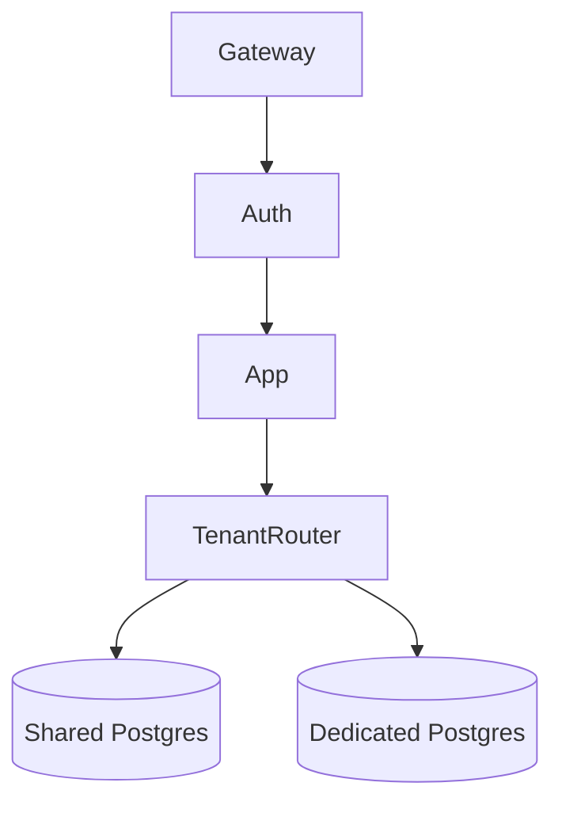

# Design: Multi-Tenant SaaS Platform

## 1. Clarify Requirements
**Candidate**: "What scale of multi-tenancy? How many tenants?"
**Interviewer**: "Thousands of small businesses, a few large enterprises."
**Candidate**: "Do enterprises need strict data isolation?"
**Interviewer**: "Yes, some require dedicated databases."

## 2. Functional Requirements
- Tenant onboarding.
- Feature flagging per tenant.
- Custom branding.
- Data isolation.

## 3. Non-Functional Requirements
- Performance isolation (noisy neighbor protection).
- Secure data boundaries.

## 4. Scale Assumptions
- 10,000 tenants.
- 100 users per tenant average.

## 5. Traffic Estimation
- 1M daily active users. 100 RPS.

## 6. Storage Estimation
- 1TB total, mostly shared, some dedicated.

## 7. API Design
Tenant ID must be passed in headers or derived from JWT.
```typescript
// tenantId derived from auth middleware
app.get('/api/data', (req, res) => { ... });
```

## 8. High-Level Architecture


## 9. Component Responsibilities
- **Tenant Router**: Looks up DB connection string based on Tenant ID.

## 10. Database Design
- **Pool 1**: Shared DB with Row-Level Security (RLS).
- **Pool 2**: Dedicated DBs.

```sql
ALTER TABLE data ENABLE ROW LEVEL SECURITY;
CREATE POLICY tenant_isolation ON data USING (tenant_id = current_setting('app.current_tenant')::uuid);
```

## 11. Caching
Prefix cache keys with tenant ID: `tenant_123:users_list`.

## 12. Queues
Multi-tenant queues: ensure fair processing so one tenant doesn't block others (Fair Queuing).

## 13. Async Processing
Background reports scoped by tenant.

## 14. Failure Handling
Tenant-level circuit breakers.

## 15. Retry Strategy
Standard retries.

## 16. Idempotency
Standard.

## 17. Consistency
Strong consistency within a tenant.

## 18. Security
RLS is the primary defense in the shared pool.

## 19. Observability
Metrics tagged by `tenant_id`.

## 20. Deployment
Standard.

## 21. Scaling
Move heavy tenants to dedicated infrastructure.

## 22. Disaster Recovery
Point-in-time recovery for shared DB.

## 23. Cost
Shared pool is highly cost-effective. Dedicated DBs are charged a premium.

## 24. Trade-offs
Schema-per-tenant vs Row-level. Schema is hard to migrate for 10K tenants. RLS is better for shared.

## 25. Alternative Architecture
Silo model for everything (too expensive).

## 26. Final Answer
"We use a hybrid approach: pooled RLS for small tenants and dedicated DBs for enterprise, balancing cost and isolation."
