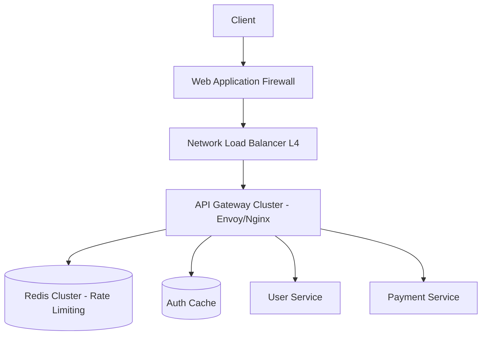

# Design: High-Scale API Gateway Handling 10K+ RPS

## 1. Clarify Requirements
**Candidate**: "What specific traffic patterns are we expecting? Is it consistent 10K RPS or extremely bursty?"
**Interviewer**: "It can burst up to 50K RPS during marketing events."
**Candidate**: "Are we terminating TLS at the gateway? Do we need to handle authentication and rate limiting?"
**Interviewer**: "Yes, TLS termination, API key validation, JWT validation, and per-user rate limiting."

## 2. Functional Requirements
- Accept incoming API requests.
- Terminate TLS/SSL.
- Authenticate requests via JWT or API Keys.
- Route requests to appropriate downstream microservices.
- Enforce rate limits per API key or user ID.

## 3. Non-Functional Requirements
- **Latency**: Must add <10ms to the request.
- **Availability**: 99.999% uptime (highly critical component).
- **Scalability**: Seamlessly scale from 10K to 50K RPS.
- **Security**: Prevent DDoS, invalid payloads, and unauthorized access.

## 4. Scale Assumptions
- **Avg RPS**: 10,000.
- **Peak RPS**: 50,000.
- **Payload size**: ~2KB avg.
- **Bandwidth**: 50K * 2KB = 100 MB/s peak.

## 5. Traffic Estimation
- See above. Network cards must support high packet rates.

## 6. Storage Estimation
- Gateway itself is largely stateless.
- Rate limiting data in Redis (ephemeral).
- Logging: 50K RPS * 1KB log size = 50 MB/s -> 4.3 TB/day. Needs aggressive sampling or fast storage (Kafka -> ClickHouse).

## 7. API Design
Internal routing configuration (Control Plane):
```yaml
routes:
  - path: /api/v1/users
    backend: user-service.internal:8080
    auth: jwt
    rate_limit:
      requests: 100
      window: 1m
```

## 8. High-Level Architecture


## 9. Component Responsibilities
- **WAF**: Blocks SQLi, XSS, and geographic blocks.
- **NLB**: Distributes TCP connections evenly across Gateway nodes.
- **API Gateway**: Envoy or Nginx handling L7 routing, JWT validation, and Redis calls for rate limiting.

## 10. Database Design
Stateless component, but uses Redis for counters.
Key format: `ratelimit:{user_id}:{endpoint}`.

## 11. Caching
- Cache public keys (JWKS) for JWT validation locally in memory (TTL 1 hour).
- Cache API key hashes in memory or fast local Redis to avoid hitting a persistent DB on every request.

## 12. Queues
Logs are sent asynchronously over UDP or via sidecar to Kafka to avoid blocking the main event loop.

## 13. Async Processing
Logging and metrics aggregation.

## 14. Failure Handling
- **Circuit Breakers**: If `Payment Service` fails 50% of requests, trip circuit breaker and return 503 immediately to save Gateway resources.

## 15. Retry Strategy
Gateway should NOT retry POST requests automatically (lack of idempotency). Only retry idempotent GETs with exponential backoff.

## 16. Idempotency
Enforce `Idempotency-Key` headers for critical downstream endpoints.

## 17. Consistency
Rate limiting can use eventual consistency (e.g., Redis async replication) to prefer speed over strict limits.

## 18. Security
Strict TLS 1.3, mTLS to downstream services.

## 19. Observability
Prometheus metrics for HTTP 4xx, 5xx, latency histograms. Distributed tracing headers (OpenTelemetry) injected and passed downstream.

## 20. Deployment
DaemonSet on Kubernetes (one per node) to reduce network hops, or dedicated ASG in AWS.

## 21. Scaling
Autoscale based on CPU utilization and active connections.

## 22. Disaster Recovery
Multi-region active-active deployment using Route 53 latency-based routing.

## 23. Cost
Major costs are NLB bandwidth and Redis cluster. Optimize Redis by using local memory counters that sync to Redis periodically (sliding window sync).

## 24. Trade-offs
- **Token Bucket vs Sliding Window**: Sliding window is more accurate but memory intensive. Token bucket is fast and uses O(1) memory per user.

## 25. Alternative Architecture
AWS API Gateway + WAF. Managed service, zero maintenance, but higher cost at 50K RPS compared to custom Envoy on EC2.

## 26. Final Answer
"An Envoy-based API gateway behind an L4 NLB provides the low latency required. Utilizing a token bucket algorithm in Redis ensures fast rate limiting, while local caching of JWKS prevents external auth bottlenecks at 50K RPS."
