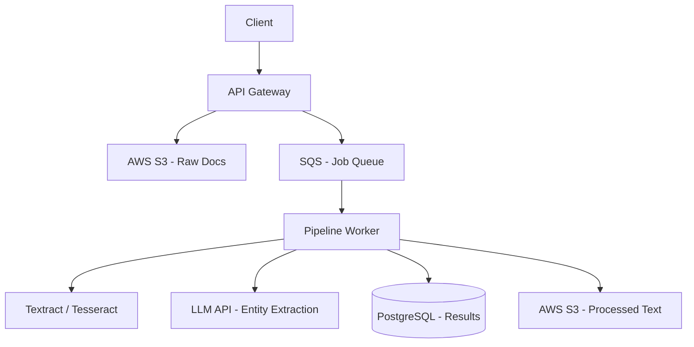

# Design: Document Processing Pipeline Using LLMs

## 1. Clarify Requirements
**Candidate**: "What volume of documents are we processing? Are they scanned images or text-based?"
**Interviewer**: "Thousands daily. Mix of PDFs, Word docs, and scanned images. We need to extract key entities and classify the document type."

## 2. Functional Requirements
- Accept file uploads up to 50MB.
- Perform OCR on images and scanned PDFs.
- Use LLM to classify document (e.g., Invoice, Contract, ID).
- Extract structured JSON data using LLM.
- Provide API to query processing status and results.

## 3. Non-Functional Requirements
- High reliability (don't lose documents).
- Scalable processing (handle bursts of uploads).
- Observability and error tracking.

## 4. Scale Assumptions
- 10,000 documents/day.
- Average size 5MB.

## 5. Traffic Estimation
- Upload bandwidth: 50 GB/day.

## 6. Storage Estimation
- Original files in S3: 50 GB/day = 1.5 TB/month.
- Extracted JSON in Postgres: 10K * 2KB = 20 MB/day.

## 7. API Design
```typescript
interface UploadResponse {
  jobId: string;
  status: 'PENDING';
}

interface JobStatus {
  jobId: string;
  status: 'PROCESSING' | 'COMPLETED' | 'FAILED';
  extractedData?: any;
}
```

## 8. High-Level Architecture


## 9. Component Responsibilities
- **API**: Returns presigned S3 URLs for fast, direct-to-cloud uploads.
- **Worker**: Orchestrates OCR -> Text chunking -> LLM calls -> DB saving.

## 10. Database Design
```sql
CREATE TABLE documents (
    id UUID PRIMARY KEY,
    s3_uri VARCHAR,
    status VARCHAR,
    document_type VARCHAR,
    extracted_json JSONB,
    created_at TIMESTAMP
);
```

## 11. Caching
Not highly relevant for batch processing, unless caching identical files via file hash.

## 12. Queues
AWS SQS with Dead Letter Queues (DLQ) for failed documents.

## 13. Async Processing
Entire pipeline is async. Webhooks or polling notify the client when done.

## 14. Failure Handling
If LLM fails due to context length, chunk the document and use map-reduce extraction. If PDF is corrupted, fail job and update DB status.

## 15. Retry Strategy
SQS max receives = 3. Transient errors (LLM timeouts) retry automatically.

## 16. Idempotency
Workers use `jobId` to ensure they don't insert duplicate results.

## 17. Consistency
Eventual consistency is perfect here.

## 18. Security
Pre-signed S3 URLs expire in 15 minutes. SSE-S3 encryption for stored documents.

## 19. Observability
Log each step (OCR done, LLM done) to track where bottlenecks are.

## 20. Deployment
Workers in ECS Tasks (can scale to 0 when queue is empty).

## 21. Scaling
SQS queue length triggers ECS autoscaling.

## 22. Disaster Recovery
S3 Cross-Region Replication.

## 23. Cost
LLM token costs dominate. Use OCR to strip whitespace/garbage to reduce token count.

## 24. Trade-offs
Direct API vs S3 Presigned URLs. Presigned URLs remove network load from API gateway but require complex client logic.

## 25. Alternative Architecture
AWS Step Functions for pipeline orchestration instead of custom workers. Better visibility, slightly higher AWS lock-in.

## 26. Final Answer
"An event-driven architecture using SQS and ECS workers provides the resilience needed for batch processing, while standardizing LLM outputs into structured JSONB ensures easy downstream consumption."
