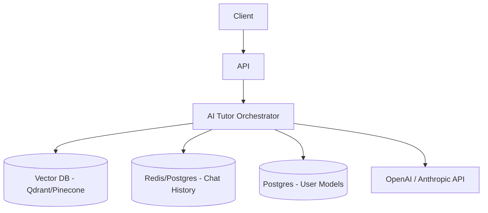

# Design: AI-Powered Tutoring System

## 1. Clarify Requirements
**Candidate**: "Is this tutor completely autonomous, or does it assist human tutors? What domain knowledge does it need?"
**Interviewer**: "Autonomous, for development finance professionals. Needs strict adherence to Palladium's curriculum."

## 2. Functional Requirements
- Chat interface for learners.
- Answer questions accurately based on course materials (RAG).
- Track learner mastery of topics over time.
- Generate dynamic quizzes to test knowledge.

## 3. Non-Functional Requirements
- High factual accuracy (no hallucinations).
- Low latency chat responses (<2 seconds).
- Strict data privacy.

## 4. Scale Assumptions
- 10,000 active learners.
- 50 messages per day per learner.
- 500,000 messages daily.

## 5. Traffic Estimation
- ~6-10 chat messages per second globally.

## 6. Storage Estimation
- Chat history: 500K messages * 1KB = 500MB/day.
- Vector DB for curriculum: 5GB.

## 7. API Design
```typescript
interface ChatRequest {
  sessionId: string;
  message: string;
}

interface ChatResponse {
  reply: string;
  sources: Array<{ title: string; link: string }>;
}
```

## 8. High-Level Architecture


## 9. Component Responsibilities
- **Orchestrator**: Manages RAG flow: Embed query -> Search VectorDB -> Fetch History -> Prompt LLM.
- **Learner Profile**: Tracks user's weak points to adjust quiz difficulty.

## 10. Database Design
```sql
CREATE TABLE chat_sessions (
    id UUID PRIMARY KEY,
    user_id UUID,
    course_id UUID,
    started_at TIMESTAMP
);

CREATE TABLE messages (
    id UUID PRIMARY KEY,
    session_id UUID,
    role VARCHAR, -- 'user' or 'assistant'
    content TEXT,
    created_at TIMESTAMP
);
```

## 11. Caching
Cache embedding vectors for exact matching queries.

## 12. Queues
Background jobs to re-embed curriculum when courses are updated.

## 13. Async Processing
Generating weekly progress summaries for users.

## 14. Failure Handling
Standard LLM failover.

## 15. Retry Strategy
Standard API retries.

## 16. Idempotency
Chat messages should have UUIDs to prevent double-posting.

## 17. Consistency
Strong consistency for chat history.

## 18. Security
Role-based access control. Prompt injection defenses.

## 19. Observability
Log "hallucination indicators" (when users downvote an answer).

## 20. Deployment
Containerized microservices.

## 21. Scaling
Easily scales horizontally. Vector DB handles the heavy lifting.

## 22. Disaster Recovery
Standard DB backups.

## 23. Cost
Use smaller models (GPT-4o-mini) for general chat, fallback to GPT-4o only if query complexity is high (using a fast intent classifier).

## 24. Trade-offs
RAG vs Fine-tuning. RAG guarantees up-to-date knowledge and provides source citations, which is critical for educational compliance.

## 25. Alternative Architecture
Agentic framework (LangChain/LlamaIndex) for complex tool use (e.g., executing Python code for finance formulas).

## 26. Final Answer
"The AI tutor utilizes a RAG architecture to strictly anchor LLM responses in approved curriculum, ensuring accuracy. By maintaining a learner profile graph, the system personalizes the pedagogical approach while keeping costs low through tiered model routing."
