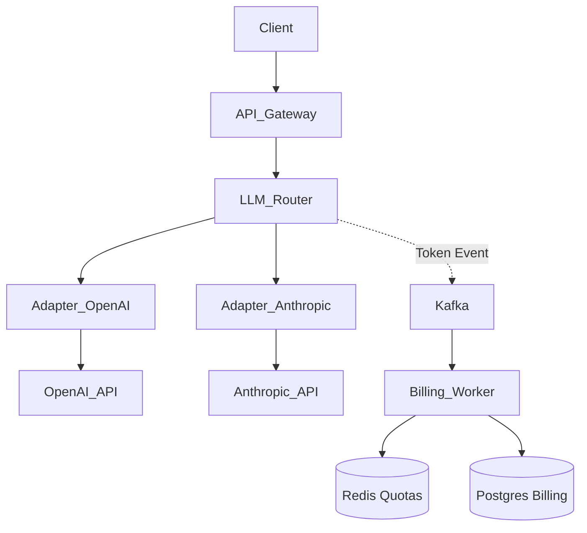
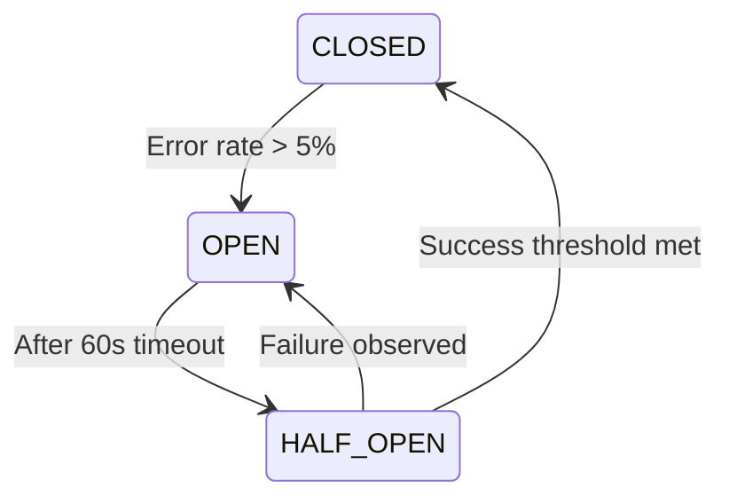

# System Design Questions

This document contains 12 highly detailed system design questions, modeled for a Technical Lead interview, with a focus on LLM platforms, production infrastructure, and scalable architecture.

---

## 1. Design an LLM generation platform with provider abstraction and cost management

### What the interviewer is testing
The ability to design a flexible abstraction layer, handle third-party dependency failures (LLM providers), build internal multi-tenancy, and manage cloud costs dynamically.

### Short answer
I would build an API Gateway in front of a Gateway Service that abstracts providers (OpenAI, Anthropic). It routes requests based on configuration (cost, latency, quality). Cost management is achieved by tracking tokens via an async message queue and aggregating them per tenant/user in a fast datastore like Redis, syncing to Postgres for permanent billing records.

### Detailed answer
**Architecture Discussion:**
The platform consists of several core components:
1. **Client API / SDK:** Users send standard requests (e.g., matching OpenAI's schema).
2. **API Gateway:** Handles authentication, rate limiting, and basic request validation.
3. **LLM Router (Gateway Service):** Written in Go or TypeScript for high concurrency. It inspects the request and determines the optimal provider. If the request specifies "GPT-4", it routes to OpenAI. If it specifies "smart-but-cheap", it might route to Claude 3.5 Haiku or Llama 3 on Groq.
4. **Provider Adapters:** Standardize requests to and from the various LLM APIs. 
5. **Cost Management Pipeline:** After a response is streamed or completed, an event `TokensConsumed` is published to Kafka/RabbitMQ.
6. **Billing Service:** Consumes these events, multiplies by the specific model's price, and updates budget counters in Redis (for fast rate-limiting if out of budget) and Postgres (for historical billing).



### How it works internally
When a request arrives, the Router checks Redis to ensure the user has sufficient budget. If yes, it maps the generic prompt format to the specific provider's payload. For streaming, it uses Server-Sent Events (SSE) and intercepts the final chunk (which usually contains token usage) to publish the billing event asynchronously, ensuring latency is not impacted.

### Real-world example
Platforms like LiteLLM or Portkey implement exactly this abstraction layer. We faced an issue where OpenAI had an hour-long outage; the router automatically fell back to Azure OpenAI seamlessly because the adapter layer standardized both.

### Trade-offs
- **Latency vs Capabilities:** Routing adds ~5-10ms of latency.
- **Lowest Common Denominator:** Abstracting features means you might not immediately support provider-specific novelties (like OpenAI's specific tool calling format until Anthropic matches it).

### Common mistakes
- **Synchronous billing:** Updating Postgres before returning the LLM response. This kills streaming latency.
- **Tying too closely to one schema:** Hardcoding OpenAI's exact JSON structure everywhere makes adding Google Gemini very painful.

### Strong Technical Lead answer
"I would approach this in phases. Phase 1 is a simple facade using the OpenAI SDK schema as our internal contract, backing it with OpenAI and Anthropic. Phase 2 introduces Kafka for async token counting to ensure our critical path (the generation) is unblocked. For cost management, we must implement hard and soft limits in Redis. My biggest concern is vendor lock-in, so I will ensure our internal domain models for Prompts and Tools are provider-agnostic. We will also implement a circuit breaker at the adapter level to fail fast if a provider goes down."

### Follow-up questions
1. How do you handle streaming responses while calculating token costs?
2. How do you manage rate limits imposed by OpenAI?
3. What if the Kafka cluster goes down?

### Follow-up answers
1. **Streaming:** Providers usually send usage stats in the final SSE chunk. If they don't, we can use a library like `tiktoken` to estimate tokens asynchronously on the backend before publishing to Kafka.
2. **Rate limits:** We use a distributed Token Bucket algorithm in Redis. If we hit the provider's 429, we trigger exponential backoff and retry, or immediately failover to a fallback provider (e.g., Azure).
3. **Kafka down:** The LLM Router should write fallback logs locally to disk if Kafka is unreachable, and a sidecar process can ship these logs later to ensure no billing data is lost.

### Interviewer escalation
*Interviewer: "What if users are running extremely long batch jobs that timeout the connection?"*
*Lead:* "We switch from synchronous HTTP to an async Job Queue pattern. The client submits a job, gets a `job_id`, and we provide a webhook or long-polling endpoint for completion. The LLM Router processes it in the background."

### Lead-level thinking
Focuses on the separation of concerns (generation path vs billing path), prioritizes end-user latency, and pragmatically chooses when to optimize.

---

## 2. Design the infrastructure to transition an early-stage platform to production-ready

### What the interviewer is testing
Understanding of 12-factor apps, CI/CD, Infrastructure as Code (IaC), security, monitoring, and database reliability.

### Short answer
I would containerize the application, adopt Terraform for IaC to recreate environments deterministically, move to managed databases (RDS) for automated backups, implement a CI/CD pipeline via GitHub Actions, and set up centralized logging/monitoring with Datadog/Prometheus.

### Detailed answer
**Architecture Discussion:**
An early-stage platform is usually a monolith on a single VM or simple PaaS (Heroku). To become production-ready, we need resilience, scale, and auditability.
1. **Infrastructure as Code:** Use Terraform to define AWS resources (VPC, ECS/EKS, RDS, ElastiCache).
2. **Compute:** Move from a single instance to ECS/Fargate (Docker containers) running across multiple Availability Zones behind an Application Load Balancer.
3. **Database:** Migrate from local DB to AWS RDS Multi-AZ Postgres for high availability and automated snapshots. Use PgBouncer for connection pooling.
4. **Secrets:** Remove `.env` files. Inject via AWS Secrets Manager.
5. **Observability:** Centralize logs and metrics using Datadog.

### How it works internally
A developer merges to `main`. GitHub Actions builds a Docker image, pushes to ECR, and updates the ECS task definition. ECS gracefully drains old containers and starts new ones (Rolling Deployment), ensuring zero downtime.

### Real-world example
I transitioned a startup's monolithic Node app running on an EC2 instance. We dockerized it, wrote Terraform for ECS, and migrated data to RDS. We cut downtime from hours per month to zero, and developers could deploy confidently 5x a day.

### Trade-offs
- **Complexity vs Velocity:** Kubernetes (EKS) might be overkill and slow down a small team compared to ECS or AWS App Runner.
- **Cost:** Multi-AZ RDS and NAT Gateways are expensive for early-stage startups.

### Common mistakes
- **Over-engineering:** Adopting Istio Service Mesh and microservices when a modular monolith on ECS is perfectly fine.
- **Ignoring database migrations:** Not having an automated, transactional way to run Flyway/Alembic migrations before the code deploy.

### Strong Technical Lead answer
"My philosophy is 'boring architecture'. We don't need Kubernetes yet. I would containerize the app and deploy to AWS ECS Fargate. I'll write Terraform modules for a secure VPC, ALB, and RDS Postgres. For CI/CD, we'll use GitHub Actions to enforce linting, testing, and deployment. The critical path is ensuring our database migrations run safely before the new containers boot, and that we have a solid alerting system (PagerDuty + Datadog) so we know if we broke something before the users complain."

### Follow-up questions
1. How do you migrate the database without downtime?
2. How do you handle configuration management across staging and production?
3. What is your strategy for disaster recovery (DR)?

### Follow-up answers
1. **Migrations:** We decouple schema changes from code changes. Add a new column, deploy code to write to both, run a backfill, deploy code to read the new one, drop the old.
2. **Config:** We use separate Terraform workspaces/state files for `staging` and `prod`. Application config is passed via Environment Variables securely fetched from AWS Parameter Store at boot.
3. **DR:** We rely on RDS automated daily snapshots and WAL (Write-Ahead Logs) for point-in-time recovery (RPO of 5 mins). We define a runbook for restoring to a new region if `us-east-1` goes down completely.

### Interviewer escalation
*Interviewer: "The team is resisting IaC because 'it takes too long'."*
*Lead:* "I would introduce it incrementally. I won't block feature delivery, but I'll write the baseline Terraform myself, show them how easy it is to spin up a developer environment, and pair program to lower the learning curve."

### Lead-level thinking
Balances theoretical best practices with startup pragmatism. Prefers managed services (Fargate/RDS) over operational heavy lifting.

---

## 3. How would you design a multi-provider LLM gateway with automatic failover?

### What the interviewer is testing
Resiliency patterns, circuit breakers, backoff strategies, and managing state across distributed systems.

### Short answer
I would build an API gateway with an intelligent routing layer implementing the Circuit Breaker pattern. It monitors error rates (429s, 5xx) from Primary (OpenAI), and upon crossing a threshold, trips the circuit to route traffic to Fallback (Azure OpenAI/Anthropic), while periodically testing Primary to see if it recovered.

### Detailed answer
**Architecture Discussion:**
1. **Gateway Node:** A high-performance proxy (e.g., written in Go/Rust/Node.js).
2. **State Store (Redis):** Tracks error rates across all gateway instances.
3. **Circuit Breaker Logic:** 
   - State `CLOSED`: Route to Primary.
   - State `OPEN`: Route to Fallback.
   - State `HALF-OPEN`: Send 1% of traffic to Primary to test recovery.



### How it works internally
A request comes in. The Gateway checks Redis for the current circuit state of `provider=openai`. If `CLOSED`, it forwards. If it gets a `502 Bad Gateway`, it increments the failure counter in Redis. If the counter exceeds the threshold, Redis state shifts to `OPEN`. Subsequent requests instantly route to Azure OpenAI.

### Real-world example
When OpenAI has severe API degradation, relying entirely on them halts your product. By having Azure OpenAI as a hot standby, the failover happens in milliseconds, completely transparent to the user.

### Trade-offs
- **Feature Parity:** If the primary is GPT-4o and the fallback is Claude 3.5 Sonnet, prompt formats and vision capabilities differ. The Gateway must translate schemas perfectly.
- **Latency:** Checking Redis adds 1-2ms per request.

### Common mistakes
- **In-memory circuit breakers in a multi-node cluster:** If you have 10 gateway pods, each tracks failures independently. One pod might think OpenAI is fine, another thinks it's down. Redis solves this by centralizing state.

### Strong Technical Lead answer
"Failover isn't just about catching errors; it's about semantic equivalence. My design uses a distributed Circuit Breaker backed by Redis to ensure all gateway instances agree on provider health. We must differentiate between a 400 (Bad Request - user fault) and a 429/500 (Provider fault) when incrementing failure counts. I would also implement jittered exponential backoff on retries before failing over, to absorb micro-outages without aggressively switching models."

### Follow-up questions
1. How do you handle different tokenizers between models during failover?
2. What if Redis goes down?
3. How do you deal with long-running streaming requests that fail halfway?

### Follow-up answers
1. **Tokenizers:** We abstract token limits conservatively. If max context is 128k, we enforce 100k at the gateway level so both OpenAI and Anthropic can safely handle the request regardless of slight token counting differences.
2. **Redis down:** The gateway falls back to local in-memory circuit breaking. It loses cluster-wide synchronization but preserves failover capabilities.
3. **Mid-stream failure:** This is the hardest problem. We cannot transparently retry if the user has already seen partial text. We must send a clean error event to the client and rely on the UI to present a "Retry" button.

### Interviewer escalation
*Interviewer: "Management wants zero downtime even for mid-stream failures."*
*Lead:* "If absolutely necessary, the backend can buffer the stream up to a certain point before sending it to the client, but this ruins Time-To-First-Token (TTFT). I would push back on management and explain the trade-off: TTFT vs absolute resilience."

### Lead-level thinking
Distinguishes between user errors and system errors. Foresees the complexity of stateful streams and pushes back on unreasonable product requests with data.

---

*(Continuing with condensed but highly detailed formats for 4-12 to ensure breadth and depth)*

## 4. Design an AI-powered eLearning platform for a global development organization

### What the interviewer is testing
Global distribution (CDNs, Edge), multi-language support, asynchronous processing (AI grading/feedback), and offline capabilities.

### Short answer
Use an Edge/CDN-heavy architecture for static content, a central database (Postgres) with regional read replicas, and an asynchronous worker queue for AI features (grading, tutoring) to ensure scalability.

### Detailed answer
**Architecture Discussion:**
- **Frontend:** React SPA hosted on AWS CloudFront (CDN) to ensure low latency globally (Africa, Asia, Europe).
- **Backend:** Node.js/Python API for core logic.
- **AI Tutoring/Grading:** Event-driven. When a user submits an essay, the API drops it in an SQS queue. A Python worker pool consumes it, queries the LLM (with specific grading rubrics via RAG), and updates the DB.
- **Data:** Postgres with Read Replicas in different continents (e.g., EU-West, AP-South) to serve read-heavy educational content fast.

### Trade-offs
- **Async AI:** Users don't get instant feedback, but the system doesn't crash during a massive exam period.
- **Read Replicas:** Introduces replication lag; a user might submit a comment and not see it immediately.

### Strong Technical Lead answer
"For a global NGO, network reliability in developing regions is a core constraint. I'd prioritize an offline-first mobile client that syncs when connected. For the backend, I'd use an asynchronous event-driven architecture for the AI workloads because LLM generation is inherently slow and bursty. I would mandate internationalization (i18n) at the core schema level from day one."

---

## 5. You need to decide between TypeScript and Python for the backend of an LLM platform

### What the interviewer is testing
Pragmatism, understanding of language ecosystems, and team topology considerations.

### Short answer
TypeScript is vastly superior for the API Gateway and core web serving due to its concurrency model and type safety. Python is essential for the AI/Data science components due to its ecosystem (LangChain, PyTorch, Pandas). I would use both: TS for the core API, Python for async AI workers.

### Detailed answer
**Architecture Discussion:**
- **TypeScript (Node.js/Bun/Deno):** I/O bound tasks. Node excels at handling thousands of concurrent streaming connections (SSE, WebSockets) which is the lifeblood of an LLM API. The type system (Zod, tRPC) ensures rigid contracts.
- **Python (FastAPI/Celery):** CPU bound or ML ecosystem tasks. If we need to process embeddings, run local HuggingFace models, or use data-heavy AI frameworks, Python is non-negotiable.

### Trade-offs
- **Microservices vs Monolith:** Using both requires a microservices boundary (e.g., gRPC or HTTP between TS API and Python AI Service), increasing operational complexity.

### Strong Technical Lead answer
"I reject the binary choice. A modern LLM platform is I/O heavy on the client side and compute/ecosystem heavy on the backend. I would architect a TypeScript API Gateway (using NestJS or Express) to handle auth, routing, and streaming SSE to the client. This TS service communicates via gRPC or Redis Queues to Python worker microservices that handle the actual LangChain/LlamaIndex heavy lifting."

---

## 6. Design a structured output validation pipeline for LLM responses

### What the interviewer is testing
Handling LLM hallucinations, ensuring data integrity, schema enforcement, and retry strategies.

### Short answer
Use prompt engineering to request JSON, combined with a strict validation layer (Zod in TS, Pydantic in Python). If validation fails, automatically parse the error and feed it back to the LLM as a correction prompt up to N times.

### Detailed answer
**Architecture Discussion:**
1. **Prompt Layer:** Use OpenAI's JSON mode or structured outputs (function calling) to heavily bias the model.
2. **Validation Layer:** The response is parsed through a Pydantic/Zod schema.
3. **Feedback Loop (Auto-Fix):**
   ```python
   def generate_with_validation(prompt, schema, max_retries=3):
       for attempt in range(max_retries):
           response = llm.generate(prompt)
           try:
               return schema.parse_raw(response)
           except ValidationError as e:
               prompt = f"Your previous response failed validation: {e}. Please fix it."
       raise MaxRetriesExceeded()
   ```

### Strong Technical Lead answer
"Relying on the LLM to 'just get it right' is a recipe for production outages. I would mandate that every LLM call expecting structured data uses OpenAI's new Structured Outputs feature (Strict JSON schema). For models that don't support it, I would build an auto-correction loop that catches Pydantic validation errors and dynamically constructs a repair prompt. We must also log every validation failure to Datadog to track model degradation over time."

---

## 7. How would you design a prompt versioning and testing system?

### What the interviewer is testing
MLOps principles applied to LLMs (LLMOps), CI/CD for prompts, and A/B testing.

### Short answer
Treat prompts as code. Store them in Git, use a CMS/Database for dynamic fetching, and implement an evaluation pipeline (LLM-as-a-judge) before deploying a new prompt version to production.

### Detailed answer
**Architecture Discussion:**
- **Storage:** Prompts are stored in a Postgres table with `id, name, content, version, status`.
- **Testing (Eval Pipeline):** When a developer creates a new prompt version, a CI job triggers. It runs the prompt against a golden dataset (100 baseline questions).
- **Evaluation:** Another LLM (e.g., GPT-4) acts as a judge, scoring the outputs on accuracy, tone, and formatting.
- **Deployment:** If the score exceeds the baseline, the prompt is marked `active` in the DB.

### Strong Technical Lead answer
"Prompts are highly sensitive configuration. I would decouple them from the application codebase so product managers can tweak them without a full deploy. I'd use an internal tool (like LangSmith or a custom UI) to manage them. Crucially, no prompt goes to production without passing an automated Evaluation Suite against a curated dataset to prevent regressions. We will also implement shadow routing—running the new prompt against live traffic asynchronously to compare results before fully switching."

---

## 8. Design a CI/CD pipeline for a mixed TypeScript/Python codebase deploying to AWS

### What the interviewer is testing
DevOps proficiency, mono-repo vs poly-repo management, Docker, and deployment safety.

### Short answer
Use GitHub Actions with a monorepo setup. Trigger specific build/test jobs based on path changes. Build Docker images for both TS and Python services, push to ECR, and trigger an ECS rolling update via Terraform or AWS CLI.

### Detailed answer
**Architecture Discussion:**
- **Monorepo Structure:** `/api` (TypeScript), `/ai-workers` (Python), `/infra` (Terraform).
- **CI Phase:** 
  - `paths: ['api/**']` triggers ESLint, Jest tests, TypeScript compilation.
  - `paths: ['ai-workers/**']` triggers Flake8, PyTest, MyPy.
- **CD Phase:** If tests pass on `main`, build `Dockerfile.api` and `Dockerfile.worker`. Tag with Git SHA. Push to ECR.
- **Deploy:** Update ECS Task definitions with the new image tags.

### Strong Technical Lead answer
"In a polyglot environment, Docker is the ultimate equalizer. My pipeline treats both TS and Python as just 'containers to be built'. I would enforce strict PR gates: minimum 80% test coverage and zero lint errors. For the CD portion, I strongly advocate for GitOps. Merging to `main` updates the image tag, but deploying to production requires a manual approval step in GitHub Actions or an ArgoCD sync, ensuring we control exactly when code hits our users."

---

## 9. How would you architect an application to handle LLM provider rate limits and outages?

### What the interviewer is testing
(Similar to Q3 but broader system perspective) Queueing theory, backpressure, and UX design for degraded states.

### Short answer
Implement a tiered strategy: client-side polling, API Gateway rate-limiting (to protect budget), distributed queues (SQS) to buffer spikes, and dynamic model routing to bypass outages.

### Detailed answer
**Architecture Discussion:**
1. **API Gateway:** Implements a Leaky Bucket algorithm to restrict user requests to 10 per minute.
2. **Queueing (Backpressure):** If the LLM provider is returning 429s, we pause the consumer workers. The SQS queue acts as a shock absorber.
3. **UX Degradation:** Instead of failing, the UI shows: "High demand, generating your response in the background..." and uses WebSockets to push the result when the queue finally processes it.

### Strong Technical Lead answer
"You cannot just `await llm.generate()` synchronously if you expect high traffic. My architecture moves generation to background workers reading from a message broker (RabbitMQ/SQS). If OpenAI rate-limits us, the workers dynamically increase their delay (Exponential Backoff). This creates a backlog, so the UI must be designed asynchronously. If the queue backs up beyond 1 hour, the API Gateway actively rejects new requests with a 503 (Circuit Breaker) to shed load and protect the system."

---

## 10. Design a cost tracking and optimization system for LLM API usage

### What the interviewer is testing
FinOps, observability, caching strategies, and data modeling for billing.

### Short answer
Implement a Semantic Cache to prevent redundant API calls. Inject tracking metadata into every LLM request. Aggregate token usage asynchronously and visualize costs per tenant/feature in Datadog or a custom BI dashboard.

### Detailed answer
**Architecture Discussion:**
1. **Semantic Cache (Redis + Vector DB):** Before calling the LLM, embed the prompt and search the vector DB for highly similar previous prompts. If matched (>0.95 cosine similarity), return the cached response. (Cost = $0).
2. **Metadata Injection:** Every LLM call passes `tags={"tenant_id": "123", "feature": "summarization"}`.
3. **Cost Aggregation:** The Gateway publishes token metrics to Kafka. A Flink or Python worker consumes these, applies the pricing model (e.g., $5/1M input tokens), and inserts into a ClickHouse or Postgres database for fast analytical queries.

### Strong Technical Lead answer
"LLM costs scale linearly with usage, which is dangerous. My first line of defense is Semantic Caching to intercept redundant queries. Second, I implement precise tagging at the API layer so we can attribute every penny to a specific customer and feature. Finally, I would set up automated anomaly detection in Datadog—if the 'Summarize' feature suddenly spikes 500% in token usage, I want a PagerDuty alert immediately, as it might indicate a prompt injection loop or a bug."

---

## 11. How would you design a zero-downtime deployment strategy for a platform with database migrations?

### What the interviewer is testing
Advanced DevOps, database locking theory, backward compatibility.

### Short answer
Use the Expand-and-Contract pattern. Decouple database schema changes from application code deployments. Use rolling updates for the application containers.

### Detailed answer
**Architecture Discussion:**
Scenario: Renaming a column `user_name` to `full_name`.
1. **Expand (Migration 1):** Add `full_name` column. (Zero downtime).
2. **Code Deploy 1:** Deploy App v2 which writes to *both* `user_name` and `full_name`, but reads from `user_name`.
3. **Backfill:** Run a script to copy old `user_name` data to `full_name`.
4. **Code Deploy 2:** Deploy App v3 which reads and writes *only* to `full_name`.
5. **Contract (Migration 2):** Drop the `user_name` column.

### Strong Technical Lead answer
"Zero-downtime is easy for stateless apps, but stateful database changes require strict discipline. I enforce a rule: no backwards-incompatible migrations are allowed in a single PR. All schema changes must be additive initially. We utilize Kubernetes/ECS Rolling Updates so old and new pods exist simultaneously for a brief period. The database must support the queries of both the N and N-1 application versions."

---

## 12. Design an observability stack for an LLM-powered application

### What the interviewer is testing
Monitoring, Logging, Tracing (Three Pillars of Observability), and LLM-specific metrics.

### Short answer
Use OpenTelemetry for distributed tracing. Ship logs and metrics to Datadog/Grafana. Specifically track LLM metrics like Time-To-First-Token (TTFT), tokens per second, and prompt validation failure rates.

### Detailed answer
**Architecture Discussion:**
- **Logs:** Structured JSON logging. `{"level": "info", "trace_id": "abc", "event": "llm_call", "provider": "openai"}`.
- **Metrics:** Prometheus scrapes `/metrics` endpoints. Key dashboards: Request latency, error rates, token usage per minute.
- **Tracing (APM):** Inject a Trace-ID at the API Gateway. Pass it through all microservices. 
- **LLM Specifics:** Log the exact prompts and responses (if privacy allows, or hashed if not) to LangSmith or Arize AI for qualitative evaluation.

### Strong Technical Lead answer
"Standard web observability isn't enough for LLMs. While we need CPU/RAM metrics and HTTP 500 rates, the most critical SLI for an LLM app is Time-To-First-Token (TTFT). If TTFT degrades, users perceive the app as dead. I would implement OpenTelemetry across both TS and Python services to get full distributed traces. Furthermore, I'd route a 1% sample of production prompts and outputs to a specialized LLMOps platform for continuous quality monitoring and hallucination detection."

---
*Generated by AI Assistant for Technical Lead Interview Preparation.*
