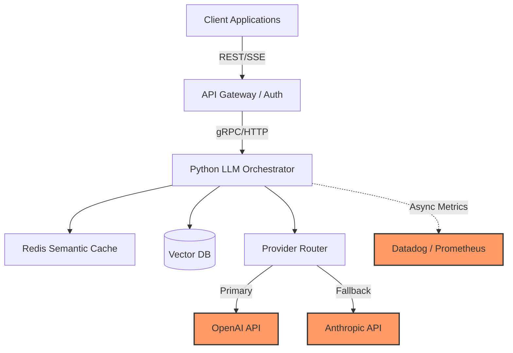
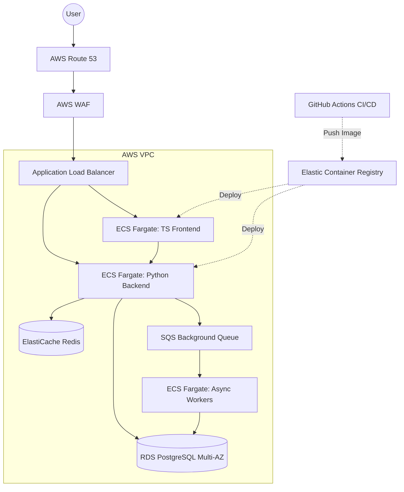

# SAQAYA System Design Guide

This document covers high-level system design architectures expected for a Tech Lead role at SAQAYA, specifically focusing on LLM platforms and production infrastructure.

## 1. Design an Internal LLM Generation Platform

**Scenario**: SAQAYA needs an internal platform that allows different product teams to easily integrate LLM capabilities (text generation, RAG, tool calling) without worrying about provider APIs, keys, or rate limits.

### Core Requirements
- **Functional**: Unified API for multiple providers (OpenAI, Anthropic). Support for RAG. Support for streaming responses.
- **Non-Functional**: High availability, strict rate-limiting per tenant/team, comprehensive cost tracking, low perceived latency.

### Architecture Components
1. **API Gateway (TypeScript/NestJS)**: Handles Authentication, Tenant ID extraction, and basic rate limiting (Redis).
2. **LLM Orchestrator (Python/FastAPI)**: The core engine. Implements the strategy pattern for different providers.
3. **Telemetry Interceptor**: Middleware that calculates token counts and sends metrics to Datadog.
4. **Vector Database (Pinecone/Qdrant)**: Stores embeddings for RAG capabilities.
5. **Caching Layer (Redis)**: Stores semantic caches to reduce duplicate LLM calls.

### Mermaid Diagram

### Deep Dive Points for TL:
- **Streaming**: Emphasize using Server-Sent Events (SSE) to stream chunks directly from the provider, through the orchestrator, back to the client to minimize Time-to-First-Token (TTFT).
- **Cost Tracking**: Explain how you'd intercept the response stream, calculate tokens (using `tiktoken` equivalent), and log the cost *asynchronously* so it doesn't block the response.

## 2. Design Production Infrastructure Migration

**Scenario**: You have a Dockerized Python/TS application running on a single EC2 instance. Design the migration to a highly available, scalable production environment on AWS.

### Architecture Components
- **Network**: VPC with Public (ALB, NAT) and Private (ECS, RDS, Redis) subnets.
- **Compute**: ECS (Elastic Container Service) with Fargate for serverless container management, allowing independent scaling of the TS Frontend and Python Backend.
- **Data**: Amazon RDS (PostgreSQL) Multi-AZ for relational data, ElastiCache (Redis) for session/caching.
- **CI/CD**: GitHub Actions deploying immutable Docker images to ECR, triggering ECS rolling updates.

### Mermaid Diagram

### Deep Dive Points for TL:
- **Security**: Emphasize that compute resources (ECS, RDS) live in private subnets with NO direct internet access. Outbound traffic routes through a NAT Gateway.
- **Infrastructure as Code**: State firmly that *nothing* is clicked in the AWS console. Everything is defined in Terraform modules, allowing you to spin up identical `staging` and `production` environments.
- **Database Migrations**: Explain your strategy for zero-downtime deployments (e.g., separating schema changes from code deployments, using tools like Alembic/Prisma).
