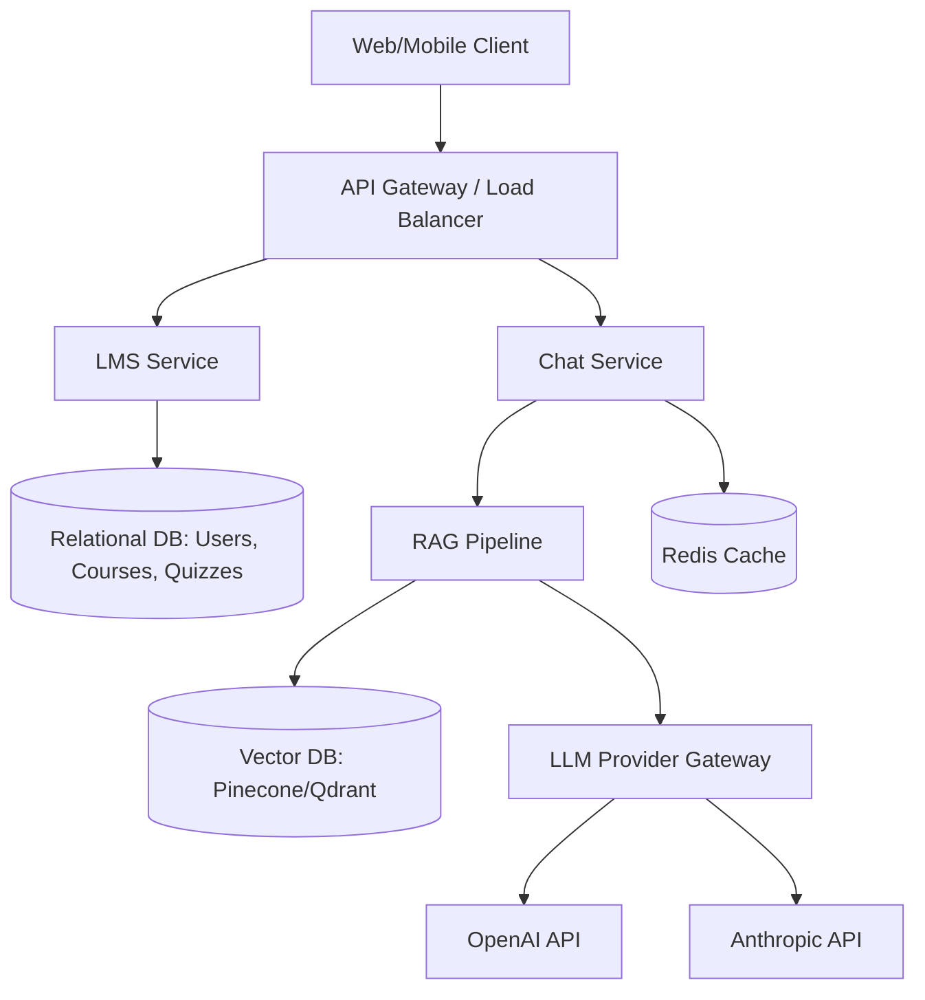

# System Design Mock Interview

**Duration:** 45 minutes
**Focus:** Designing an LLM-powered eLearning platform.

## The Prompt
"Design an eLearning platform where students can watch video lectures, take quizzes, and interact with an AI Tutor. The AI Tutor needs to answer questions based *only* on the course material. We anticipate 100,000 Daily Active Users (DAU), with spikes during exam weeks."

---

## 1. Requirements Clarification (5 mins)

**Candidate:**
- *Functional:* Video streaming? (Assume YouTube/Vimeo embedding for now). Take quizzes? (Yes). AI Tutor? (Yes, text-based chat).
- *Non-Functional:* 
  - Availability: High (99.9%).
  - Latency: Chat responses under 3 seconds.
  - Security: User data privacy, AI must not hallucinate outside course scope.
- *Scale:* 100k DAU. Say 10 questions per user per day = 1M AI requests/day. At peak, maybe 100 requests/second.

---

## 2. High-Level Architecture (10 mins)

---

## 3. Deep Dive: The AI Tutor & RAG (15 mins)

**Interviewer Probe:** "How do you ensure the AI Tutor only answers based on course material and doesn't hallucinate?"

**Candidate:**
"I would use a Retrieval-Augmented Generation (RAG) architecture.
1. **Ingestion Phase:** When a course is created, we parse transcripts and PDFs, chunk the text (e.g., 500 tokens), generate embeddings using an embedding model, and store them in a Vector Database alongside metadata (course_id).
2. **Retrieval Phase:** When a student asks a question, we embed the query. We perform a semantic search in the Vector DB, filtering by `course_id`.
3. **Generation Phase:** We construct a prompt: `You are a helpful tutor. Using strictly the following context, answer the user's question. Context: [Retrieved Chunks]. Question: [User Query]`.
4. **Guardrails:** Add a system prompt instructing the LLM to reply 'I don't know' if the answer isn't in the context."

**Interviewer Probe:** "Vector searches can be slow. How do you optimize latency?"

**Candidate:**
"1. **Semantic Caching:** Cache previous Q&A pairs using Redis. If a new query has high cosine similarity to a cached query, return the cached answer.
 2. **Metadata Filtering:** Always filter the Vector DB by `course_id` or `module_id` before performing the KNN search to reduce the search space.
 3. **Streaming:** Stream the LLM response back to the client via WebSockets or Server-Sent Events (SSE) so the perceived latency is low."

---

## 4. Deep Dive: Provider Abstraction & Reliability (10 mins)

**Interviewer Probe:** "OpenAI goes down frequently. How do we handle this?"

**Candidate:**
"We implement an LLM Gateway (like LiteLLM or a custom service).
1. **Circuit Breaker:** If OpenAI fails 3 times in a row or latencies spike, the circuit opens.
2. **Fallback Routing:** The Gateway automatically routes requests to Anthropic Claude or a self-hosted vLLM instance.
3. **Rate Limiting:** We implement Token Bucket rate limiting per user in Redis to prevent abuse.
4. **Asynchronous Retry:** For non-real-time tasks (like grading), we use a message queue (SQS/RabbitMQ) with exponential backoff."

---

## 5. Data Schema (5 mins)

**Relational DB (PostgreSQL):**
- `Users` (id, name, role)
- `Courses` (id, title, instructor_id)
- `Enrollments` (user_id, course_id)
- `ChatHistory` (id, user_id, session_id, role, content, timestamp) -> *Useful for context windows.*

**Vector DB:**
- `id`, `embedding`, `text_chunk`, `metadata: { course_id, module_id, type }`

---

## Interviewer Feedback / Evaluation
- **Strengths:** Excellent grasp of RAG architecture. Thoughtful about perceived latency (Streaming). Solid fallback strategy.
- **Areas for Improvement:** Could have discussed cost optimization (e.g., using cheaper models for routing/intent detection before hitting expensive models).
