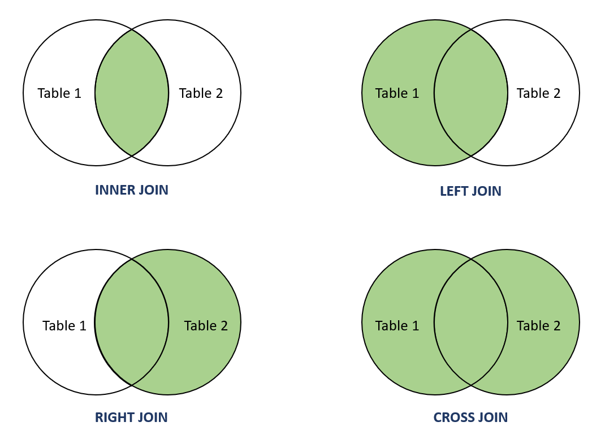

# MySQL Interview Questions

## 1. What is MySQL?

MySQL is an open-source relational database management system (RDBMS) based on SQL (Structured Query Language). It is
used for managing and storing data in a relational database, supporting various SQL operations like CRUD (Create, Read,
Update, Delete) and advanced queries.

## 2. What are the differences between MySQL and other database systems (e.g., PostgreSQL, SQL Server)?

- **MySQL**: Open-source, widely used, fast read-heavy applications, supports ACID transactions with InnoDB, and simple
  SQL syntax.
- **PostgreSQL**: Open-source, supports advanced features like JSON, GIS data types, custom functions, and full ACID
  compliance.
- **SQL Server**: A commercial product by Microsoft with integrated support for .NET applications, enterprise features,
  and extensive tools for database management.

## 3. What is a primary key in MySQL?

A primary key is a unique identifier for a record in a table. It ensures that each record can be uniquely identified by
its key, and no two records can have the same primary key value. It also enforces entity integrity.

### **Example**:

```sql
CREATE TABLE users
(
    user_id   INT PRIMARY KEY,
    full_name VARCHAR(100)
);
```

## 4. What are foreign keys in MySQL?

A foreign key is a column or a set of columns that creates a relationship between two tables. It ensures referential
integrity by enforcing that values in the foreign key column must exist in the referenced primary key column of another
table.

## 5. What are the different types of indexes in MySQL?

- **Primary Index**: Unique and automatically created for primary keys.
- **Unique Index**: Ensures that values in a column are unique.
- **Regular Index**: A non-unique index that speeds up query retrieval.
- **Full-text Index**: Used for full-text search capabilities.
- **Spatial Index**: Used for spatial data types.

## 6. What is normalization in a database, and why is it important?

Normalization is the process of organizing data in a database to minimize redundancy and dependency. It involves
dividing large tables into smaller ones and ensuring relationships between them. It is important because it reduces the
chances of data anomalies.

### **Example**:

This reduces redundancy by normalizing the address data.

```sql
-- before --
CREATE TABLE users
(
    user_id   INT PRIMARY KEY,
    full_name VARCHAR(100),
    address   VARCHAR(255),
);
-- after --
CREATE TABLE users
(
    user_id   INT PRIMARY KEY,
    full_name VARCHAR(100)
);

CREATE TABLE addresses
(
    id      INT PRIMARY KEY,
    user_id INT,
    address VARCHAR(255),
    FOREIGN KEY (user_id) REFERENCES users (user_id)
);
```

## 7. What is denormalization, and when should it be used?

Denormalization is the process of combining tables to reduce the number of joins needed in queries, which can improve
performance. It is used when performance needs to be optimized and when read-heavy operations are prioritized over write
consistency.

### **Example**:

```sql
CREATE TABLE users
(
    user_id   INT PRIMARY KEY,
    full_name VARCHAR(100),
    address   VARCHAR(255),
);
```

## 8. What are joins in SQL? Name the different types of joins.

A join is used to combine rows from two or more tables based on a related column.



The different types of joins are:

- **Inner Join**: Returns only matching rows from both tables.
- **Left Join (or Left Outer Join)**: Returns all rows from the left table and matching rows from the right table.
- **Right Join (or Right Outer Join)**: Returns all rows from the right table and matching rows from the left table.
- **Full Join (or Full Outer Join)**: Returns all rows when there is a match in either the left or right table.

```sql

-- INNER JOIN
SELECT users.full_name, orders.order_id
FROM users
       INNER JOIN orders ON users.user_id = orders.user_id;

-- LEFT JOIN
SELECT users.full_name, orders.order_id
FROM users
       LEFT JOIN orders ON users.user_id = orders.user_id;
```

## 9. What is the difference between `WHERE` and `HAVING` clauses?

- **WHERE**: Filters rows before grouping. It cannot be used with aggregate functions.
- **HAVING**: Filters groups after the `GROUP BY` clause. It can be used with aggregate functions.

```sql
-- WHERE filters individual rows
SELECT user_id, order_id, total_amount
FROM orders
WHERE total_amount > 100;

-- HAVING filters groups after aggregation
SELECT user_id, COUNT(*) AS order_count, SUM(total_amount) AS total_spent
FROM orders
GROUP BY user_id
HAVING COUNT(*) > 5 AND SUM(total_amount) > 1000;
```

## 10. What is a subquery, and how is it used in MySQL?

A subquery is a query nested inside another query, often used to retrieve a result that can be used in the outer query.
Subqueries can be used in the `SELECT`, `INSERT`, `UPDATE`, and `DELETE` statements.

```sql

SELECT full_name
FROM users
WHERE user_id IN (SELECT user_id FROM orders WHERE order_id = 101);
```
## 11. What is the difference between `CHAR` and `VARCHAR` data types?

- **CHAR**: A fixed-length string. If the string is shorter than the specified length, it is padded with spaces.
- **VARCHAR**: A variable-length string. It only uses as much space as needed for the data.

## 12. Explain the ACID properties of a transaction.

ACID stands for:

- **Atomicity**: A transaction is all-or-nothing.
- **Consistency**: The database transitions from one valid state to another.
- **Isolation**: Transactions do not interfere with each other.
- **Durability**: Once a transaction is committed, it is permanent.

```sql
START TRANSACTION;
UPDATE accounts SET balance = balance - 100 WHERE account_id = 1;
UPDATE accounts SET balance = balance + 100 WHERE account_id = 2;
COMMIT;
```

## 12.1. What is BASE, and how does it differ from ACID?

BASE is an acronym that stands for:
- **Basically Available**: The system guarantees availability in terms of the CAP theorem. The system will respond to any request, but it may not be consistent.
- **Soft state**: The state of the system may change over time, even without input, due to eventual consistency.
- **Eventual consistency**: The system will become consistent over time, assuming no new updates are made to the system.

**Key Differences:**

| ACID | BASE |
|------|------|
| Strong consistency | Eventual consistency |
| Focus on data consistency | Focus on availability |
| Used in relational databases (MySQL, PostgreSQL) | Used in NoSQL databases (MongoDB, Cassandra) |
| Prioritizes correctness | Prioritizes availability and performance |
| Synchronous updates | Asynchronous updates |
| Better for transactional systems | Better for distributed systems at scale |

**When to use ACID:**
- Financial transactions
- Critical data that must be consistent immediately
- Systems where data integrity is paramount

**When to use BASE:**
- High-traffic web applications
- Social media platforms
- Real-time analytics
- Systems where availability is more important than immediate consistency

**Example:**
In a social media application using BASE:
- When a user posts a comment, it may not immediately appear to all users (eventual consistency)
- The system remains available even if some data is temporarily inconsistent
- The comment will eventually be visible to everyone once the system propagates the update
## 13. What is an `AUTO_INCREMENT` field in MySQL?

An `AUTO_INCREMENT` field is used to automatically generate a unique number when a new record is inserted into a table.
It is typically used for primary keys.

## 14. What is the difference between `DELETE`, `TRUNCATE`, and `DROP` statements?

- **DELETE**: Removes rows from a table based on a condition. It can be rolled back.
- **TRUNCATE**: Removes all rows from a table but does not log individual row deletions. It is faster than `DELETE` and
  cannot be rolled back.
- **DROP**: Removes a table or database completely, including its structure.

## 15. What are the different types of relationships in databases (one-to-one, one-to-many, many-to-many)?

- **One-to-One**: One record in a table is related to one record in another table.
- **One-to-Many**: One record in a table is related to many records in another table.
- **Many-to-Many**: Many records in a table are related to many records in another table, often requiring a junction
  table.

## 16. Explain the `GROUP BY` and `HAVING` clauses in MySQL.

- **GROUP BY**: Groups rows that have the same values into summary rows (e.g., SUM, COUNT).
- **HAVING**: Used to filter the results of a `GROUP BY` query, similar to `WHERE`, but for aggregated results.

```sql
SELECT user_id, COUNT(*) AS order_count
FROM orders
GROUP BY user_id
HAVING order_count > 5;
```
## 17. What is the use of the `LIMIT` clause in MySQL?

The `LIMIT` clause is used to specify the number of records to return from a query. It is commonly used to paginate
results.

## 18. What are stored procedures in MySQL, and how are they different from functions?

- **Stored Procedures**: A set of SQL statements that can be executed repeatedly. They can perform actions (
  like `INSERT`, `UPDATE`, etc.).
- **Functions**: Similar to stored procedures but always return a value and cannot perform actions like `INSERT`
  or `UPDATE`.

```sql
-- Procedures
DELIMITER //
CREATE PROCEDURE GetUserOrders(IN userId INT)
BEGIN
    SELECT * FROM orders WHERE user_id = userId;
END //
DELIMITER ;
    -- Function
DELIMITER //    
CREATE FUNCTION GetOrderTotal(orderId INT)
RETURNS DECIMAL(10, 2)
BEGIN
    DECLARE total DECIMAL(10, 2);
    SELECT SUM(price) INTO total FROM order_items WHERE order_id = orderId;
    RETURN total;
END //  
DELIMITER ;
```
## 19. What is the `EXPLAIN` keyword used for in MySQL?

The `EXPLAIN` keyword provides information about how MySQL executes a query, helping optimize query performance by
showing how tables are scanned, joined, and which indexes are used.

## 20. What are triggers in MySQL, and how are they useful?

A trigger is a stored procedure that automatically executes in response to an event (e.g., `INSERT`, `UPDATE`, `DELETE`)
on a table. It helps automate tasks like maintaining audit logs or enforcing data integrity.
(similar to call_back functions in rails but this in the scope of database not coding)
```sql
CREATE TRIGGER before_insert_user
BEFORE INSERT ON users
FOR EACH ROW
SET NEW.created_at = NOW();
```
## 21. What are the different storage engines in MySQL? Explain `InnoDB` and `MyISAM`.

- **InnoDB**: Supports ACID transactions, foreign keys, and row-level locking. It is the default storage engine.
- **MyISAM**: Does not support transactions, foreign keys, or row-level locking. It is faster for read-heavy
  applications.

## 22. How does MySQL handle transactions, and what are the isolation levels available?

MySQL supports transactions to ensure data consistency. The isolation levels are:

- **READ UNCOMMITTED**
- **READ COMMITTED**
- **REPEATABLE READ**
- **SERIALIZABLE**

## 23. What is indexing in MySQL, and how does it improve performance?

An index is a data structure that improves query performance by allowing fast lookup of rows in a table based on the
values of one or more columns.

## 24. What is full-text indexing in MySQL?

Full-text indexing allows efficient searching of textual data in columns. It is typically used for searching large
amounts of text, such as in blog posts or articles.

## 25. How can you optimize a slow MySQL query?

- Analyze and optimize query execution plans using `EXPLAIN`.
- Add appropriate indexes.
- Optimize subqueries.
- Avoid SELECT * and select only required columns.
- Optimize joins and limit the number of rows returned.

```sql
EXPLAIN SELECT * FROM orders WHERE user_id = 1;
```
## 26. What are the best practices for database indexing?

- Index columns frequently used in `WHERE`, `ORDER BY`, and `JOIN` clauses.
- Avoid over-indexing, as it can slow down insert and update operations.
- Use composite indexes where necessary.

## 27. What is a deadlock, and how do you handle it in MySQL?

  A deadlock occurs when two or more transactions block each other by holding locks on resources that the others need.
MySQL automatically detects deadlocks and rolls back one of the transactions. To handle it, ensure transactions are kept
short and avoid circular dependencies.
```sql
-- Transaction 1
START TRANSACTION;
UPDATE accounts SET balance = balance - 100 WHERE account_id = 1;

-- Transaction 2
START TRANSACTION;
UPDATE accounts SET balance = balance + 100 WHERE account_id = 2;

-- The deadlock occurs when both transactions try to update the same row.
```
## 28. Explain replication in MySQL.

Replication is the process of copying data from one MySQL database (the master) to one or more MySQL databases (the
slaves). It is used for load balancing, backup, and redundancy.

## 29. How can you back up and restore a MySQL database?

- **Backup**: Use the `mysqldump` command to create a backup of the database.
- **Restore**: Use the `mysql` command to import the backup.

## 30. What is partitioning in MySQL, and how can it improve query performance?

Partitioning divides large tables into smaller, more manageable pieces, improving query performance by limiting the
amount of data to scan. It is particularly useful for time-based data, like logs or events.

## 31. What is a view in MySQL, and when would you use it?

A view is a virtual table based on the result of a SQL statement. It contains rows and columns like a real table, but the data is dynamically retrieved from one or more underlying tables.

**Benefits:**
- Simplifies complex queries
- Provides security by restricting access to specific columns
- Abstracts the underlying table structure
- Can be used to present aggregated data

```sql
-- Create a view
CREATE VIEW active_users AS
SELECT user_id, full_name, email
FROM users
WHERE status = 'active';

-- Use the view
SELECT * FROM active_users;
```

## 32. What is the difference between `UNION` and `UNION ALL`?

- **UNION**: Combines results from multiple SELECT statements and removes duplicate rows.
- **UNION ALL**: Combines results from multiple SELECT statements and includes all rows, including duplicates.

**UNION ALL is faster** because it doesn't need to check for duplicates.

```sql
-- UNION (removes duplicates)
SELECT name FROM table1
UNION
SELECT name FROM table2;

-- UNION ALL (keeps duplicates)
SELECT name FROM table1
UNION ALL
SELECT name FROM table2;
```

## 33. What is a composite key in MySQL?

A composite key is a primary key that consists of two or more columns. It is used when a single column cannot uniquely identify a row.

```sql
CREATE TABLE order_items
(
    order_id INT,
    product_id INT,
    quantity INT,
    PRIMARY KEY (order_id, product_id)
);
```

## 34. What is the difference between clustered and non-clustered indexes?

- **Clustered Index**: The table data is physically stored in the same order as the index. There can be only one clustered index per table (usually the primary key). The data rows are stored in the leaf nodes of the index.
- **Non-clustered Index**: Creates a separate structure that points to the data. The leaf nodes contain pointers to the actual data rows. A table can have multiple non-clustered indexes.

**In MySQL:**
- InnoDB uses clustered indexes (primary key is clustered)
- MyISAM uses non-clustered indexes

## 35. What are constraints in MySQL, and what types exist?

Constraints are rules enforced on data columns to ensure data integrity and accuracy.

**Types of constraints:**
- **PRIMARY KEY**: Uniquely identifies each row
- **FOREIGN KEY**: Ensures referential integrity
- **UNIQUE**: Ensures all values in a column are unique
- **NOT NULL**: Ensures a column cannot have NULL values
- **CHECK**: Ensures values meet specific conditions (MySQL 8.0.16+)
- **DEFAULT**: Sets a default value for a column

```sql
CREATE TABLE users
(
    user_id INT PRIMARY KEY,
    email VARCHAR(100) UNIQUE NOT NULL,
    age INT CHECK (age >= 18),
    status VARCHAR(20) DEFAULT 'active',
    department_id INT,
    FOREIGN KEY (department_id) REFERENCES departments(department_id)
);
```

## 36. What is a cursor in MySQL, and when would you use it?

A cursor is a database object used to retrieve and manipulate rows one at a time from a result set. It is typically used in stored procedures when you need to process rows individually.

```sql
DELIMITER //
CREATE PROCEDURE ProcessOrders()
BEGIN
    DECLARE done INT DEFAULT FALSE;
    DECLARE order_id INT;
    DECLARE total_amount DECIMAL(10, 2);
    
    DECLARE order_cursor CURSOR FOR
        SELECT order_id, total_amount FROM orders WHERE status = 'pending';
    
    DECLARE CONTINUE HANDLER FOR NOT FOUND SET done = TRUE;
    
    OPEN order_cursor;
    
    read_loop: LOOP
        FETCH order_cursor INTO order_id, total_amount;
        IF done THEN
            LEAVE read_loop;
        END IF;
        -- Process each order
        UPDATE orders SET status = 'processed' WHERE order_id = order_id;
    END LOOP;
    
    CLOSE order_cursor;
END //
DELIMITER ;
```

## 37. Explain transaction isolation levels in detail.

Transaction isolation levels determine how transactions interact with each other and what data they can see.

**Isolation Levels (from least to most strict):**

1. **READ UNCOMMITTED**: 
   - Lowest isolation level
   - Allows dirty reads (reading uncommitted data)
   - No locks are placed
   - Can lead to inconsistent data

2. **READ COMMITTED**:
   - Prevents dirty reads
   - Allows non-repeatable reads (same query returns different results)
   - Uses shared locks for reads

3. **REPEATABLE READ** (MySQL InnoDB default):
   - Prevents dirty reads and non-repeatable reads
   - Allows phantom reads (new rows appear in subsequent reads)
   - Uses range locks

4. **SERIALIZABLE**:
   - Highest isolation level
   - Prevents all concurrency issues (dirty reads, non-repeatable reads, phantom reads)
   - Uses table-level locks
   - Can cause significant performance issues

```sql
-- Set isolation level
SET TRANSACTION ISOLATION LEVEL READ COMMITTED;
START TRANSACTION;
-- Your queries here
COMMIT;
```

## 38. What is connection pooling, and why is it important?

Connection pooling is a technique where a pool of database connections is created and reused, rather than creating a new connection for each request.

**Benefits:**
- Reduces connection overhead
- Improves performance
- Limits the number of concurrent connections
- Better resource management

**How it works:**
1. A pool of connections is created at application startup
2. When a request needs a database connection, it borrows one from the pool
3. After the request completes, the connection is returned to the pool
4. Connections are reused for subsequent requests

## 39. What are database locks in MySQL, and what types exist?

Locks are mechanisms used to control concurrent access to data, preventing conflicts when multiple transactions access the same data.

**Types of locks:**

1. **Shared Lock (Read Lock)**:
   - Allows multiple transactions to read the same data
   - Prevents other transactions from writing to the locked data
   - Used in SELECT queries

2. **Exclusive Lock (Write Lock)**:
   - Prevents other transactions from reading or writing
   - Used in INSERT, UPDATE, DELETE operations

3. **Table Lock**:
   - Locks the entire table
   - Used by MyISAM storage engine

4. **Row Lock**:
   - Locks individual rows
   - Used by InnoDB storage engine
   - More granular and allows better concurrency

```sql
-- Explicit locking
SELECT * FROM orders WHERE order_id = 1 FOR UPDATE;  -- Exclusive lock
SELECT * FROM orders WHERE order_id = 1 LOCK IN SHARE MODE;  -- Shared lock
```

## 40. What is the difference between a database view and a table?

| View | Table |
|------|-------|
| Virtual table (no physical storage) | Physical table (data is stored) |
| Data is dynamically retrieved | Data is permanently stored |
| Cannot have indexes (in older MySQL versions) | Can have indexes |
| Cannot be directly updated (depends on complexity) | Can be directly updated |
| Based on SELECT query | Stores actual data |
| Takes less storage space | Takes more storage space |

## 41. What is a database schema, and how does it differ from a database?

- **Database**: A collection of data organized in a structured way. It contains tables, views, stored procedures, etc.
- **Schema**: In MySQL, schema and database are essentially the same thing. A schema is a logical container for database objects (tables, views, etc.). In other databases like PostgreSQL, schema and database are different concepts.

```sql
-- In MySQL, these are equivalent:
CREATE DATABASE mydb;
CREATE SCHEMA mydb;
```

## 42. What is the difference between `INNER JOIN` and using `WHERE` clause for joins?

Both can achieve similar results, but `INNER JOIN` is the standard SQL way and is more readable for explicit joins.

```sql
-- Using INNER JOIN (preferred)
SELECT u.full_name, o.order_id
FROM users u
INNER JOIN orders o ON u.user_id = o.user_id;

-- Using WHERE clause (old style, less clear)
SELECT u.full_name, o.order_id
FROM users u, orders o
WHERE u.user_id = o.user_id;
```

**Benefits of INNER JOIN:**
- More readable and explicit
- Separates join conditions from filter conditions
- Easier to convert to LEFT/RIGHT JOINs
- Better for complex queries with multiple joins
