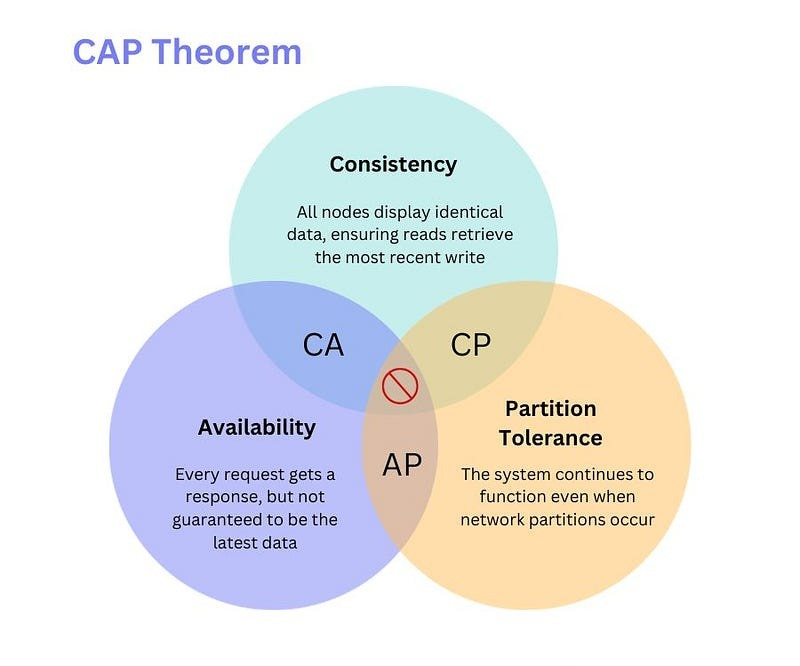
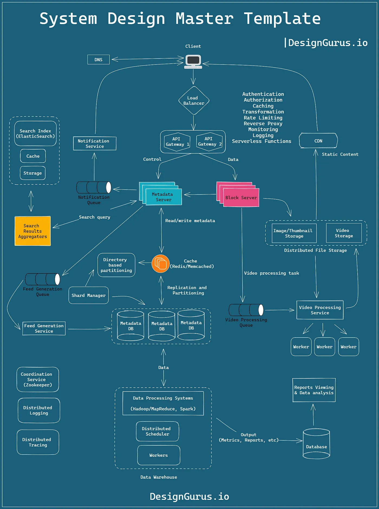

# System Design Interview Questions

## 1. What is System Design?

**Answer:**

System design is the process of defining the architecture, components, modules, interfaces,
and data for a system to satisfy specified requirements.
It is a multi-disciplinary domain that involves various concepts such as databases,
networking, load balancing, and more.

## 2. What are the key components of system design?

**Answer:**

The key components of system design include:

- **Requirements:** Understanding the problem and defining the scope of the system.
- **Architecture:** Designing the high-level structure of the system.
- **Data:** Identifying the data sources, storage, and access patterns.
- **Interfaces:** Defining the communication channels between system components.
- **Modules:** Breaking down the system into smaller components/modules.
- **Security:** Ensuring the system is secure from unauthorized access.
- **Scalability:** Designing the system to handle increased load and growth.
- **Performance:** Optimizing the system for speed and efficiency.

## 3. What is load balancing?

**Answer:**

Load balancing is the process of distributing incoming network traffic across multiple servers.
- *Example*: Using **Nginx** or **AWS ALB** to distribute traffic between 5 instances of your web server. If one server crashes, the load balancer stops sending traffic to it, keeping your site online.

## 4. What is sharding in databases?

**Answer:**

Sharding is a database partitioning technique that divides a large database into smaller parts.
- *Example*: In a global app, you might shard by region. Users in 'Europe' are stored on Server A, and users in 'Asia' are on Server B. This keeps the database size manageable and reduces latency for local users.

## 5. What is CAP theorem?

**Answer:**

- **Consistency(C):** Every read receives the most recent write or an error. *Example*: **MongoDB** (configured for strong reads) — it ensures you always get the latest data, even if it has to block while replicas sync.
- **Availability(A):** Every request receives a response, without guarantee that it contains the most recent write. *Example*: **Cassandra** or **DynamoDB** — they always give you an answer quickly, but it might be slightly older data if the network is having issues.
- **Partition tolerance(P):** The system continues to operate despite network failures. *Example*: Every distributed system *must* have P. The choice is usually between CP (Consistency) or AP (Availability) during a network split.

## 6. Explain the ACID properties of a transaction.

ACID stands for:

- **Atomicity**: A transaction is all-or-nothing.
- **Consistency**: The database transitions from one valid state to another.
- **Isolation**: Transactions do not interfere with each other.
- **Durability**: Once a transaction is committed, it is permanent.

## 7. What is a distributed system?

**Answer:** 

A distributed system is a collection of independent computers that appear to the users of the system as a single

