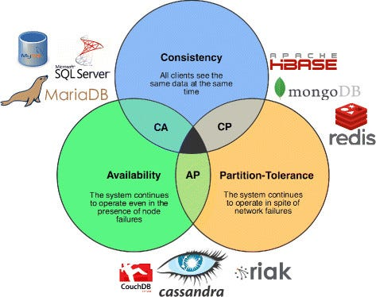

### Design Delivery System (Toters/Uber Eats Style)

System Capabilities:

- **Order Management:** Create, update, track, and cancel orders. Handle order status transitions (pending, confirmed, preparing, ready, out for delivery, delivered, cancelled).
- **Restaurant Management:** Add, update, search restaurants. Manage menu items, availability, operating hours, and pricing.
- **Driver Management:** Register drivers, manage driver availability, track driver location, assign orders to drivers, calculate earnings.
- **Real-time Tracking:** Track order status, driver location in real-time, ETA calculations, route optimization.
- **Payment Processing:** Handle multiple payment methods (credit card, debit card, digital wallets), process payments, handle refunds, manage payment history.
- **User Management:** Customer registration, authentication, profile management, order history, favorite restaurants.
- **Notification System:** Push notifications for order updates, driver assignments, delivery confirmations, promotional messages.
- **Search & Discovery:** Search restaurants by cuisine, location, rating. Filter by price, delivery time, ratings.
- **Rating & Review System:** Allow customers to rate restaurants, drivers, and food items. Display reviews and ratings.
- **Inventory Management:** Track restaurant menu availability, update item availability in real-time, handle out-of-stock scenarios.

### System Requirements:

- **Functional Requirements:**
    - System can handle 50K requests per minute during peak hours.
    - Support real-time location updates (driver/customer positions) with sub-second latency.
    - Handle 10,000 concurrent active orders.
    - Support 100,000 restaurants and 50,000 active drivers.
    - Average order size: 10 KB per order record.
    - Real-time tracking updates: 1 update per second per active order (location data ~500 bytes per update).
    - Logs grow rapidly; assume 1.5 KB per request log.
    - Image storage: Restaurant images, menu item images, driver profile photos (average 200 KB per image).

**Answer:**

According to the requirements, we need to design a system that can handle 50K requests per minute with real-time capabilities. We can break down the system into the following components:

### **Core Architecture**

- **Frontend:**
  - **Mobile Apps (iOS/Android):** Native apps for customers and drivers using React Native or Flutter for cross-platform development.
  - **Web Application:** SPA for restaurant partners using React or Angular for order management dashboard.
  - Serve static files via a Content Delivery Network (CDN) to minimize latency globally.
  - Implement offline support for viewing order history and cached restaurant data.
- **Backend:**
  - Use a microservices architecture to divide responsibilities:
    - **Order Service:** Handles order creation, updates, status management.
    - **Restaurant Service:** Manages restaurant data, menus, availability.
    - **Driver Service:** Manages driver registration, availability, location tracking.
    - **Payment Service:** Processes payments, handles refunds, manages payment gateways.
    - **Notification Service:** Sends push notifications, SMS, emails.
    - **Search Service:** Handles restaurant search, filtering, recommendations.
    - **Matching Service:** Matches orders with available drivers using algorithms.
    - **Location Service:** Handles real-time location tracking, geocoding, route optimization.
  - Implement the backend with scalable frameworks like Node.js, Go, or Spring Boot.
  - Deploy the backend on a container orchestration platform like Kubernetes for auto-scaling.
- **API Gateway:**
  - Use an API Gateway (e.g., AWS API Gateway, Kong, Nginx) to handle requests and route them to appropriate services.
  - Implement rate-limiting, authentication, and caching at the API gateway level.
  - Support WebSocket connections for real-time tracking updates.
- **Load Balancer:**
  - Use a load balancer (e.g., AWS ELB, Nginx, HAProxy) to distribute requests across multiple backend instances.
  - Implement geographic load balancing to route users to nearest data centers.
- **Message Queue:**
  - Use message queues (e.g., Apache Kafka, RabbitMQ, AWS SQS) for asynchronous processing:
    - Order processing pipeline
    - Notification delivery
    - Analytics event processing
    - Driver matching tasks

### **Database:**

By applying the CAP theorem,

**Relational Database:** For transactional data requiring ACID properties:
- **Order data:** Order details, status, payment information (MySQL or PostgreSQL)
- **User accounts:** Customer, driver, restaurant partner accounts
- **Payment transactions:** Payment records, refunds, financial data
- **Restaurant metadata:** Restaurant information, menu items, pricing

**NoSQL Database:** For high-volume, schema-flexible data:
- **MongoDB:** For logs, analytics, user sessions, cached restaurant data
- **Cassandra:** For time-series data like location tracking updates, order events
- **Redis:** For real-time data caching, session management, driver availability, active order tracking

**Graph Database (Optional):**
- **Neo4j:** For complex relationships like restaurant recommendations, driver-customer matching algorithms, social features

### **Storage:**

- **File Storage:**
    - Store restaurant images, menu item photos, driver profile pictures in cloud storage services (e.g., AWS S3, Google Cloud Storage).
    - Use a CDN (e.g., CloudFront, Cloudflare) for fast image delivery globally.
    - Implement image optimization and multiple size variants (thumbnails, medium, full resolution).
- **Database Storage:**
    - Use SSD-backed storage for database instances for high IOPS.
    - Implement automated backup and disaster recovery solutions.
    - Use read replicas for scaling read operations.

**Estimating Storage Requirements:**

- **For 100,000 restaurants:** 
    - Restaurant metadata: 100,000 * 2 KB = 200 MB
    - Menu items: 100,000 restaurants * 50 items * 1 KB = 5 GB
- **For 50,000 active drivers:**
    - Driver profiles: 50,000 * 3 KB = 150 MB
- **For orders:**
    - Active orders: 10,000 concurrent * 10 KB = 100 MB
    - Historical orders: 1 million orders/month * 10 KB = 10 GB/month
    - Store orders for 2 years = 10 GB * 24 months = 240 GB
- **For images:**
    - Restaurant images: 100,000 restaurants * 5 images * 200 KB = 100 GB
    - Menu item images: 5 million items * 200 KB = 1 TB
    - Driver photos: 50,000 * 200 KB = 10 GB
    - Total images: ~1.1 TB
- **Real-time location tracking:**
    - 10,000 active orders * 1 update/second * 500 bytes * 3600 seconds/hour = 18 GB/hour
    - Store location history for 7 days = 18 GB * 24 * 7 = 3 TB
    - Use time-series database with data retention policies
- **Logs:**
    - Logs grow rapidly; assume 1.5 KB per request log.
    - 50K requests per minute * 60 minutes * 24 hours * 30 days * 1.5 KB = 3.24 TB/month
    - Store logs for 3 months = 3.24 TB * 3 = 9.72 TB ≈ 10 TB
- **Backup:**
    - Keep daily backups of databases and critical data.
    - Estimate backup size at 2 TB (database + critical files) for versioned backups (weekly full backups, daily incremental backups).
- **Total size:** ~18 TB (with growth based on usage and retention policies)

### **Load Balancer:**

Distribute incoming requests to multiple application servers to ensure that no single server is overwhelmed.
Implement geographic load balancing to handle users from different regions and route them to the nearest data center.
Use health checks to automatically remove unhealthy servers from the pool.
Implement session affinity (sticky sessions) where necessary for WebSocket connections.

### **Application Servers:**

Handle all the read/write requests for the system. We can have different server clusters for different functionalities:
- **Order Management Servers:** Handle order creation, updates, status changes
- **Restaurant Management Servers:** Handle restaurant data, menu updates
- **Driver Management Servers:** Handle driver operations, location updates
- **Payment Processing Servers:** Handle payment transactions
- **Search & Discovery Servers:** Handle search queries, filtering
- **Real-time Tracking Servers:** Handle WebSocket connections for live tracking

**Calculation**
To handle 50K requests per minute:
> 50K requests/60 seconds = 833 requests per second
> - Assuming each server can handle 100 requests per second (conservative estimate)
> - 833 requests/100 requests = 8.33 servers
> - Add 30% buffer for peak traffic = 8.33 * 1.3 = 10.8 servers

We need **Minimum 11 application servers** to handle the base load.
For high availability and redundancy, deploy **15-20 servers** across multiple availability zones.

**Real-time Tracking Servers:**
> 10,000 concurrent active orders * 1 WebSocket connection per order
> - Each WebSocket server can handle ~5,000 connections
> - 10,000 / 5,000 = 2 servers minimum
> - Add redundancy = **4-5 WebSocket servers**

### **Cache:**

We can use an in-memory data store like **Redis** to cache frequently accessed data:
- **Restaurant data:** Cache popular restaurants, menus, ratings (TTL: 5-15 minutes)
- **User sessions:** Store active user sessions
- **Driver availability:** Cache available drivers in each region
- **Active orders:** Cache order status for quick lookups
- **Search results:** Cache popular search queries and results
- **Geographic data:** Cache restaurant locations, delivery zones

**Cache Strategy:**
- **Write-through cache:** For critical data like order status
- **Write-behind cache:** For less critical data like restaurant ratings
- **Cache invalidation:** Implement smart invalidation on data updates

This will help in reducing the load on the database and improve the response time of the system significantly.

### **Logging:**

We can use a distributed logging system like **ELK stack** (Elasticsearch, Logstash, Kibana) or **AWS CloudWatch** to store and analyze logs.
- **Application logs:** Track errors, performance metrics, business events
- **Access logs:** Track API requests, response times, status codes
- **Audit logs:** Track sensitive operations like payment processing, order cancellations
- **Real-time monitoring:** Use log aggregation for real-time alerting

This will help in monitoring the system and identifying any issues quickly.

### **Monitoring:**

We can use monitoring tools like **Prometheus** and **Grafana** to monitor the system in real-time:
- **Application Performance Monitoring (APM):** Track response times, error rates, throughput
- **Infrastructure Monitoring:** Monitor CPU, memory, disk, network usage
- **Business Metrics:** Track orders per minute, average delivery time, driver utilization
- **Alerting:** Set up alerts for critical thresholds (high error rates, slow response times, system failures)

This will help in identifying any performance bottlenecks and scaling the system accordingly.

### **Security:**

Implement security best practices:
- **Authentication & Authorization:** 
    - JWT tokens for API authentication
    - OAuth 2.0 for third-party integrations
    - Role-based access control (RBAC) for different user types
- **Data Encryption:**
    - Encrypt sensitive data at rest (database encryption)
    - Encrypt data in transit (HTTPS/TLS)
    - Encrypt payment information (PCI DSS compliance)
- **API Security:**
    - Rate limiting to prevent abuse
    - Input validation and sanitization
    - SQL injection prevention
    - XSS protection
- **Infrastructure Security:**
    - Network security groups and firewalls
    - DDoS protection
    - Regular security audits and penetration testing

### **Real-time Features:**

- **WebSocket Servers:** 
    - Handle real-time location updates for drivers
    - Push order status updates to customers
    - Broadcast notifications to multiple clients
- **Message Queue Integration:**
    - Process location updates asynchronously
    - Queue notification delivery
    - Handle order matching algorithms
- **Geospatial Indexing:**
    - Use geospatial databases (PostGIS, MongoDB geospatial indexes) for location-based queries
    - Efficiently find nearby restaurants and drivers
    - Calculate delivery ETAs using route optimization algorithms

### **Scaling Strategies:**

In addition to the above components, we can also implement:

- **Database Sharding:**
    - Shard orders by region or order ID
    - Shard restaurants by geographic location
    - Distribute data across multiple database servers
- **Read Replicas:**
    - Use read replicas for scaling read operations
    - Route read queries to replicas, writes to master
- **Caching Layers:**
    - Multi-level caching (application cache, distributed cache, CDN)
- **Auto-scaling:**
    - Implement auto-scaling based on CPU, memory, or request metrics
    - Scale up during peak hours, scale down during off-peak hours
- **Database Partitioning:**
    - Partition order tables by date (monthly partitions)
    - Archive old data to cold storage

**Handling 50,000 Requests/Minute:**

- **Estimation:**
    - 50,000 requests/minute = 833 requests/second.
    - Deploy multiple instances of backend services, each capable of handling ~50-100 requests/second.
    - Use a load balancer to distribute the load evenly.
    - Implement horizontal scaling with auto-scaling groups.
- **Database Throughput:**
    - Optimize database queries using indexing, denormalization, and caching.
    - Use connection pooling to manage database connections efficiently.
    - Implement read replicas for read-heavy operations.
    - Use bulk inserts/updates where possible to reduce write load.
- **API Gateway/Load Balancer:**
    - Implement rate limiting to prevent abuse (e.g., 100 requests/minute per user).
    - Use HTTP/2 or gRPC for faster communication.
    - Implement request queuing for peak traffic handling.
- **Real-time Updates:**
    - Use WebSocket connections for real-time tracking (separate from HTTP API).
    - Implement message queues for processing location updates asynchronously.
    - Use Redis pub/sub for broadcasting updates to multiple clients.
- **Scaling and Strategy:**
    - **Dynamic Scaling:** Use cloud services with auto-scaling capabilities to expand as needed.
    - **Geographic Distribution:** Deploy services in multiple regions to reduce latency.
    - **Archiving:** Move old orders and location history to cold storage (e.g., AWS Glacier) to reduce costs.
    - **Retention Policies:** Apply data retention policies to delete logs and old data after a set period.
    - **Peak Hour Handling:** Pre-scale resources before known peak hours (lunch, dinner times).

### **Order Matching Algorithm:**

- **Driver Assignment:**
    - Use algorithms to match orders with available drivers based on:
        - Proximity to restaurant
        - Driver availability status
        - Current order load
        - Driver rating and performance
    - Implement real-time matching using location data and availability status
- **Route Optimization:**
    - Calculate optimal routes for drivers using mapping services (Google Maps API, Mapbox)
    - Consider traffic conditions, distance, and delivery time windows
    - Support batch deliveries (multiple orders per driver)

### **Payment Processing:**

- **Payment Gateway Integration:**
    - Integrate with multiple payment gateways (Stripe, PayPal, local payment providers)
    - Handle payment failures gracefully with retry mechanisms
    - Implement idempotency for payment requests
- **Fraud Detection:**
    - Implement fraud detection algorithms
    - Monitor suspicious payment patterns
    - Require additional verification for high-value orders

By following the above design, we can build a system that can handle 50K requests per minute, support real-time tracking, and meet the functional requirements of a modern delivery application like Toters or Uber Eats.

**Summary**

- Frontend: Native mobile apps + Web SPA served via CDN.
- Backend: Scalable microservices architecture with specialized services.
- Database: Relational for transactional data + NoSQL for logs/analytics + Redis for real-time data.
- Storage: Cloud-based file storage (e.g., AWS S3) + SSD for DB + Time-series DB for location tracking.
- Real-time: WebSocket servers for live tracking, message queues for async processing.
- Scaling: Horizontal auto-scaling with read replicas, caching, and database sharding.
- Monitoring: Comprehensive monitoring tools for real-time insights and alerting.
- Security: Multi-layer security with encryption, authentication, and authorization.

