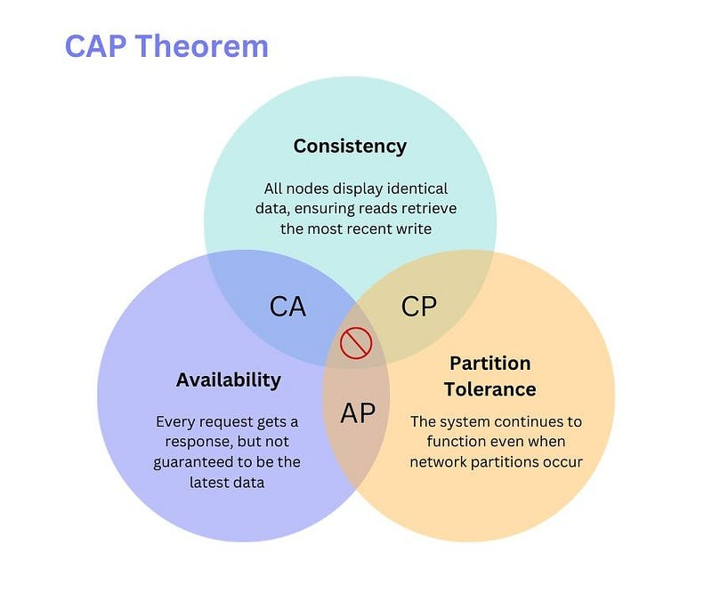
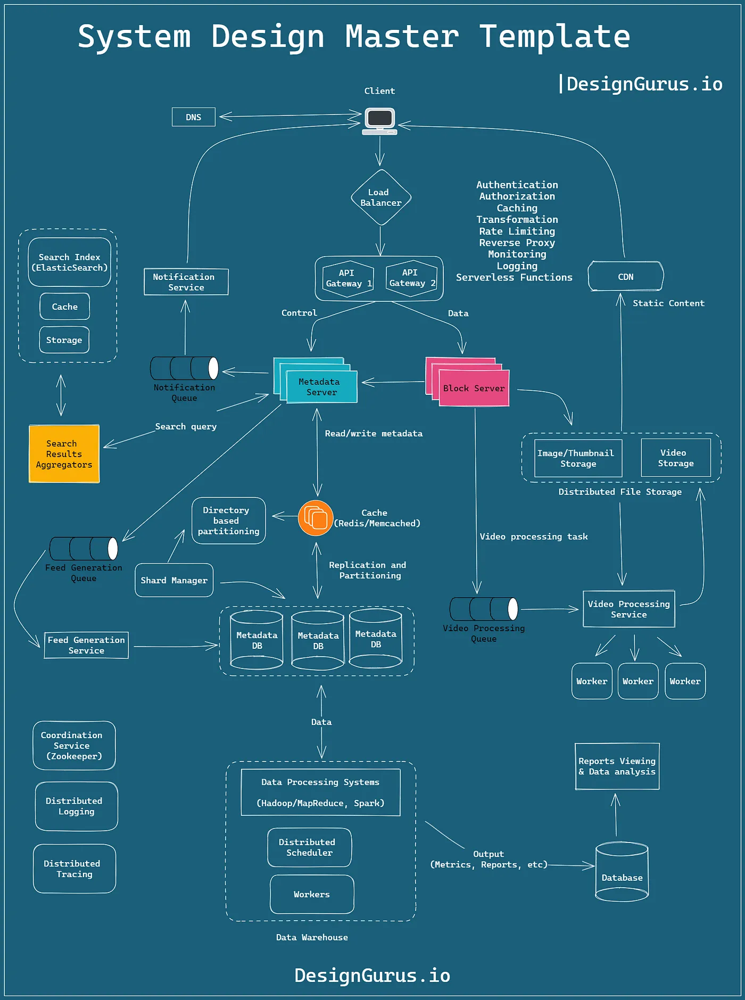

# System Design Interview Questions

## 1. What is System Design?

**Answer:**

System design is the process of defining the architecture, components, modules, interfaces,
and data for a system to satisfy specified requirements.
It is a multi-disciplinary domain that involves various concepts such as databases,
networking, load balancing, and more.

## 2. What are the key components of system design?

**Answer:**

The key components of system design include:

- **Requirements:** Understanding the problem and defining the scope of the system.
- **Architecture:** Designing the high-level structure of the system.
- **Data:** Identifying the data sources, storage, and access patterns.
- **Interfaces:** Defining the communication channels between system components.
- **Modules:** Breaking down the system into smaller components/modules.
- **Security:** Ensuring the system is secure from unauthorized access.
- **Scalability:** Designing the system to handle increased load and growth.
- **Performance:** Optimizing the system for speed and efficiency.

## 3. What is load balancing?

**Answer:**

Load balancing is the process of distributing incoming network traffic across multiple servers to ensure no single
server is overwhelmed. It improves the responsiveness and availability of applications by preventing any one server
from becoming a bottleneck.

## 4. What is sharding in databases?

**Answer:**

Sharding is a database partitioning technique that divides a large database into smaller, more manageable parts called
shards. Each shard is stored on a separate server instance to distribute the load and improve performance.

## 5. What is CAP theorem?

**Answer:**

- **Consistency(C):** Every read receives the most recent write or an error.
    - **Explanation:**
        - All nodes in the distributed system see the same data at the same time.
        - After a write operation completes, all subsequent reads will return that value.
    - **Implications:**
        - Consistency is achieved by updating all replicas before responding to read requests.
        - This approach can lead to increased latency and reduced availability.
        - Ensures data accuracy and reliability.
        - Requires synchronization among nodes, which can introduce latency.
- **Availability(A):** Every request receives a response, without guarantee that it contains the most recent write.
    - **Explanation:**
        - The system remains operational 100% of the time.
        - Every node returns a response for every request without exceptions.
    - **Implications:**
        - Availability is achieved by allowing read and write operations to continue even in the presence of network
          partitions.
        - This approach can lead to eventual consistency.
        - Essential for systems where responsiveness is critical.
        - Focuses on the system's ability to respond to queries, even if the data is stale.
- **Partition tolerance(P):** The system continues to operate despite an arbitrary number of messages being dropped (or
  delayed) by the network between nodes.
    - **Explanation:**
        - The system can withstand network failures that result in messages being lost or delayed.
        - The system can be partitioned into multiple components that continue to operate independently.
        - The system as a whole continues to function, even if parts of it are disconnected.
        - The distributed system can sustain network partitions where nodes cannot communicate with each other.
    - **Implications:**
        - Partition tolerance is achieved by replicating data across multiple nodes.
        - This approach can lead to inconsistencies between replicas.
        - Ensures the system remains operational even if network failures occur.
        - Allows the system to continue functioning despite network partitions.
        - Recognizes that network failures are inevitable in distributed systems.
        - Requires mechanisms to handle partitions gracefully.

## 6. Explain the ACID properties of a transaction.

ACID stands for:

- **Atomicity**: A transaction is all-or-nothing.
- **Consistency**: The database transitions from one valid state to another.
- **Isolation**: Transactions do not interfere with each other.
- **Durability**: Once a transaction is committed, it is permanent.

## 7. What is a distributed system?

**Answer:** 

A distributed system is a collection of independent computers that appear to the users of the system as a single

