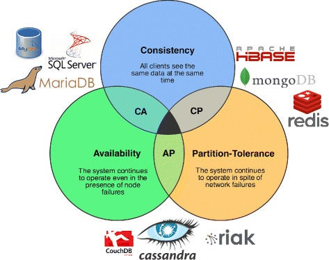

~~### Design HR System

System Capabilities:

- **Employee Management:** Add, delete, update, search employees.
- **Department Management:** Add, delete, update, search departments.
- **Role Management:** Add, delete, update, search roles.
- **Salary Management:** Calculate salary, bonuses, deductions.
- **Attendance Management:** Mark attendance, calculate leaves, overtime.

### System Requirements:

- **Functional Requirements:**
    - System can handle 15K request per minute.
    - Assume an average record size of 5 KB per employee
    - Logs grow rapidly; assume 1 KB per request log.

**Answer:**

According to the requirements, we need to design a system that can handle 15K requests per minute. We can break down the
system into the following components:

### **Core Architecture**

- **Frontend:**
  Use a Single Page Application (SPA) framework like React or Angular for a fast and interactive UI.
  Serve static files via a Content Delivery Network (CDN) to minimize latency.
- **Backend:**
  Use a microservices architecture to divide responsibilities (e.g., User Management, Payroll, Leave Management).
  Implement the backend with a scalable framework like Node.js, Django, or Spring Boot.
  Deploy the backend on a container orchestration platform like Kubernetes for scalability.
- **API Gateway:**
  Use an API Gateway (e.g., AWS API Gateway, Nginx) to handle requests and route them to appropriate services.
  Implement rate-limiting and caching at the API gateway level.
- **Load Balancer:**
  Use a load balancer (e.g., AWS ELB or Nginx) to distribute requests across multiple backend instances.

### **Database:**

By applying the CAP theorem,

**Relational Database:** For transactional data like employee records,department, role,salary information.,
payroll and leave balances. like **MySQL** or **PostgreSQL**

**NoSQL Database:** For logs, analytics, and real-time features like notifications, attendance information
we can choose **MongoDB**

### **Storage:**

- **File Storage:**
    - Store employee documents, contracts, and other files in cloud storage services (e.g., AWS S3, Google Cloud
      Storage).
    - Use a CDN for static file delivery.
- **Database Storage:**
    - Use SSD-backed storage for database instances for high IOPS.
    - Implement automated backup and disaster recovery solutions.

**Estimating Storage Requirements:**

- **For 100,000 employees:** 100,000 * 5 KB = 500 MB as initial storage requirement.
- **For employees Documents:**
    - Each employee uploads approximately 10 documents (average size: 500 KB/document).
    - Total storage required = 100,000 employees * 10 documents * 500 KB = 500 GB.
- **Logs:**
    - Logs grow rapidly; assume 1 KB per request log.
    - 15K requests per minute * 60 minutes * 24 hour * 30 day * 1KB = 648 GB/month
    - Store logs for 3 months = 648 GB * 3 = 1944 GB = ~2 TB
- **Backup:**
    - Keep daily backups of databases and documents.
    - Estimate backup size at 1.5 TB (database + documents) for versioned backups (e.g., weekly full backups, daily
      incremental backups).
- **Total size:** ~4 TB Growth based on usage and retention policies.

### **Load Balancer:**

Distribute incoming requests to multiple application servers to ensure that no single server is overwhelmed.
and we can also add geographic load balancing to handle users from different regions.

### **Application Servers:**

Handle all the read/write requests for the system. We can have different servers for different functionalities like
employee management, department management, role management, salary management, and attendance management.

**Calculation**
To handle 15k requests per minute
> 15k requests/60 seconds = 250 requests per second
> - Assuming each server can handle 100 requests per second
> - 250 requests/100 requests = 2.5 servers

We need **Minimum 3 application servers** to handle the load.

### **Cache:**

We can use an in-memory data store like **Redis** to cache the frequently accessed data.
This will help in reducing the load on the database and improve the response time of the system.

### **Logging:**

We can use a distributed logging system like **ELK stack** (Elasticsearch, Logstash, Kibana) or **New Relic**  to store
and analyze logs.
This will help in monitoring the system and identifying any issues.

### **Monitoring:**

We can use monitoring tools like **Prometheus** and **Grafana** to monitor the system in real-time. This will help in
identifying any performance bottlenecks and scaling the system accordingly.

### **Security:**

Implement security best practices like encryption, authentication, and authorization to ensure that the system is secure
from unauthorized access.

addition to the above components, we can also implement sharding in the database to distribute the data across multiple
servers. This will help in improving the performance and scalability of the system.

**Handling 15,000 Requests/Minute:**

- **Estimation:**
    - 15,000 requests/minute = 250 requests/second.
    - Deploy multiple instances of backend services, each capable of handling ~50 requests/second.
    - Use a load balancer to distribute the load evenly.
- **Database Throughput:**
    - Optimize database queries using indexing, denormalization, and caching.
    - Use bulk inserts/updates where possible to reduce write load.
- **API Gateway/Load Balancer:**
    - Implement rate limiting to prevent abuse.
    - Use HTTP/2 or gRPC for faster communication.
- **Scaling and Strategy**
    - **Dynamic Scaling:** Use cloud storage with auto-scaling capabilities to expand as needed.
    - **Archiving:** Move old logs and inactive employee records to cold storage to reduce costs.
    - **Retention Policies:** Apply data retention policies to delete logs after a set period.

By following the above design, we can build a system that can handle 15K requests per minute and meet the functional
requirements of the HR system.

**Summary**

- Frontend: SPA served via CDN.
- Backend: Scalable microservices architecture.
- Database: Relational for transactional data + NoSQL for logs/analytics.
- Storage: Cloud-based file storage (e.g., AWS S3) + SSD for DB.
- Scaling: Horizontal auto-scaling with read replicas and caching.
- Monitoring: Use monitoring tools for real-time insights.~~

